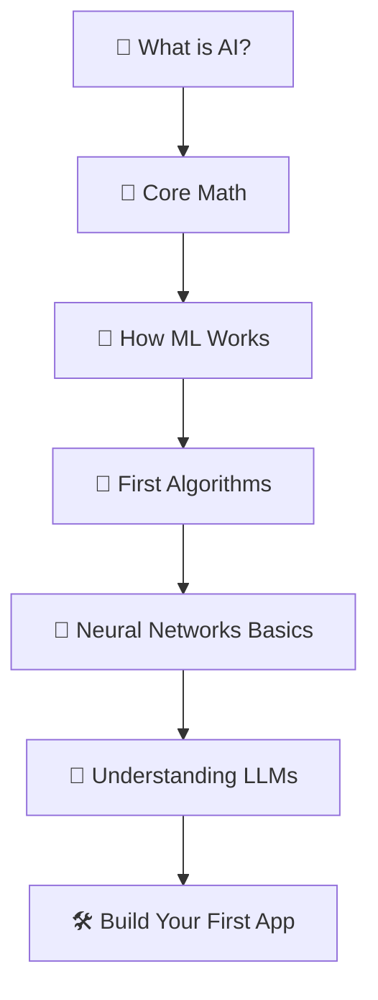

# 🟢 Beginner Path — Your First 30 Topics in AI

> **Goal:** Go from zero to understanding how AI works, being able to explain it clearly, and building your first LLM-powered app.
> **Who this is for:** Complete beginners, non-engineers curious about AI, developers who've never touched ML.
> **Time:** ~40–60 hours at a comfortable pace.

---

## The Mental Model First

Before any topic — read this:

> AI is not magic. It is pattern recognition at scale. A model sees millions of examples, finds patterns in them, and uses those patterns to make predictions on new data. That's it.

---

## Your Roadmap

---

## Phase 1 — What is AI? *(2–3 hours)*

> Read these first. No math. Just get the mental model.

| # | Topic | Why | Link |
|---|---|---|---|
| 1 | What is ML | Understand the difference between rules and learning | [📖 Theory](../02_Machine_Learning_Foundations/01_What_is_ML/Theory.md) · [⚡ Cheatsheet](../02_Machine_Learning_Foundations/01_What_is_ML/Cheatsheet.md) |
| 2 | Training vs Inference | The two phases every AI system has | [📖 Theory](../02_Machine_Learning_Foundations/02_Training_vs_Inference/Theory.md) · [⚡ Cheatsheet](../02_Machine_Learning_Foundations/02_Training_vs_Inference/Cheatsheet.md) |
| 3 | Supervised Learning | How models learn from labeled examples | [📖 Theory](../02_Machine_Learning_Foundations/03_Supervised_Learning/Theory.md) · [⚡ Cheatsheet](../02_Machine_Learning_Foundations/03_Supervised_Learning/Cheatsheet.md) |
| 4 | LLM Fundamentals | What a large language model actually is | [📖 Theory](../07_Large_Language_Models/01_LLM_Fundamentals/Theory.md) · [⚡ Cheatsheet](../07_Large_Language_Models/01_LLM_Fundamentals/Cheatsheet.md) |

---

## Phase 2 — Core Math (Just Enough) *(4–6 hours)*

> You don't need to be a mathematician. You need enough to understand why things work.

| # | Topic | Why | Link |
|---|---|---|---|
| 5 | Probability | How AI handles uncertainty | [📖 Theory](../01_Math_for_AI/01_Probability/Theory.md) · [💡 Intuition](../01_Math_for_AI/01_Probability/Intuition_First.md) · [⚡ Cheatsheet](../01_Math_for_AI/01_Probability/Cheatsheet.md) |
| 6 | Statistics | Mean, variance, distributions — the language of data | [📖 Theory](../01_Math_for_AI/02_Statistics/Theory.md) · [💡 Intuition](../01_Math_for_AI/02_Statistics/Intuition_First.md) |
| 7 | Linear Algebra (basics) | Vectors and matrices — how data is stored and transformed | [📖 Theory](../01_Math_for_AI/03_Linear_Algebra/Theory.md) · [💡 Intuition](../01_Math_for_AI/03_Linear_Algebra/Intuition_First.md) |
| 8 | Gradient Descent | How models improve — the engine of learning | [📖 Theory](../02_Machine_Learning_Foundations/08_Gradient_Descent/Theory.md) · [⚡ Cheatsheet](../02_Machine_Learning_Foundations/08_Gradient_Descent/Cheatsheet.md) |

---

## Phase 3 — How ML Actually Works *(4–5 hours)*

| # | Topic | Why | Link |
|---|---|---|---|
| 9 | Model Evaluation | How do you know if your model is good? | [📖 Theory](../02_Machine_Learning_Foundations/05_Model_Evaluation/Theory.md) · [📊 Metrics Deep Dive](../02_Machine_Learning_Foundations/05_Model_Evaluation/Metrics_Deep_Dive.md) |
| 10 | Overfitting & Regularization | Why models fail on new data and how to fix it | [📖 Theory](../02_Machine_Learning_Foundations/06_Overfitting_and_Regularization/Theory.md) |
| 11 | Loss Functions | What the model is trying to minimize | [📖 Theory](../02_Machine_Learning_Foundations/09_Loss_Functions/Theory.md) · [⚡ Cheatsheet](../02_Machine_Learning_Foundations/09_Loss_Functions/Cheatsheet.md) |
| 12 | Bias vs Variance | The fundamental tradeoff in ML | [📖 Theory](../02_Machine_Learning_Foundations/10_Bias_vs_Variance/Theory.md) |

---

## Phase 4 — Your First Algorithms *(5–6 hours)*

> These are the classic ML algorithms. Every AI engineer knows them.

| # | Topic | Why | Link |
|---|---|---|---|
| 13 | Linear Regression | Simplest prediction model | [📖 Theory](../03_Classical_ML_Algorithms/01_Linear_Regression/Theory.md) · [💻 Code](../03_Classical_ML_Algorithms/01_Linear_Regression/Code_Example.md) |
| 14 | Logistic Regression | Simplest classifier | [📖 Theory](../03_Classical_ML_Algorithms/02_Logistic_Regression/Theory.md) · [💻 Code](../03_Classical_ML_Algorithms/02_Logistic_Regression/Code_Example.md) |
| 15 | Decision Trees | Intuitive, explainable decisions | [📖 Theory](../03_Classical_ML_Algorithms/03_Decision_Trees/Theory.md) · [💻 Code](../03_Classical_ML_Algorithms/03_Decision_Trees/Code_Example.md) |
| 16 | Random Forests | Better than decision trees alone | [📖 Theory](../03_Classical_ML_Algorithms/04_Random_Forests/Theory.md) · [💻 Code](../03_Classical_ML_Algorithms/04_Random_Forests/Code_Example.md) |

---

## Phase 5 — Neural Networks Basics *(5–7 hours)*

| # | Topic | Why | Link |
|---|---|---|---|
| 17 | Perceptron | The building block of all neural networks | [📖 Theory](../04_Neural_Networks_and_Deep_Learning/01_Perceptron/Theory.md) |
| 18 | Multi-Layer Perceptrons | How layers create powerful representations | [📖 Theory](../04_Neural_Networks_and_Deep_Learning/02_MLPs/Theory.md) · [💻 Code](../04_Neural_Networks_and_Deep_Learning/02_MLPs/Code_Example.md) |
| 19 | Activation Functions | Why non-linearity makes deep learning work | [📖 Theory](../04_Neural_Networks_and_Deep_Learning/03_Activation_Functions/Theory.md) · [⚡ Cheatsheet](../04_Neural_Networks_and_Deep_Learning/03_Activation_Functions/Cheatsheet.md) |
| 20 | Backpropagation | How neural networks actually learn | [📖 Theory](../04_Neural_Networks_and_Deep_Learning/06_Backpropagation/Theory.md) |

---

## Phase 6 — Understanding LLMs *(4–5 hours)*

| # | Topic | Why | Link |
|---|---|---|---|
| 21 | How LLMs Generate Text | Token by token — the mechanics | [📖 Theory](../07_Large_Language_Models/02_How_LLMs_Generate_Text/Theory.md) · [⚡ Cheatsheet](../07_Large_Language_Models/02_How_LLMs_Generate_Text/Cheatsheet.md) |
| 22 | Tokenization | How text becomes numbers for the model | [📖 Theory](../05_NLP_Foundations/02_Tokenization/Theory.md) |
| 23 | Word Embeddings | How meaning lives in vectors | [📖 Theory](../05_NLP_Foundations/04_Word_Embeddings/Theory.md) |
| 24 | Context Windows & Tokens | Why there's a limit — and what it costs | [📖 Theory](../07_Large_Language_Models/07_Context_Windows_and_Tokens/Theory.md) |
| 25 | Hallucination & Alignment | Why AI makes things up and how to handle it | [📖 Theory](../07_Large_Language_Models/08_Hallucination_and_Alignment/Theory.md) |

---

## Phase 7 — Build Your First App *(6–8 hours)*

> This is where it gets real. You'll actually build something.

| # | Topic | Why | Link |
|---|---|---|---|
| 26 | Prompt Engineering | The most important practical skill for working with LLMs | [📖 Theory](../08_LLM_Applications/01_Prompt_Engineering/Theory.md) · [🎯 Patterns](../08_LLM_Applications/01_Prompt_Engineering/Prompt_Patterns.md) · [⚠️ Mistakes](../08_LLM_Applications/01_Prompt_Engineering/Common_Mistakes.md) |
| 27 | Using LLM APIs | Call Claude/GPT in Python | [📖 Theory](../07_Large_Language_Models/09_Using_LLM_APIs/Theory.md) · [💻 Cookbook](../07_Large_Language_Models/09_Using_LLM_APIs/Code_Cookbook.md) |
| 28 | Structured Outputs | Get JSON back from an LLM reliably | [📖 Theory](../08_LLM_Applications/03_Structured_Outputs/Theory.md) · [💻 Code](../08_LLM_Applications/03_Structured_Outputs/Code_Example.md) |
| 29 | Embeddings | Turn text into searchable vectors | [📖 Theory](../08_LLM_Applications/04_Embeddings/Theory.md) · [💻 Code](../08_LLM_Applications/04_Embeddings/Code_Example.md) |
| 30 | Streaming Responses | Make your app feel instant | [📖 Theory](../08_LLM_Applications/08_Streaming_Responses/Theory.md) · [💻 Code](../08_LLM_Applications/08_Streaming_Responses/Code_Example.md) |

---

## ✅ You're Ready for Intermediate When...

- [ ] You can explain what gradient descent does without looking it up
- [ ] You can write a prompt that reliably extracts structured data from text
- [ ] You can call an LLM API, handle errors, and stream the response
- [ ] You understand why a model might hallucinate and what to do about it
- [ ] You can describe the difference between training and inference

**➡️ Next:** [Intermediate Path](./02_Intermediate_Path.md)

---

## 📂 Navigation

| File | |
|---|---|
| [🗺️ Learning Path](./Learning_Path.md) | Full linear path |
| [🟡 Intermediate Path](./02_Intermediate_Path.md) | Build real AI systems |
| [🔴 Advanced Path](./03_Advanced_Path.md) | Production-grade AI |
| [✅ Progress Tracker](./Progress_Tracker.md) | Track your progress |

⬅️ **Back to:** [Learning Guide](./Readme.md)
