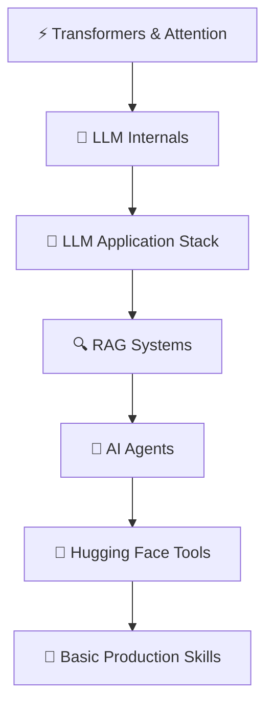

# 🟡 Intermediate Path — Build Real AI Systems

> **Goal:** Move from understanding AI to building production-worthy LLM applications — RAG systems, agents, and intelligent tools.
> **Who this is for:** Developers who understand the basics of ML/LLMs and want to build real things people use.
> **Prereq:** Comfortable with [Beginner Path](./Beginner_Path.md) or equivalent knowledge.
> **Time:** ~50–70 hours.

---

## What You'll Be Able to Build

By the end of this path you can build:
- ✅ A RAG system that answers questions from your own documents
- ✅ An LLM agent that uses tools and takes actions
- ✅ A semantic search system
- ✅ A multi-turn conversational AI with memory
- ✅ A fine-tuned model for a specific task

---

## Your Roadmap

---

## Phase 1 — Transformers & How LLMs Really Work *(6–8 hours)*

> Understanding the architecture makes everything else click.

| # | Topic | Why | Link |
|---|---|---|---|
| 1 | Attention Mechanism | The core innovation — how models focus | [📖 Theory](../06_Transformers/02_Attention_Mechanism/Theory.md) · [🔢 Math](../06_Transformers/02_Attention_Mechanism/Math_Walkthrough.md) |
| 2 | Self-Attention | How tokens relate to each other | [📖 Theory](../06_Transformers/03_Self_Attention/Theory.md) |
| 3 | Transformer Architecture | The full picture | [📖 Theory](../06_Transformers/06_Transformer_Architecture/Theory.md) · [🏗️ Deep Dive](../06_Transformers/06_Transformer_Architecture/Architecture_Deep_Dive.md) |
| 4 | BERT vs GPT | Encoder-only vs decoder-only — what's the difference | [📖 BERT Theory](../06_Transformers/08_BERT/Theory.md) · [📖 GPT Theory](../06_Transformers/09_GPT/Theory.md) |
| 5 | Pretraining | How LLMs learn from the internet | [📖 Theory](../07_Large_Language_Models/03_Pretraining/Theory.md) |
| 6 | Fine-Tuning | Adapting a model to your task | [📖 Theory](../07_Large_Language_Models/04_Fine_Tuning/Theory.md) · [💻 Code](../07_Large_Language_Models/04_Fine_Tuning/Code_Example.md) · [❓ When to Use](../07_Large_Language_Models/04_Fine_Tuning/When_to_Use.md) |

---

## Phase 2 — The LLM Application Stack *(5–6 hours)*

> The tools you'll use in every LLM app you build.

| # | Topic | Why | Link |
|---|---|---|---|
| 7 | Tool Calling | Let your LLM take actions | [📖 Theory](../08_LLM_Applications/02_Tool_Calling/Theory.md) · [💻 Code](../08_LLM_Applications/02_Tool_Calling/Code_Example.md) · [🏗️ Architecture](../08_LLM_Applications/02_Tool_Calling/Architecture_Deep_Dive.md) |
| 8 | Vector Databases | Store and search embeddings at scale | [📖 Theory](../08_LLM_Applications/05_Vector_Databases/Theory.md) · [📊 Comparison](../08_LLM_Applications/05_Vector_Databases/Comparison.md) · [💻 Code](../08_LLM_Applications/05_Vector_Databases/Code_Example.md) |
| 9 | Semantic Search | Find meaning, not just keywords | [📖 Theory](../08_LLM_Applications/06_Semantic_Search/Theory.md) · [💻 Code](../08_LLM_Applications/06_Semantic_Search/Code_Example.md) |
| 10 | Memory Systems | Give your AI a persistent brain | [📖 Theory](../08_LLM_Applications/07_Memory_Systems/Theory.md) · [📊 Comparison](../08_LLM_Applications/07_Memory_Systems/Comparison.md) |

---

## Phase 3 — RAG Systems (Full Pipeline) *(10–12 hours)*

> The most commonly deployed AI pattern. Know it inside out.

| # | Topic | Why | Link |
|---|---|---|---|
| 11 | RAG Fundamentals | What RAG is and when to use it | [📖 Theory](../09_RAG_Systems/01_RAG_Fundamentals/Theory.md) · [❓ When to Use RAG](../09_RAG_Systems/01_RAG_Fundamentals/When_to_Use_RAG.md) |
| 12 | Document Ingestion | Getting documents into your pipeline | [📖 Theory](../09_RAG_Systems/02_Document_Ingestion/Theory.md) · [💻 Code](../09_RAG_Systems/02_Document_Ingestion/Code_Example.md) |
| 13 | Chunking Strategies | How you split documents matters | [📖 Theory](../09_RAG_Systems/03_Chunking_Strategies/Theory.md) · [📊 Comparison](../09_RAG_Systems/03_Chunking_Strategies/Comparison.md) · [💻 Code](../09_RAG_Systems/03_Chunking_Strategies/Code_Example.md) |
| 14 | Embedding & Indexing | How chunks become searchable | [📖 Theory](../09_RAG_Systems/04_Embedding_and_Indexing/Theory.md) · [💻 Code](../09_RAG_Systems/04_Embedding_and_Indexing/Code_Example.md) |
| 15 | Retrieval Pipeline | Finding the right chunks fast | [📖 Theory](../09_RAG_Systems/05_Retrieval_Pipeline/Theory.md) · [💻 Code](../09_RAG_Systems/05_Retrieval_Pipeline/Code_Example.md) |
| 16 | Context Assembly | Putting it together for the LLM | [📖 Theory](../09_RAG_Systems/06_Context_Assembly/Theory.md) · [💻 Code](../09_RAG_Systems/06_Context_Assembly/Code_Example.md) |
| 17 | RAG Evaluation | How to know if your RAG is actually good | [📖 Theory](../09_RAG_Systems/08_RAG_Evaluation/Theory.md) · [📊 Metrics Guide](../09_RAG_Systems/08_RAG_Evaluation/Metrics_Guide.md) |
| 18 | **Build a RAG App** | Put it all together — end to end | [🔨 Project Guide](../09_RAG_Systems/09_Build_a_RAG_App/Project_Guide.md) · [📋 Step by Step](../09_RAG_Systems/09_Build_a_RAG_App/Step_by_Step.md) · [🏗️ Blueprint](../09_RAG_Systems/09_Build_a_RAG_App/Architecture_Blueprint.md) |

---

## Phase 4 — AI Agents *(8–10 hours)*

| # | Topic | Why | Link |
|---|---|---|---|
| 19 | Agent Fundamentals | The agent loop — perceive, reason, act | [📖 Theory](../10_AI_Agents/01_Agent_Fundamentals/Theory.md) · [🧠 Mental Model](../10_AI_Agents/01_Agent_Fundamentals/Mental_Model.md) |
| 20 | ReAct Pattern | The most common agent architecture | [📖 Theory](../10_AI_Agents/02_ReAct_Pattern/Theory.md) · [💻 Code](../10_AI_Agents/02_ReAct_Pattern/Code_Example.md) |
| 21 | Tool Use | Build agents that actually do things | [📖 Theory](../10_AI_Agents/03_Tool_Use/Theory.md) · [💻 Code](../10_AI_Agents/03_Tool_Use/Code_Example.md) · [🔧 Custom Tools](../10_AI_Agents/03_Tool_Use/Building_Custom_Tools.md) |
| 22 | Agent Memory | Agents that remember | [📖 Theory](../10_AI_Agents/04_Agent_Memory/Theory.md) · [📊 Comparison](../10_AI_Agents/04_Agent_Memory/Comparison.md) |
| 23 | Agent Frameworks | LangChain, CrewAI, AutoGen | [📖 Theory](../10_AI_Agents/08_Agent_Frameworks/Theory.md) · [📊 Comparison](../10_AI_Agents/08_Agent_Frameworks/Comparison.md) |
| 24 | **Build an Agent** | Capstone: ReAct agent from scratch | [🔨 Project Guide](../10_AI_Agents/09_Build_an_Agent/Project_Guide.md) · [📋 Step by Step](../10_AI_Agents/09_Build_an_Agent/Step_by_Step.md) |

---

## Phase 5 — Hugging Face Ecosystem *(5–6 hours)*

> The practical toolkit. Every AI job uses this.

| # | Topic | Why | Link |
|---|---|---|---|
| 25 | Hub & Model Cards | Find, download, and share models | [📖 Theory](../14_Hugging_Face_Ecosystem/01_Hub_and_Model_Cards/Theory.md) · [💻 Code](../14_Hugging_Face_Ecosystem/01_Hub_and_Model_Cards/Code_Example.md) |
| 26 | Transformers Library | Use any model in 3 lines of code | [📖 Theory](../14_Hugging_Face_Ecosystem/02_Transformers_Library/Theory.md) · [💻 Code](../14_Hugging_Face_Ecosystem/02_Transformers_Library/Code_Example.md) · [📋 Pipeline Guide](../14_Hugging_Face_Ecosystem/02_Transformers_Library/Pipeline_Guide.md) |
| 27 | PEFT & LoRA | Fine-tune without a supercomputer | [📖 Theory](../14_Hugging_Face_Ecosystem/04_PEFT_and_LoRA/Theory.md) · [💻 Code](../14_Hugging_Face_Ecosystem/04_PEFT_and_LoRA/Code_Example.md) |
| 28 | Trainer API | Train models without writing training loops | [📖 Theory](../14_Hugging_Face_Ecosystem/05_Trainer_API/Theory.md) · [💻 Code](../14_Hugging_Face_Ecosystem/05_Trainer_API/Code_Example.md) |

---

## Phase 6 — Basic Production Skills *(5–6 hours)*

> You need to know this before shipping anything.

| # | Topic | Why | Link |
|---|---|---|---|
| 29 | Model Serving | How to serve a model to users | [📖 Theory](../12_Production_AI/01_Model_Serving/Theory.md) |
| 30 | Cost Optimization | LLM APIs are expensive — manage them | [📖 Theory](../12_Production_AI/03_Cost_Optimization/Theory.md) · [💰 Cost Guide](../07_Large_Language_Models/09_Using_LLM_APIs/Cost_Guide.md) |
| 31 | Safety & Guardrails | Don't ship AI without safety checks | [📖 Theory](../12_Production_AI/07_Safety_and_Guardrails/Theory.md) |
| 32 | AI Evaluation Basics | Know if your system is actually working | [📖 Theory](../18_AI_Evaluation/01_Evaluation_Fundamentals/Theory.md) · [📋 Checklist](../18_AI_Evaluation/Evaluation_Checklist.md) |

---

## ✅ You're Ready for Advanced When...

- [ ] You've built and deployed a working RAG system
- [ ] You've built an agent that uses at least 2 tools
- [ ] You can fine-tune a model with LoRA
- [ ] You know how to evaluate whether your AI system is working
- [ ] You understand the cost implications of your architecture choices

**⬅️ Prev:** [Beginner Path](./01_Beginner_Path.md) &nbsp;&nbsp; **➡️ Next:** [Advanced Path](./03_Advanced_Path.md)

---

## 📂 Navigation

| File | |
|---|---|
| [🗺️ Learning Path](./Learning_Path.md) | Full linear path |
| [🟢 Beginner Path](./01_Beginner_Path.md) | Start here if new |
| [🔴 Advanced Path](./03_Advanced_Path.md) | Production-grade AI |
| [✅ Progress Tracker](./Progress_Tracker.md) | Track your progress |

⬅️ **Back to:** [Learning Guide](./Readme.md)
