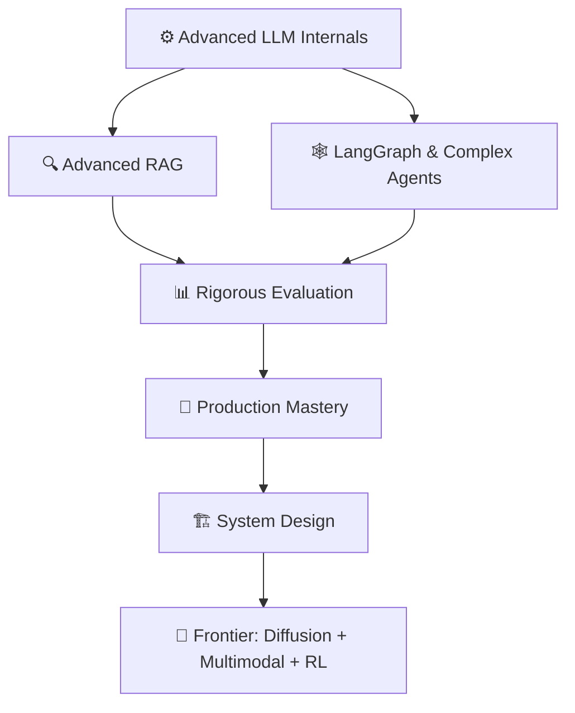

# 🔴 Advanced Path — Production-Grade AI Engineering

> **Goal:** Design, build, and ship AI systems that handle real users, real scale, and real failure modes.
> **Who this is for:** Engineers who can build LLM apps and want to operate them at scale, ace system design interviews, and stay current with the frontier.
> **Prereq:** Comfortable with [Intermediate Path](./Intermediate_Path.md) — you've shipped at least one LLM-powered app.
> **Time:** ~60–80 hours.

---

## What You'll Be Able to Do

- ✅ Design and critique any AI system architecture
- ✅ Build multi-agent workflows with complex state and control flow
- ✅ Own the full RAG stack including evaluation and advanced retrieval
- ✅ Run AI in production: latency, cost, safety, observability
- ✅ Fine-tune and evaluate models rigorously
- ✅ Ace senior-level AI system design interviews

---

## Your Roadmap

---

## Phase 1 — Advanced LLM Internals *(6–8 hours)*

> Know what's under the hood. This separates senior engineers from the rest.

| # | Topic | Why | Link |
|---|---|---|---|
| 1 | RLHF | How ChatGPT was aligned — reward models, PPO, DPO | [📖 Theory](../07_Large_Language_Models/06_RLHF/Theory.md) · [🏗️ Deep Dive](../07_Large_Language_Models/06_RLHF/Architecture_Deep_Dive.md) |
| 2 | Instruction Tuning | SFT, chat templates, dataset construction | [📖 Theory](../07_Large_Language_Models/05_Instruction_Tuning/Theory.md) |
| 3 | Fine-Tuning in Production | LoRA, QLoRA, continuous retraining at scale | [📖 Theory](../12_Production_AI/08_Fine_Tuning_in_Production/Theory.md) · [💻 Code](../12_Production_AI/08_Fine_Tuning_in_Production/Code_Example.md) |
| 4 | PEFT Deep Dive | r, alpha, target modules — the hyperparameters that matter | [📖 Theory](../14_Hugging_Face_Ecosystem/04_PEFT_and_LoRA/Theory.md) · [❓ When to Use](../14_Hugging_Face_Ecosystem/04_PEFT_and_LoRA/When_to_Use.md) |
| 5 | Inference Optimization | Quantization, speculative decoding, KV cache | [📖 Theory](../12_Production_AI/02_Latency_Optimization/Theory.md) · [📖 HF Inference](../14_Hugging_Face_Ecosystem/06_Inference_Optimization/Theory.md) · [📊 Comparison](../14_Hugging_Face_Ecosystem/06_Inference_Optimization/Comparison.md) |

---

## Phase 2 — Advanced RAG *(6–8 hours)*

| # | Topic | Why | Link |
|---|---|---|---|
| 6 | Advanced RAG Techniques | HyDE, query rewriting, RAPTOR, multi-hop | [📖 Theory](../09_RAG_Systems/07_Advanced_RAG_Techniques/Theory.md) · [🔀 Hybrid Search](../09_RAG_Systems/07_Advanced_RAG_Techniques/Hybrid_Search.md) · [🔄 Reranking](../09_RAG_Systems/07_Advanced_RAG_Techniques/Reranking.md) |
| 7 | RAG Evaluation (RAGAS) | Faithfulness, relevance, recall — measuring it all | [📖 Theory](../09_RAG_Systems/08_RAG_Evaluation/Theory.md) · [💻 Code](../09_RAG_Systems/08_RAG_Evaluation/Code_Example.md) · [📊 Metrics](../09_RAG_Systems/08_RAG_Evaluation/Metrics_Guide.md) |
| 8 | Caching Strategies | Semantic cache, prompt cache, exact-match cache | [📖 Theory](../12_Production_AI/04_Caching_Strategies/Theory.md) · [💻 Code](../12_Production_AI/04_Caching_Strategies/Code_Example.md) |
| 9 | Full RAG Pipeline | Single-page reference — every component | [📋 Pipeline Overview](../09_RAG_Systems/Full_Pipeline_Overview.md) |

---

## Phase 3 — LangGraph & Complex Agent Workflows *(8–10 hours)*

| # | Topic | Why | Link |
|---|---|---|---|
| 10 | LangGraph Fundamentals | Graphs vs chains — why state machines win for agents | [📖 Theory](../15_LangGraph/01_LangGraph_Fundamentals/Theory.md) · [🧠 Mental Model](../15_LangGraph/01_LangGraph_Fundamentals/Mental_Model.md) |
| 11 | Nodes & Edges | The building blocks of graph-based agents | [📖 Theory](../15_LangGraph/02_Nodes_and_Edges/Theory.md) · [💻 Code](../15_LangGraph/02_Nodes_and_Edges/Code_Example.md) |
| 12 | State Management | TypedDict state, reducers, shared memory | [📖 Theory](../15_LangGraph/03_State_Management/Theory.md) · [💻 Code](../15_LangGraph/03_State_Management/Code_Example.md) |
| 13 | Cycles & Loops | Agents that retry until done | [📖 Theory](../15_LangGraph/04_Cycles_and_Loops/Theory.md) · [💻 Code](../15_LangGraph/04_Cycles_and_Loops/Code_Example.md) |
| 14 | Human-in-the-Loop | Checkpointing, interrupts, approvals | [📖 Theory](../15_LangGraph/05_Human_in_the_Loop/Theory.md) · [💻 Code](../15_LangGraph/05_Human_in_the_Loop/Code_Example.md) |
| 15 | Multi-Agent with LangGraph | Supervisor pattern, parallel subgraphs | [📖 Theory](../15_LangGraph/06_Multi_Agent_with_LangGraph/Theory.md) · [🏗️ Architecture](../15_LangGraph/06_Multi_Agent_with_LangGraph/Architecture_Deep_Dive.md) |
| 16 | Planning & Reasoning | Tree-of-thought, task decomposition | [📖 Theory](../10_AI_Agents/05_Planning_and_Reasoning/Theory.md) |
| 17 | Multi-Agent Systems | Orchestrator-worker, debate patterns | [📖 Theory](../10_AI_Agents/07_Multi_Agent_Systems/Theory.md) · [🏗️ Architecture](../10_AI_Agents/07_Multi_Agent_Systems/Architecture_Deep_Dive.md) |
| 18 | LangGraph vs LangChain | When to use each | [📊 Comparison](../15_LangGraph/LangGraph_vs_LangChain.md) |

---

## Phase 4 — MCP Protocol *(4–5 hours)*

> The emerging standard for connecting AI to tools. Know it early.

| # | Topic | Why | Link |
|---|---|---|---|
| 19 | MCP Fundamentals | What MCP is and why it matters | [📖 Theory](../11_MCP_Model_Context_Protocol/01_MCP_Fundamentals/Theory.md) |
| 20 | MCP Architecture | Hosts, clients, servers — the full protocol | [📖 Theory](../11_MCP_Model_Context_Protocol/02_MCP_Architecture/Theory.md) · [🏗️ Deep Dive](../11_MCP_Model_Context_Protocol/02_MCP_Architecture/Architecture_Deep_Dive.md) |
| 21 | Build an MCP Server | Schema → handler → test | [📖 Theory](../11_MCP_Model_Context_Protocol/06_Building_an_MCP_Server/Theory.md) · [💻 Code](../11_MCP_Model_Context_Protocol/06_Building_an_MCP_Server/Code_Example.md) · [📋 Step by Step](../11_MCP_Model_Context_Protocol/06_Building_an_MCP_Server/Step_by_Step.md) |

---

## Phase 5 — Rigorous AI Evaluation *(5–6 hours)*

| # | Topic | Why | Link |
|---|---|---|---|
| 22 | Benchmarks | MMLU, HumanEval, GSM8K — what scores mean | [📖 Theory](../18_AI_Evaluation/02_Benchmarks/Theory.md) · [📊 Comparison](../18_AI_Evaluation/02_Benchmarks/Benchmark_Comparison.md) |
| 23 | LLM-as-Judge | Scale evaluation without humans | [📖 Theory](../18_AI_Evaluation/03_LLM_as_Judge/Theory.md) · [💻 Code](../18_AI_Evaluation/03_LLM_as_Judge/Code_Example.md) · [📝 Prompts](../18_AI_Evaluation/03_LLM_as_Judge/Prompt_Templates.md) |
| 24 | Agent Evaluation | Task completion, trajectory, tool accuracy | [📖 Theory](../18_AI_Evaluation/05_Agent_Evaluation/Theory.md) |
| 25 | Red Teaming | Break your system before users do | [📖 Theory](../18_AI_Evaluation/06_Red_Teaming/Theory.md) · [⚠️ Attack Patterns](../18_AI_Evaluation/06_Red_Teaming/Common_Attack_Patterns.md) |
| 26 | Build an Eval Pipeline | Automated regression testing for AI | [🔨 Project Guide](../18_AI_Evaluation/08_Build_an_Eval_Pipeline/Project_Guide.md) · [💻 Code](../18_AI_Evaluation/08_Build_an_Eval_Pipeline/Code_Example.md) |

---

## Phase 6 — Production Mastery *(8–10 hours)*

| # | Topic | Why | Link |
|---|---|---|---|
| 27 | Latency Optimization | Speculative decoding, KV cache, batching | [📖 Theory](../12_Production_AI/02_Latency_Optimization/Theory.md) · [🔧 Techniques](../12_Production_AI/02_Latency_Optimization/Optimization_Techniques.md) |
| 28 | Cost Optimization | Model routing, token reduction, caching | [📖 Theory](../12_Production_AI/03_Cost_Optimization/Theory.md) |
| 29 | Observability | Logs, metrics, traces — LLM-specific telemetry | [📖 Theory](../12_Production_AI/05_Observability/Theory.md) · [🛠️ Tools](../12_Production_AI/05_Observability/Tools_Guide.md) |
| 30 | Evaluation Pipelines | CI/CD for AI — catch regressions automatically | [📖 Theory](../12_Production_AI/06_Evaluation_Pipelines/Theory.md) · [💻 Code](../12_Production_AI/06_Evaluation_Pipelines/Code_Example.md) |
| 31 | Safety & Guardrails | Prompt injection, output validation, content filtering | [📖 Theory](../12_Production_AI/07_Safety_and_Guardrails/Theory.md) · [🛡️ Implementation](../12_Production_AI/07_Safety_and_Guardrails/Implementation_Guide.md) |
| 32 | Scaling AI Apps | Auto-scaling, queues, horizontal scaling | [📖 Theory](../12_Production_AI/09_Scaling_AI_Apps/Theory.md) · [🏗️ Architecture](../12_Production_AI/09_Scaling_AI_Apps/Architecture_Deep_Dive.md) |
| 33 | Production Checklist | Before you ship anything | [📋 Checklist](../12_Production_AI/Production_Checklist.md) |

---

## Phase 7 — AI System Design *(8–10 hours)*

> The ultimate test of your skills.

| # | Topic | Why | Link |
|---|---|---|---|
| 34 | System Design Framework | 5-step approach to any AI system design question | [📋 Framework](../13_AI_System_Design/System_Design_Framework.md) |
| 35 | Customer Support Agent | Full system: intent, tools, escalation, memory | [🏗️ Blueprint](../13_AI_System_Design/01_Customer_Support_Agent/Architecture_Blueprint.md) · [🔨 Build Guide](../13_AI_System_Design/01_Customer_Support_Agent/Build_Guide.md) · [🎯 Interview Q&A](../13_AI_System_Design/01_Customer_Support_Agent/Interview_QA.md) |
| 36 | RAG Document Search | Search system at scale | [🏗️ Blueprint](../13_AI_System_Design/02_RAG_Document_Search_System/Architecture_Blueprint.md) · [🎯 Interview Q&A](../13_AI_System_Design/02_RAG_Document_Search_System/Interview_QA.md) |
| 37 | AI Coding Assistant | Context windows, repo indexing, tool use | [🏗️ Blueprint](../13_AI_System_Design/03_AI_Coding_Assistant/Architecture_Blueprint.md) · [🎯 Interview Q&A](../13_AI_System_Design/03_AI_Coding_Assistant/Interview_QA.md) |
| 38 | Multi-Agent Workflow | Orchestration, fault tolerance at scale | [🏗️ Blueprint](../13_AI_System_Design/05_Multi_Agent_Workflow/Architecture_Blueprint.md) · [🎯 Interview Q&A](../13_AI_System_Design/05_Multi_Agent_Workflow/Interview_QA.md) |

---

## Phase 8 — Frontier Topics *(10–12 hours)*

> Stay ahead. These are increasingly important in production.

| # | Topic | Why | Link |
|---|---|---|---|
| 39 | Diffusion Fundamentals | Image generation — how it actually works | [📖 Theory](../16_Diffusion_Models/01_Diffusion_Fundamentals/Theory.md) |
| 40 | Stable Diffusion | The most widely deployed image model | [📖 Theory](../16_Diffusion_Models/03_Stable_Diffusion/Theory.md) · [💻 Code](../16_Diffusion_Models/03_Stable_Diffusion/Code_Example.md) |
| 41 | Vision-Language Models | Claude Vision, GPT-4V, CLIP | [📖 Theory](../17_Multimodal_AI/02_Vision_Language_Models/Theory.md) |
| 42 | Using Vision APIs | Practical multimodal with code | [📖 Theory](../17_Multimodal_AI/04_Using_Vision_APIs/Theory.md) · [💻 Cookbook](../17_Multimodal_AI/04_Using_Vision_APIs/Code_Cookbook.md) |
| 43 | RL Fundamentals | The theory behind RLHF | [📖 Theory](../19_Reinforcement_Learning/01_RL_Fundamentals/Theory.md) · [💡 Intuition](../19_Reinforcement_Learning/01_RL_Fundamentals/Intuition_First.md) |
| 44 | PPO | The algorithm that trained ChatGPT | [📖 Theory](../19_Reinforcement_Learning/06_PPO/Theory.md) · [🔢 Math](../19_Reinforcement_Learning/06_PPO/Math_Intuition.md) |
| 45 | RL for LLMs | How RL connects back to RLHF | [📖 Theory](../19_Reinforcement_Learning/08_RL_for_LLMs/Theory.md) · [🔗 RLHF Connection](../19_Reinforcement_Learning/08_RL_for_LLMs/Connection_to_RLHF.md) |

---

## ✅ You've Mastered Advanced When...

- [ ] You can whiteboard any AI system design question in under 10 minutes
- [ ] You've built a multi-agent system with LangGraph that includes human-in-the-loop
- [ ] You can measure and improve your RAG system using RAGAS
- [ ] You've red-teamed an AI system and fixed the vulnerabilities found
- [ ] You can explain PPO and why it's used in RLHF
- [ ] You've deployed AI to production with observability, cost controls, and guardrails

---

## 📂 Navigation

| File | |
|---|---|
| [🗺️ Learning Path](./Learning_Path.md) | Full linear path |
| [🟢 Beginner Path](./01_Beginner_Path.md) | Start here if new |
| [🟡 Intermediate Path](./02_Intermediate_Path.md) | Build real systems |
| [✅ Progress Tracker](./Progress_Tracker.md) | Track your progress |

⬅️ **Back to:** [Learning Guide](./Readme.md)
