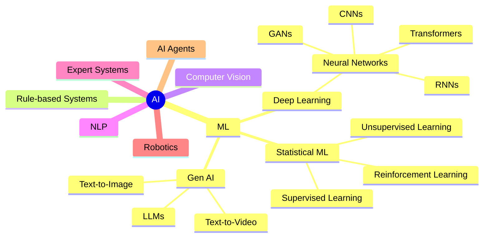

# AI Landscape — Full Taxonomy

> The complete map of AI subfields — where every topic in this repo fits.

## Where This Repo Covers Each Area

| Area | Sections in This Repo |
|---|---|
| **Statistical ML** | [01 Math](../01_Math_for_AI/) · [02 ML Foundations](../02_Machine_Learning_Foundations/) · [03 Classical ML](../03_Classical_ML_Algorithms/) |
| **Neural Networks / Deep Learning** | [04 Neural Networks](../04_Neural_Networks_and_Deep_Learning/) · [05 NLP](../05_NLP_Foundations/) |
| **Transformers** | [06 Transformers](../06_Transformers/) |
| **LLMs / Gen AI** | [07 LLMs](../07_Large_Language_Models/) · [08 LLM Applications](../08_LLM_Applications/) |
| **Text-to-Image** | [16 Diffusion Models](../16_Diffusion_Models/) |
| **Computer Vision / Multimodal** | [17 Multimodal AI](../17_Multimodal_AI/) |
| **AI Agents** | [10 AI Agents](../10_AI_Agents/) · [11 MCP](../11_MCP_Model_Context_Protocol/) · [15 LangGraph](../15_LangGraph/) |
| **Reinforcement Learning** | [19 Reinforcement Learning](../19_Reinforcement_Learning/) |
| **Production / MLOps** | [12 Production AI](../12_Production_AI/) · [13 System Design](../13_AI_System_Design/) |

---

## 📂 Navigation

⬅️ **Back to:** [Learning Guide](./Readme.md)
