# Learning Path

The full zero-to-production AI learning path. Follow this order — each section builds on the last.

---

## The Path

```mermaid
flowchart TD
    A[01 Math for AI\nProbability · Statistics · Linear Algebra] --> B
    B[02 ML Foundations\nGradient Descent · Loss Functions · Eval] --> C
    C[03 Classical ML Algorithms\nRegression · Trees · SVM · K-Means · PCA] --> D
    D[04 Neural Networks\nPerceptron · MLPs · CNNs · RNNs · GANs] --> E
    E[05 NLP Foundations\nTokenization · Embeddings · Similarity] --> F
    F[06 Transformers\nAttention · Self-Attention · BERT · GPT] --> G
    G[07 Large Language Models\nPretraining · Fine-tuning · RLHF · APIs] --> H
    H[08 LLM Applications\nPrompt Engineering · Tool Calling · Vector DBs] --> I
    I[09 RAG Systems\nChunking · Retrieval · Reranking · Evaluation] --> J
    J[10 AI Agents\nReAct · Tool Use · Memory · Multi-Agent] --> K
    K[11 MCP Protocol\nArchitecture · Building Servers · Ecosystem] --> L
    L[12 Production AI\nServing · Latency · Cost · Observability] --> M
    M[13 AI System Design\nBlueprints · Case Studies · Interview Prep] --> N
    N[14 Hugging Face Ecosystem\nTransformers · PEFT · LoRA · Trainer API] --> O
    O[15 LangGraph\nState Machines · Cycles · Human-in-Loop] --> P
    P[16 Diffusion Models\nDDPM · Stable Diffusion · ControlNet] --> Q
    Q[17 Multimodal AI\nCLIP · Vision APIs · Audio · Speech] --> R
    R[18 AI Evaluation\nBenchmarks · LLM-as-Judge · Red Teaming] --> S
    S[19 Reinforcement Learning\nMDPs · Q-Learning · PPO · RLHF]
```

---

## Section Summaries

| # | Section | What you learn | Links |
|---|---|---|---|
| 01 | [Math for AI](../01_Math_for_AI/Readme.md) | Probability, statistics, linear algebra, calculus | [📖 Readme](../01_Math_for_AI/Readme.md) |
| 02 | [ML Foundations](../02_Machine_Learning_Foundations/Readme.md) | How models learn, training vs inference, loss, gradient descent | [📖 Readme](../02_Machine_Learning_Foundations/Readme.md) |
| 03 | [Classical ML](../03_Classical_ML_Algorithms/Readme.md) | Regression, trees, SVMs, clustering, PCA | [📖 Readme](../03_Classical_ML_Algorithms/Readme.md) |
| 04 | [Neural Networks](../04_Neural_Networks_and_Deep_Learning/Readme.md) | Perceptrons to CNNs, RNNs, GANs, backprop | [📖 Readme](../04_Neural_Networks_and_Deep_Learning/Readme.md) |
| 05 | [NLP Foundations](../05_NLP_Foundations/Readme.md) | Tokenization, embeddings, semantic similarity | [📖 Readme](../05_NLP_Foundations/Readme.md) |
| 06 | [Transformers](../06_Transformers/Readme.md) | Attention, BERT, GPT, vision transformers | [📖 Readme](../06_Transformers/Readme.md) |
| 07 | [Large Language Models](../07_Large_Language_Models/Readme.md) | Pretraining, fine-tuning, RLHF, APIs | [📖 Readme](../07_Large_Language_Models/Readme.md) |
| 08 | [LLM Applications](../08_LLM_Applications/Readme.md) | Prompting, tool calling, vector DBs, streaming | [📖 Readme](../08_LLM_Applications/Readme.md) |
| 09 | [RAG Systems](../09_RAG_Systems/Readme.md) | Full pipeline: ingest → chunk → embed → retrieve → generate | [📖 Readme](../09_RAG_Systems/Readme.md) |
| 10 | [AI Agents](../10_AI_Agents/Readme.md) | ReAct, tool use, planning, multi-agent systems | [📖 Readme](../10_AI_Agents/Readme.md) |
| 11 | [MCP Protocol](../11_MCP_Model_Context_Protocol/Readme.md) | Model Context Protocol — standard for AI tools | [📖 Readme](../11_MCP_Model_Context_Protocol/Readme.md) |
| 12 | [Production AI](../12_Production_AI/Readme.md) | Serving, latency, cost, observability, safety | [📖 Readme](../12_Production_AI/Readme.md) |
| 13 | [AI System Design](../13_AI_System_Design/Readme.md) | Full blueprints for real AI systems | [📖 Readme](../13_AI_System_Design/Readme.md) |
| 14 | [Hugging Face Ecosystem](../14_Hugging_Face_Ecosystem/Readme.md) | Hub, Transformers library, PEFT, LoRA, Trainer API | [📖 Readme](../14_Hugging_Face_Ecosystem/Readme.md) |
| 15 | [LangGraph](../15_LangGraph/Readme.md) | Graph-based agents with state, cycles, human-in-the-loop | [📖 Readme](../15_LangGraph/Readme.md) |
| 16 | [Diffusion Models](../16_Diffusion_Models/Readme.md) | DDPM, Stable Diffusion, ControlNet, guidance | [📖 Readme](../16_Diffusion_Models/Readme.md) |
| 17 | [Multimodal AI](../17_Multimodal_AI/Readme.md) | CLIP, vision-language models, vision APIs, speech | [📖 Readme](../17_Multimodal_AI/Readme.md) |
| 18 | [AI Evaluation](../18_AI_Evaluation/Readme.md) | Benchmarks, LLM-as-judge, RAGAS, red teaming | [📖 Readme](../18_AI_Evaluation/Readme.md) |
| 19 | [Reinforcement Learning](../19_Reinforcement_Learning/Readme.md) | MDPs, Q-learning, DQN, PPO, connecting to RLHF | [📖 Readme](../19_Reinforcement_Learning/Readme.md) |

---

## Time Estimates

| Pace | Time per section | Total |
|---|---|---|
| Fast (read only) | 2–4 hours | ~50 hours |
| Standard (read + exercises) | 4–8 hours | ~100 hours |
| Deep (read + code + projects) | 1–2 weeks | ~4–6 months |

---

## Skill-Based Paths

Want to focus? See the curated paths:

| Path | For | Link |
|---|---|---|
| 🟢 Beginner | New to AI/ML | [01_Beginner_Path.md](./01_Beginner_Path.md) |
| 🟡 Intermediate | Building LLM apps | [02_Intermediate_Path.md](./02_Intermediate_Path.md) |
| 🔴 Advanced | Production-grade AI | [03_Advanced_Path.md](./03_Advanced_Path.md) |

---

## 📂 Navigation

⬅️ **Back to:** [Learning Guide](./Readme.md)
