# Learning Path

The full zero-to-production AI learning path. Follow this order — each section builds on the last.

---

## The Path

```mermaid
flowchart TD
    A[01 Math for AI\nProbability · Statistics · Linear Algebra\nCalculus · Information Theory] --> B
    B[02 ML Foundations\nWhat is ML · Supervised · Unsupervised\nGradient Descent · Loss Functions] --> C
    C[03 Classical ML Algorithms\nLinear/Logistic Regression · Decision Trees\nRandom Forests · SVM · K-Means · PCA] --> D
    D[04 Neural Networks\nPerceptron · MLPs · CNNs · RNNs · GANs\nBackprop · Optimizers · Regularization] --> E
    E[05 NLP Foundations\nTokenization · Embeddings · TF-IDF\nWord2Vec · Semantic Similarity] --> F
    F[06 Transformers\nAttention · Self-Attention · BERT · GPT\nTransformer Architecture] --> G
    G[07 Large Language Models\nPretraining · Fine-tuning · RLHF\nHallucination · Using APIs] --> H
    H[08 LLM Applications\nPrompt Engineering · Tool Calling\nEmbeddings · Vector DBs · Streaming] --> I
    I[09 RAG Systems\nChunking · Retrieval · Reranking\nAdvanced RAG · Evaluation] --> J
    J[10 AI Agents\nReAct · Tool Use · Memory\nPlanning · Multi-Agent] --> K
    K[11 MCP\nProtocol · Architecture · Tools\nBuilding Servers · Ecosystem] --> L
    L[12 Production AI\nServing · Latency · Cost · Caching\nObservability · Guardrails · Scaling] --> M
    M[13 AI System Design\nCustomer Support · RAG Search\nCoding Assistant · Research Agent]
```

---

## Section Summaries

| # | Section | What you learn | Prereqs |
|---|---|---|---|
| 01 | Math for AI | Probability, statistics, linear algebra, calculus — the math behind ML | Basic algebra |
| 02 | ML Foundations | How models learn, training vs inference, supervised/unsupervised, loss, gradient descent | 01 |
| 03 | Classical ML | The core algorithms every ML engineer knows — regression, trees, SVMs, clustering | 02 |
| 04 | Neural Networks | Deep learning — perceptrons to CNNs, RNNs, GANs. How backprop works. | 03 |
| 05 | NLP Foundations | How text becomes numbers — tokenization, embeddings, semantic similarity | 04 |
| 06 | Transformers | The architecture that powers all modern AI — attention, BERT, GPT | 05 |
| 07 | Large Language Models | How LLMs are trained, fine-tuned, aligned, and used | 06 |
| 08 | LLM Applications | Building real things with LLMs — prompting, tools, memory, vector search | 07 |
| 09 | RAG Systems | Grounding LLMs in your own data — full pipeline from ingestion to evaluation | 08 |
| 10 | AI Agents | Autonomous AI — ReAct, tool use, planning, multi-agent systems | 08, 09 |
| 11 | MCP | Model Context Protocol — the standard for connecting AI to tools | 10 |
| 12 | Production AI | Deploying AI at scale — serving, cost, latency, observability, safety | All above |
| 13 | AI System Design | Real system design case studies — tie everything together | All above |

---

## Time Estimates

| Pace | Time per section | Total |
|---|---|---|
| Fast (read only) | 2–4 hours | ~40 hours |
| Standard (read + exercises) | 4–8 hours | ~80 hours |
| Deep (read + code + projects) | 1–2 weeks | ~3–6 months |

---

## 📂 Navigation

⬅️ **Back to:** [Learning Guide](./Readme.md)
