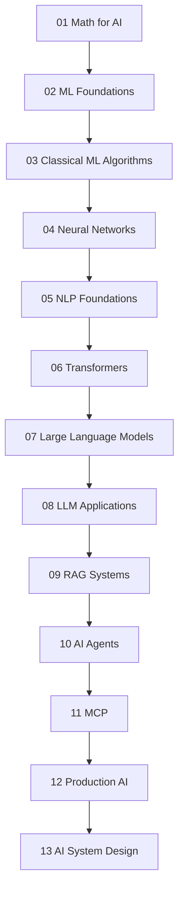

# AI Knowledge Base — Start Here

No fluff. No overwhelm. Every concept explained with a story first, then the technical detail.

---

## How Every Topic Is Structured

Each topic folder has 3 files:

| File | What it is |
|---|---|
| `Theory.md` | The full explanation — story, diagrams, how it works |
| `Cheatsheet.md` | One-page quick reference |
| `Interview_QA.md` | Questions you'll actually get asked |

Every `Theory.md` ends with:
```
✅ What you just learned
🔨 Build this now (tiny hands-on task)
➡️ Next step
```

---

## The Learning Path (Follow This Order)



---

## One Rule

Don't skim. Read the story. Let the analogy land. Then read the technical part.

One topic understood properly beats five topics half-read.

---

## 📂 Navigation

⬅️ **Start of the repo** &nbsp;&nbsp;&nbsp; ➡️ **Next section:** [01 Math for AI](../01_Math_for_AI/Readme.md)
