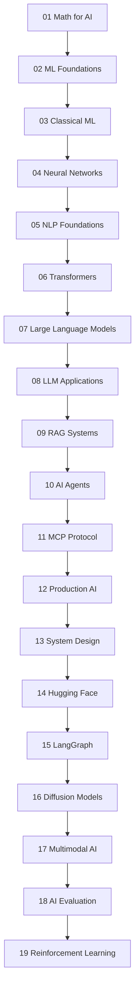

# AI Knowledge Base — Start Here

No fluff. No overwhelm. Every concept explained with a story first, then the technical detail.

---

## Choose Your Path

| Path | For | Topics | Time | Link |
|---|---|---|---|---|
| 🟢 Beginner | New to AI/ML | 30 topics | ~40–60h | [Start Beginner Path](./01_Beginner_Path.md) |
| 🟡 Intermediate | Building LLM apps | 32 topics | ~50–70h | [Start Intermediate Path](./02_Intermediate_Path.md) |
| 🔴 Advanced | Production-grade AI | 45 topics | ~60–80h | [Start Advanced Path](./03_Advanced_Path.md) |
| 🛠️ Projects | Practice by building | 15 projects | Build as you learn | [Browse Projects](../20_Projects/Readme.md) |

---

## How Every Topic Is Structured

Each topic folder has 3 core files:

| File | What it is |
|---|---|
| `Theory.md` | The full explanation — story, diagrams, how it works |
| `Cheatsheet.md` | One-page quick reference |
| `Interview_QA.md` | Questions you'll actually get asked |

Every `Theory.md` ends with:
```
✅ What you just learned
🔨 Build this now (tiny hands-on task)
➡️ Next step
```

---

## The Full Learning Path (20 Sections)



---

## One Rule

Don't skim. Read the story. Let the analogy land. Then read the technical part.

One topic understood properly beats five topics half-read.

---

## 📂 Files in This Folder

| File | Purpose |
|---|---|
| [🟢 01_Beginner_Path.md](./01_Beginner_Path.md) | Beginner learning path — 30 topics |
| [🟡 02_Intermediate_Path.md](./02_Intermediate_Path.md) | Intermediate learning path — 32 topics |
| [🔴 03_Advanced_Path.md](./03_Advanced_Path.md) | Advanced learning path — 45 topics |
| [🗺️ Learning_Path.md](./Learning_Path.md) | Full linear path through all 20 sections |
| [✅ Progress_Tracker.md](./Progress_Tracker.md) | Track every topic you complete |
| [📖 How_to_Use_This_Repo.md](./How_to_Use_This_Repo.md) | Tips for getting the most out of this repo |
| [🗺️ AI_Landscape_Map.md](./AI_Landscape_Map.md) | Full AI field taxonomy — where every topic fits |

⬅️ **Start of the repo** &nbsp;&nbsp;&nbsp; ➡️ **Next section:** [01 Math for AI](../01_Math_for_AI/Readme.md)
