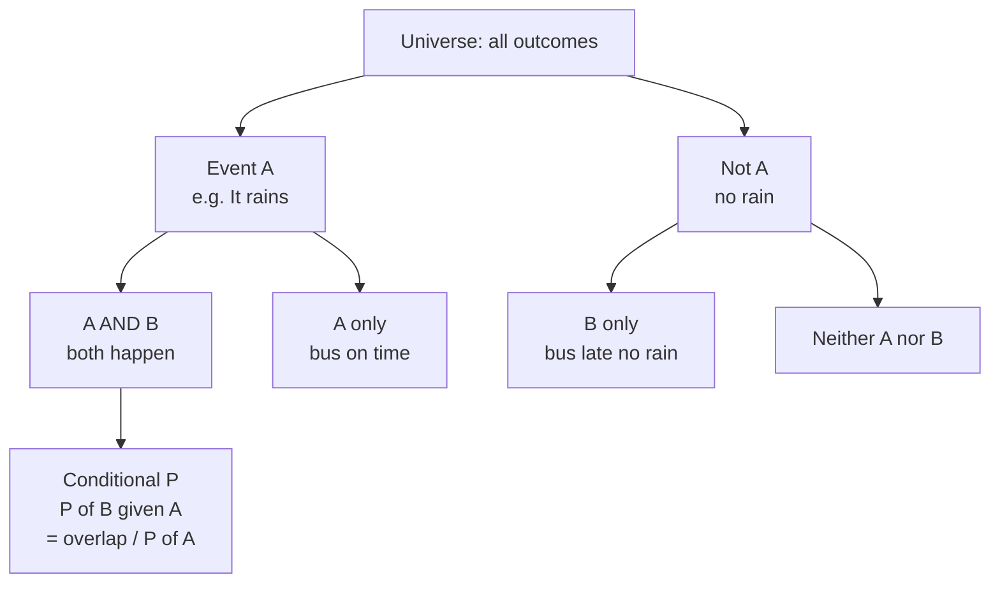
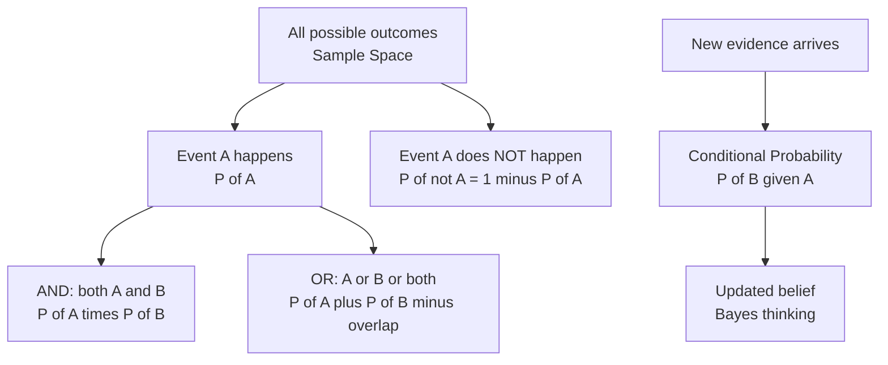

# Probability — Theory

You check the weather app before leaving home. It says "70% chance of rain." You grab an umbrella. Later, your bus is 10 minutes late — again. You start wondering: "What are the chances my bus is late on any given day?" You've been doing probability your whole life without realizing it.

👉 This is why we need **Probability** — AI makes predictions, and predictions are always about what's likely, not what's certain.

---

## What Is Probability?

Probability is a number between 0 and 1 measuring how likely something is to happen.

- **0** = impossible (you roll a 7 on a standard die)
- **1** = certain (the sun rises tomorrow)
- **0.5** = 50/50 (a fair coin flip)
- **0.7** = 70% likely (weather app saying rain)

---

## Basic Vocabulary

| Term | Meaning | Example |
|---|---|---|
| **Event** | Something that can happen | Rolling a 6 |
| **Outcome** | A single result | Getting heads on a coin |
| **Sample space** | All possible outcomes | {1, 2, 3, 4, 5, 6} for a die |
| **P(A)** | Probability of event A | P(rolling a 6) = 1/6 |

---

## The AND Rule (Both happen)

"What's the chance it rains AND my bus is late?"

If the two events are **independent** (one doesn't affect the other):

```
P(A and B) = P(A) × P(B)
```

Example: P(rain) = 0.7, P(bus late) = 0.3
P(rain AND bus late) = 0.7 × 0.3 = 0.21 → about 1 in 5 days

---

## The OR Rule (At least one happens)

"What's the chance it rains OR my bus is late (or both)?"

```
P(A or B) = P(A) + P(B) − P(A and B)
```

Subtract the overlap to avoid counting it twice. P(rain OR bus late) = 0.7 + 0.3 − 0.21 = 0.79

---

## The Complement Rule (What DOESN'T happen)

"What's the chance my bus is NOT late?"

```
P(not A) = 1 − P(A)
```

P(bus NOT late) = 1 − 0.3 = 0.7. Sometimes it's easier to calculate the opposite and subtract.

---

## Conditional Probability (Given that something already happened)

"It's raining. NOW what's the chance my bus is late?" New information changes our estimate.

```
P(B | A) = P(A and B) / P(A)
```

Read "P(B | A)" as: "probability of B, given A already happened." Real example: P(spam | email contains "FREE MONEY") is much higher than P(spam) alone — the word is new evidence.



---

## Visualizing It



---

## Why AI Cares

Every AI model that makes a prediction is doing probability:

- A spam filter: "95% chance this is spam."
- A self-driving car: "12% chance that blob is a pedestrian."
- A language model: "The next word is 40% likely to be 'the'."

None of these are certainties — they're probabilities.

---

✅ **What you just learned:** Probability gives us a number from 0 to 1 to measure how likely any event is, and the AND/OR/complement/conditional rules let us combine those numbers logically.

🔨 **Build this now:** Pick three things that might happen tomorrow (your alarm going off on time, your wifi being slow, it being sunny). Estimate a probability for each. Then use the AND rule to find the chance all three happen at once.

➡️ **Next step:** Statistics — `01_Math_for_AI/02_Statistics/Theory.md`

---

## 🛠️ Practice Project

Apply what you just learned → **[B1: Data & Probability Explorer](../../22_Capstone_Projects/01_Data_and_Probability_Explorer/03_GUIDE.md)**
> This project uses: sample space, P(A|B), AND/OR rules, conditional probability on a real dataset


---

## 📝 Practice Questions

- 📝 [Q1 · probability-basics](../../ai_practice_questions_100.md#q1--normal--probability-basics)
- 📝 [Q2 · bayes-theorem](../../ai_practice_questions_100.md#q2--normal--bayes-theorem)


---

## 📂 Navigation

**In this folder:**
| File | |
|---|---|
| 📄 **Theory.md** | ← you are here |
| [📄 Cheatsheet.md](./Cheatsheet.md) | Quick reference |
| [📄 Interview_QA.md](./Interview_QA.md) | Interview prep |
| [📄 Intuition_First.md](./Intuition_First.md) | No-formula intuition primer |
| [📄 Mini_Exercise.md](./Mini_Exercise.md) | Practice exercises |

⬅️ **Prev:** [00 Learning Guide](../../00_Learning_Guide/Readme.md) &nbsp;&nbsp;&nbsp; ➡️ **Next:** [02 Statistics](../02_Statistics/Theory.md)
