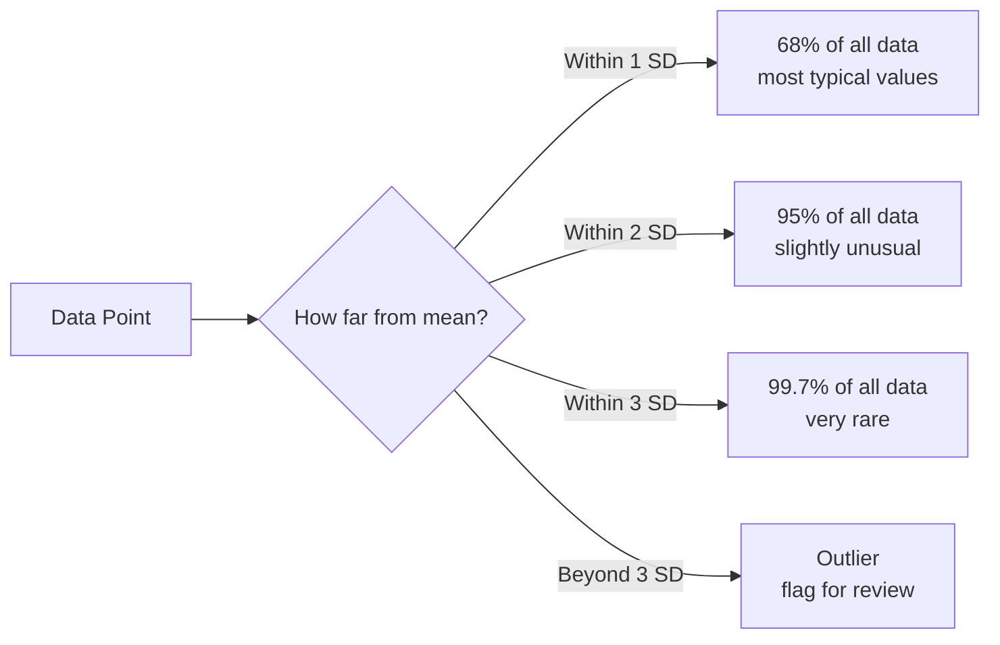
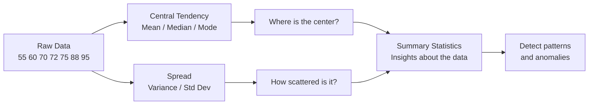

# Statistics — Theory

Ms. Chen just finished grading 30 exams. She spreads them on her desk. One score is 98. One is 42. Most are somewhere in the middle. She thinks: "What's the typical score? Are these scores spread out or bunched together? Are there more high scores or low scores?" She needs to summarize 30 numbers into a few key facts.

👉 This is why we need **Statistics** — to turn a pile of raw numbers into useful, understandable insights.

---

## From Raw Data to Insight

These 7 exam scores: **55, 60, 70, 72, 75, 88, 95** — statistics gives us tools to summarize them.

---

## Mean — The "Average"

Add them all up and divide by how many there are.

```
Mean = (55 + 60 + 70 + 72 + 75 + 88 + 95) / 7
     = 515 / 7
     ≈ 73.6
```

The mean is the "center of gravity" of the data. **Problem:** one extreme value destroys it. If one student scored 5 instead of 55, the mean drops a lot — a single outlier makes it misleading.

---

## Median — The Middle Value

Sort the numbers. Find the one in the middle.

Sorted: 55, 60, 70, **72**, 75, 88, 95

The median is **72**. Three numbers below it, three above it.

The median doesn't care about extreme values. A billionaire moving into a neighborhood raises mean income hugely — barely moves the median. That's why median income is often more useful.

---

## Mode — The Most Common Value

The mode is the value that appears most often.

In scores: 55, 60, 70, 72, 75, 88, 95 — each appears once, so there's no mode here.

New example: 70, 72, 72, 75, 75, 75, 88

The mode is **75** — it appears 3 times.

Useful when you want to know "what's the most popular result?"

---

## Variance — How Spread Out Is the Data?

The mean tells you where the center is. Variance tells you how far data points scatter from it.

1. Find the mean (say 73.6)
2. For each score, find the distance from the mean
3. Square those distances (so negatives don't cancel)
4. Average the squared distances

```
Variance = average of (each value - mean)²
```

High variance = scores are all over the place. Low variance = tightly clustered.

---

## Standard Deviation — Variance in Plain Units

Variance uses squared units, which is awkward. Take the square root to get standard deviation (SD).

```
Standard Deviation = √Variance
```

If the mean is 73.6 and SD is 12, most scores are within 12 points of 73.6 — between about 62 and 86. **SD is the most useful measure of spread** because it's in the same units as your data.

---

## The Normal Distribution

When data clusters naturally around an average, it forms a bell curve — the **normal distribution**:

- Most values cluster near the mean
- Fewer values further away
- Symmetric curve

```
              |
         *    |    *
       *      |      *
     *        |        *
   *          |          *
  *           |           *
 _____________|_____________
      -2SD  -1SD  mean  +1SD  +2SD
```

In a normal distribution:
- ~68% of data falls within 1 SD of the mean
- ~95% falls within 2 SDs
- ~99.7% falls within 3 SDs

This is called the **68-95-99.7 rule**. An AI model trained on normally distributed data behaves very predictably.



---

## Visualizing the Pipeline



---

## Why AI Cares

- **Feature scaling:** subtract the mean, divide by SD — called normalization
- **Model evaluation:** accuracy, precision, recall are statistical measures
- **Detecting outliers:** data points more than 3 SDs from the mean are suspicious
- **Comparing models:** is model A actually better, or just got lucky on this dataset?

---

✅ **What you just learned:** Statistics gives you tools — mean, median, mode, variance, and standard deviation — to summarize and understand large collections of numbers.

🔨 **Build this now:** Take any 5 numbers (your 5 most recent grades, temperatures, or prices). Calculate the mean by hand. Then calculate the median. Are they different? What does that difference tell you?

➡️ **Next step:** Linear Algebra — `01_Math_for_AI/03_Linear_Algebra/Theory.md`

---

## 🛠️ Practice Project

Apply what you just learned → **[B1: Data & Probability Explorer](../../22_Capstone_Projects/01_Data_and_Probability_Explorer/03_GUIDE.md)**
> This project uses: mean, variance, standard deviation, distributions, descriptive statistics on real data

---

## 📂 Navigation

**In this folder:**
| File | |
|---|---|
| 📄 **Theory.md** | ← you are here |
| [📄 Cheatsheet.md](./Cheatsheet.md) | Quick reference |
| [📄 Interview_QA.md](./Interview_QA.md) | Interview prep |
| [📄 Intuition_First.md](./Intuition_First.md) | No-formula intuition primer |
| [📄 Mini_Exercise.md](./Mini_Exercise.md) | Practice exercises |

⬅️ **Prev:** [01 Probability](../01_Probability/Theory.md) &nbsp;&nbsp;&nbsp; ➡️ **Next:** [03 Linear Algebra](../03_Linear_Algebra/Theory.md)
