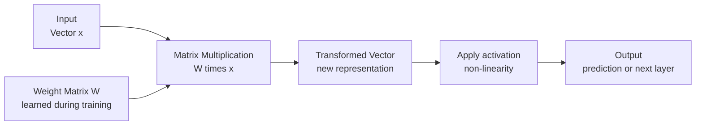

# Linear Algebra — Theory

Your phone's GPS knows exactly where you are. It describes your location as two numbers: latitude and longitude. For example: (37.7749, -122.4194). That pair of numbers IS your location. Change one number and you move. The whole world can be described this way — as lists of numbers. A vector is just that: a list of numbers that points somewhere.

👉 This is why we need **Linear Algebra** — AI stores everything (words, images, users, preferences) as lists of numbers, and linear algebra is the math for working with those lists.

---

## What Is a Vector?

A vector is an ordered list of numbers.

```
v = [3, 5]        ← a 2D vector (a point on a map)
v = [0.2, 0.8, 0.1, 0.5]   ← a 4D vector (maybe probabilities for 4 categories)
v = [300 numbers]  ← a word embedding in an NLP model
```

Think of each number as describing one "dimension" or "feature."

- A location: [latitude, longitude]
- A color: [red, green, blue] — that's [255, 128, 0] for orange
- A word: [0.2, -0.7, 0.5, 0.3, ...] — hundreds of numbers capturing its meaning

Vectors let us represent anything as a point in space.

---

## Vector Addition and Scaling

You can add two vectors by adding matching numbers:

```
[1, 2] + [3, 4] = [4, 6]
```

You can scale a vector by multiplying all numbers by a constant:

```
2 × [1, 2] = [2, 4]    ← same direction, twice as long
```

These operations let you combine features, adjust magnitudes, and move through space.

---

## The Dot Product — Measuring Similarity

The dot product of two vectors multiplies matching numbers and adds them all up:

```
[1, 2, 3] · [4, 5, 6] = (1×4) + (2×5) + (3×6) = 4 + 10 + 18 = 32
```

What does this number mean? It measures how much the two vectors point in the same direction.

- **Large positive dot product:** the vectors point roughly the same way (similar)
- **Near zero:** the vectors are perpendicular (unrelated)
- **Negative:** the vectors point in opposite directions (dissimilar)

This is exactly how recommendation systems work. Your preference vector and a movie's feature vector — if their dot product is high, you'll probably like the movie.

---

## What Is a Matrix?

A matrix is a rectangular grid of numbers — like a spreadsheet.

```
A = | 1  2  3 |
    | 4  5  6 |
```

This is a 2×3 matrix (2 rows, 3 columns).

A matrix can represent:
- A dataset (rows = examples, columns = features)
- A transformation (rotating, stretching, flipping space)
- A set of weights in a neural network layer

---

## Matrix Multiplication — A Transformation

Multiplying a matrix times a vector transforms the vector into a new vector.

```
| 2  0 |   | 3 |   | 6 |
| 0  3 | × | 1 | = | 3 |
```

The matrix stretched the x-axis by 2 and the y-axis by 3. The point (3,1) moved to (6,3).

Every layer of a neural network is exactly this — a matrix multiplication. The weights of the layer form the matrix. Your data is the vector. The output is a transformed vector, ready for the next layer.

---

## Visualizing the Flow



---

## Why AI Needs This

Every operation in a neural network is linear algebra:

| AI Operation | Linear Algebra |
|---|---|
| Store a word's meaning | Word embedding vector |
| Feed data through a layer | Matrix × vector |
| Compare two sentences for similarity | Dot product |
| Rotate/scale data features | Matrix transformation |
| Find patterns in data | Eigendecomposition / SVD |

When you hear "this model has 175 billion parameters," those are all entries in massive matrices and vectors. Training a model means finding the right numbers to fill those matrices.

---

✅ **What you just learned:** Vectors are lists of numbers that represent things in AI, matrices are grids that transform vectors, dot products measure similarity, and every neural network layer is fundamentally a matrix multiplication.

🔨 **Build this now:** Pick two things you could rate 1-5: (1) how much you like them, (2) how healthy they are. Rate 3 foods using these two features. Each food is now a 2D vector like [taste, healthiness]. Which two foods have the most similar vectors?

➡️ **Next step:** Calculus and Optimization — `01_Math_for_AI/04_Calculus_and_Optimization/Theory.md`

---

## 📂 Navigation

**In this folder:**
| File | |
|---|---|
| 📄 **Theory.md** | ← you are here |
| [📄 Cheatsheet.md](./Cheatsheet.md) | Quick reference |
| [📄 Interview_QA.md](./Interview_QA.md) | Interview prep |
| [📄 Intuition_First.md](./Intuition_First.md) | No-formula intuition primer |
| [📄 Vectors_and_Matrices.md](./Vectors_and_Matrices.md) | Visual reference for vectors and matrices |

⬅️ **Prev:** [02 Statistics](../02_Statistics/Theory.md) &nbsp;&nbsp;&nbsp; ➡️ **Next:** [04 Calculus and Optimization](../04_Calculus_and_Optimization/Theory.md)
