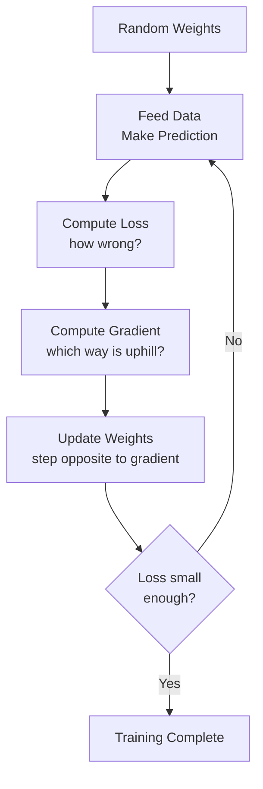
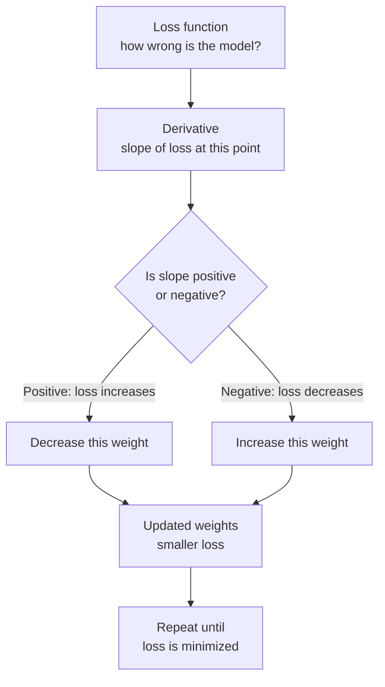

# Calculus and Optimization — Theory

You step into the shower. The water is freezing. You turn the dial a little to the right — warmer. A little more — perfect. Then you overshoot — too hot. You turn back slightly. Left, right, left, smaller adjustments each time until you land on exactly the right temperature. You found the optimum without knowing any formula. You just followed the feedback.

👉 This is why we need **Calculus and Optimization** — training an AI is exactly this process: adjusting numbers by following feedback, step by step, until the model's error is as small as possible.

---

## 📌 Learning Priority

**Must Learn** — core concepts, needed to understand the rest of this file:
[What Is a Derivative](#what-is-a-derivative) · [Gradient Descent](#gradient-descent--the-core-algorithm) · [Gradient](#gradient--multi-dimensional-derivative)

**Should Learn** — important for real projects and interviews:
[Why AI Needs Derivatives](#why-ai-needs-derivatives) · [Chain Rule](#the-chain-rule--how-backpropagation-works)

**Good to Know** — useful in specific situations, not needed daily:
[Local vs Global Minimum](#local-vs-global-minimum)

**Reference** — skim once, look up when needed:
[Visualizing the Flow](#visualizing-the-flow)

---

## What Is a Derivative?

A derivative measures how fast something is changing — it's the slope of a function at a point.

- **Positive slope:** going uphill — f(x) increases as x increases
- **Negative slope:** going downhill — f(x) decreases as x increases
- **Zero slope:** flat top or bottom — where the minimum or maximum lives

---

## Why AI Needs Derivatives

An AI model has a **loss function** — a measure of how wrong the model is. The loss depends on the model's weights. The derivative of the loss with respect to a weight tells you which direction to change that weight to reduce loss: if derivative is positive, decrease the weight; if negative, increase it.

Moving opposite to the derivative is called **gradient descent**.

---

## Gradient = Multi-Dimensional Derivative

A neural network has millions of weights. The **gradient** is the collection of all partial derivatives — one for every weight:

```
gradient = [∂loss/∂w1, ∂loss/∂w2, ∂loss/∂w3, ...]
```

Each number says: "if you increase this weight by a tiny amount, the loss changes by this much." The gradient points in the direction of steepest increase in loss — moving opposite decreases it most efficiently.

---

## Gradient Descent — The Core Algorithm

```
1. Start with random weights
2. Feed data through the model → get a prediction
3. Calculate the loss (how wrong was the prediction?)
4. Calculate the gradient (which direction increases loss?)
5. Update each weight: weight = weight - (learning_rate × gradient)
6. Repeat from step 2 until loss is small enough
```

The **learning rate** controls how big each step is. Too big and you overshoot. Too small and training takes forever. It's the shower dial again.



---

## The Chain Rule — How Backpropagation Works

To find the gradient of the loss with respect to the first layer's weights, you "chain" derivatives through every layer back to the beginning:

```
if y depends on x through an intermediate z,
then dy/dx = (dy/dz) × (dz/dx)
```

Backpropagation is just applying the chain rule repeatedly, layer by layer, from output back to input — hence "back" propagation.

---

## Visualizing the Flow



---

## Local vs. Global Minimum

Gradient descent might find a local minimum (a small valley) instead of the global minimum (the deepest valley). In practice with deep learning, local minima are rarely a big problem — the high-dimensional loss landscape has so many dimensions that most flat regions are saddle points, and large models find good-enough solutions.

---

✅ **What you just learned:** Derivatives measure how fast a function changes (its slope), gradients extend this to many dimensions at once, and gradient descent uses gradients to minimize the loss function step by step — which is how every neural network learns.

🔨 **Build this now:** Think of any bowl-shaped hill or valley you know. Mentally place a ball anywhere on the rim. Which direction does it roll? That's gradient descent. Now think: what if the bowl has a smaller divot near the rim? That's a local minimum trap. Where would a ball get stuck?

➡️ **Next step:** Information Theory — `01_Math_for_AI/05_Information_Theory/Theory.md`

---

## 📂 Navigation

**In this folder:**
| File | |
|---|---|
| 📄 **Theory.md** | ← you are here |
| [📄 Cheatsheet.md](./Cheatsheet.md) | Quick reference |
| [📄 Interview_QA.md](./Interview_QA.md) | Interview prep |
| [📄 Intuition_First.md](./Intuition_First.md) | No-formula intuition primer |
| [📄 Gradient_Intuition.md](./Gradient_Intuition.md) | Visual gradient intuition guide |

⬅️ **Prev:** [03 Linear Algebra](../03_Linear_Algebra/Theory.md) &nbsp;&nbsp;&nbsp; ➡️ **Next:** [05 Information Theory](../05_Information_Theory/Theory.md)
