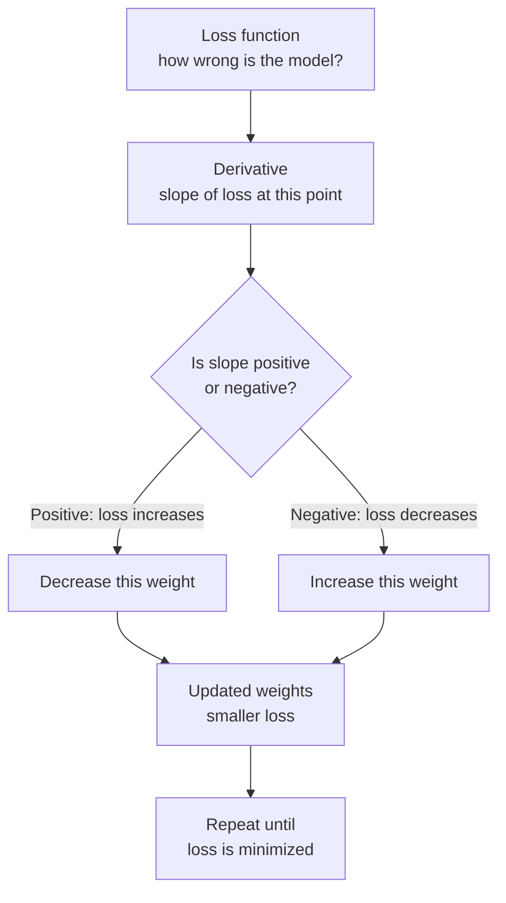

# Calculus and Optimization — Theory

You step into the shower. The water is freezing. You turn the dial a little to the right — warmer. A little more — perfect. Then you overshoot — too hot. You turn back slightly. Left, right, left, smaller adjustments each time until you land on exactly the right temperature. You found the optimum without knowing any formula. You just followed the feedback.

👉 This is why we need **Calculus and Optimization** — training an AI is exactly this process: adjusting numbers by following feedback, step by step, until the model's error is as small as possible.

---

## What Is a Derivative?

A derivative measures how fast something is changing.

You're driving on a highway. Your position changes over time. The derivative of your position is your speed — it tells you how fast your position is changing right now.

In math terms: if you have a function f(x), the derivative f'(x) tells you the slope of that function at point x.

- **Positive slope:** going uphill — f(x) increases as x increases
- **Negative slope:** going downhill — f(x) decreases as x increases
- **Zero slope:** flat at the top or bottom — this is often where the minimum or maximum lives

That's it. A derivative is the slope of a curve at a point.

---

## Why AI Needs Derivatives

An AI model has a **loss function** — a measure of how wrong the model is. When loss is high, predictions are bad. We want the loss to be as small as possible.

The loss depends on the model's weights (parameters). Change the weights, and the loss changes. The question is: **which direction should we change each weight to reduce the loss?**

The derivative answers this exactly. If the derivative of the loss with respect to a weight is positive, increasing that weight increases the loss (bad). So we should decrease it. If the derivative is negative, we should increase the weight.

We always move in the direction opposite to the derivative. This is called **gradient descent**.

---

## Gradient = Multi-Dimensional Derivative

A neural network has millions of weights. Each one is a different "dial" you can turn. The derivative with respect to just one weight tells you how to adjust that one dial.

The **gradient** is the collection of all these partial derivatives — one for every weight in the model.

```
gradient = [∂loss/∂w1, ∂loss/∂w2, ∂loss/∂w3, ...]
```

Each number says: "if you increase this particular weight by a tiny amount, the loss changes by this much."

The gradient vector points in the direction of steepest increase in loss. Moving in the opposite direction decreases the loss most efficiently.

---

## Gradient Descent — The Core Algorithm

```
1. Start with random weights
2. Feed data through the model → get a prediction
3. Calculate the loss (how wrong was the prediction?)
4. Calculate the gradient (which direction increases loss?)
5. Update each weight: weight = weight - (learning_rate × gradient)
6. Repeat from step 2 until loss is small enough
```

The **learning rate** controls how big each step is. Too big and you overshoot. Too small and training takes forever. Sound familiar? It's just the shower dial again.

---

## The Chain Rule — How Backpropagation Works

Neural networks have many layers. To find the gradient of the loss with respect to the first layer's weights, you need to "chain" the derivatives through every layer back to the beginning.

The **chain rule** says:
```
if y depends on x through an intermediate z,
then dy/dx = (dy/dz) × (dz/dx)
```

Backpropagation is just applying the chain rule repeatedly, layer by layer, from the output back to the input. That's why it's called "back" propagation — gradients flow backwards through the network.

---

## Visualizing the Flow



---

## Local vs. Global Minimum

One trap: gradient descent might find a local minimum (a small valley) instead of the global minimum (the deepest valley). From a local minimum, every small step uphill — so the algorithm stops. But there might be a better solution elsewhere.

In practice with deep learning, local minima are rarely a big problem. The loss landscape has so many dimensions that most flat regions are saddle points (flat in some directions but not others), and large models have enough complexity to find good-enough solutions.

---

✅ **What you just learned:** Derivatives measure how fast a function changes (its slope), gradients extend this to many dimensions at once, and gradient descent uses gradients to minimize the loss function step by step — which is how every neural network learns.

🔨 **Build this now:** Think of any bowl-shaped hill or valley you know. Mentally place a ball anywhere on the rim. Which direction does it roll? That's gradient descent. Now think: what if the bowl has a smaller divot near the rim? That's a local minimum trap. Where would a ball get stuck?

➡️ **Next step:** Information Theory — `01_Math_for_AI/05_Information_Theory/Theory.md`

---

## 📂 Navigation

**In this folder:**
| File | |
|---|---|
| 📄 **Theory.md** | ← you are here |
| [📄 Cheatsheet.md](./Cheatsheet.md) | Quick reference |
| [📄 Interview_QA.md](./Interview_QA.md) | Interview prep |
| [📄 Intuition_First.md](./Intuition_First.md) | No-formula intuition primer |
| [📄 Gradient_Intuition.md](./Gradient_Intuition.md) | Visual gradient intuition guide |

⬅️ **Prev:** [03 Linear Algebra](../03_Linear_Algebra/Theory.md) &nbsp;&nbsp;&nbsp; ➡️ **Next:** [05 Information Theory](../05_Information_Theory/Theory.md)
