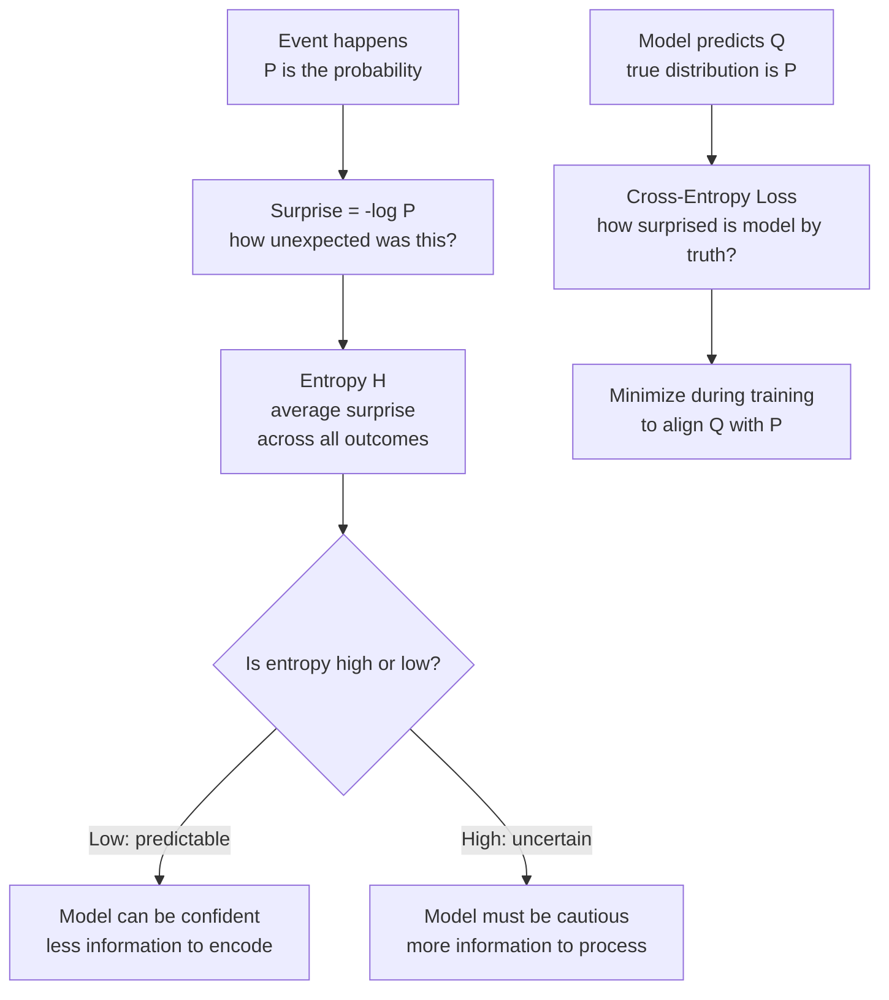

# Information Theory — Theory

Imagine two weather forecasters. Forecaster A works in the Sahara Desert and predicts: "It'll be sunny tomorrow." Nobody is surprised. It's almost always sunny there. Forecaster B works in London and predicts: "It'll snow in July." Everyone is shocked. That almost never happens. Both forecasters made one prediction — but one carried almost no information while the other carried a lot.

👉 This is why we need **Information Theory** — to mathematically measure surprise, uncertainty, and how much "information" a message actually carries. This connects directly to how AI measures its own prediction errors.

---

## 📌 Learning Priority

**Must Learn** — core concepts, needed to understand the rest of this file:
[What Is Information](#what-is-information) · [Entropy](#entropy--average-surprise) · [Cross-Entropy](#cross-entropy--comparing-two-distributions)

**Should Learn** — important for real projects and interviews:
[KL Divergence](#kl-divergence--how-different-are-two-distributions) · [Why This Matters for AI](#why-this-matters-for-ai)

**Good to Know** — useful in specific situations, not needed daily:
[The Information Flow](#the-information-flow)

**Reference** — skim once, look up when needed:
[Why This Matters for AI](#why-this-matters-for-ai)

---

## What Is Information?

Claude Shannon (1948) asked: can we measure information like we measure weight or temperature? His answer: the information in an event is related to how surprising it is.

- P = 1 (certain): carries **zero** information
- P = 0.5 (coin flip): 1 bit of information
- P = 0.001 (rare): ~10 bits of information

```
Information(event) = -log₂(P(event))
```

If P = 1: 0 bits (no surprise) · If P = 0.5: 1 bit · If P = 0.25: 2 bits · If P = 0.001: ≈10 bits

The rarer the event, the more bits of information it carries.

---

## Entropy — Average Surprise

**Entropy** measures average information across all possible events:

```
H = -Σ P(x) × log₂(P(x))
```

For each possible outcome, weight its surprise by how often it occurs, then average.

- **Low entropy:** bag of 100 red marbles — H = 0 bits. Zero surprise.
- **High entropy:** 50 red + 50 blue — H = 1 bit. Maximum surprise for two outcomes.

---

## Cross-Entropy — Comparing Two Distributions

True distribution is P (reality). Your model predicts Q.

```
H(P, Q) = -Σ P(x) × log₂(Q(x))
```

If Q = P: cross-entropy equals entropy (irreducible minimum). If Q ≠ P: cross-entropy is higher.

**Cross-entropy loss** in ML: model says P(cat) = 0.9, true label is cat → small loss. Model says P(cat) = 0.1, true label is cat → large loss. Training minimizes it.

---

## KL Divergence — How Different Are Two Distributions?

```
KL(P || Q) = Σ P(x) × log(P(x) / Q(x))
```

- KL = 0 when P = Q
- KL > 0 always when P ≠ Q
- NOT symmetric: KL(P || Q) ≠ KL(Q || P)

**Connection:** `H(P,Q) = H(P) + KL(P || Q)` — minimizing cross-entropy is the same as minimizing KL divergence (entropy is fixed for the true distribution).

---

## The Information Flow



---

## Why This Matters for AI

| AI Concept | Information Theory Concept |
|---|---|
| Classification loss | Cross-entropy loss = H(P, Q) |
| How wrong is the model? | KL divergence between prediction and truth |
| Language model next-word prediction | Cross-entropy over vocabulary distribution |
| Model compression | Minimum description length (entropy) |
| Variational Autoencoders (VAE) | KL divergence in the loss function |
| ChatGPT's training objective | Minimize cross-entropy over human-written text |

---

✅ **What you just learned:** Information is measured by surprise (rare events carry more info), entropy is average surprise across a distribution, and cross-entropy loss measures how wrong a model's predicted distribution is compared to reality — which is why it's the most common loss function in AI.

🔨 **Build this now:** Think of a true/false quiz where you know 90% of the answers. Versus one where you know 50%. Which has higher "entropy" from your perspective? Now think: a well-trained AI on familiar data has low entropy in its predictions. An AI asked about something it never saw has high entropy — it's uncertain. Does that match your intuition?

➡️ **Next step:** Machine Learning Foundations — `02_ML_Fundamentals/`


---

## 📝 Practice Questions

- 📝 [Q3 · entropy-information](../../ai_practice_questions_100.md#q3--thinking--entropy-information)


---

## 📂 Navigation

**In this folder:**
| File | |
|---|---|
| 📄 **Theory.md** | ← you are here |
| [📄 Cheatsheet.md](./Cheatsheet.md) | Quick reference |
| [📄 Interview_QA.md](./Interview_QA.md) | Interview prep |
| [📄 Intuition_First.md](./Intuition_First.md) | No-formula intuition primer |

⬅️ **Prev:** [04 Calculus and Optimization](../04_Calculus_and_Optimization/Theory.md) &nbsp;&nbsp;&nbsp; ➡️ **Next:** [01 What is ML](../../02_Machine_Learning_Foundations/01_What_is_ML/Theory.md)
