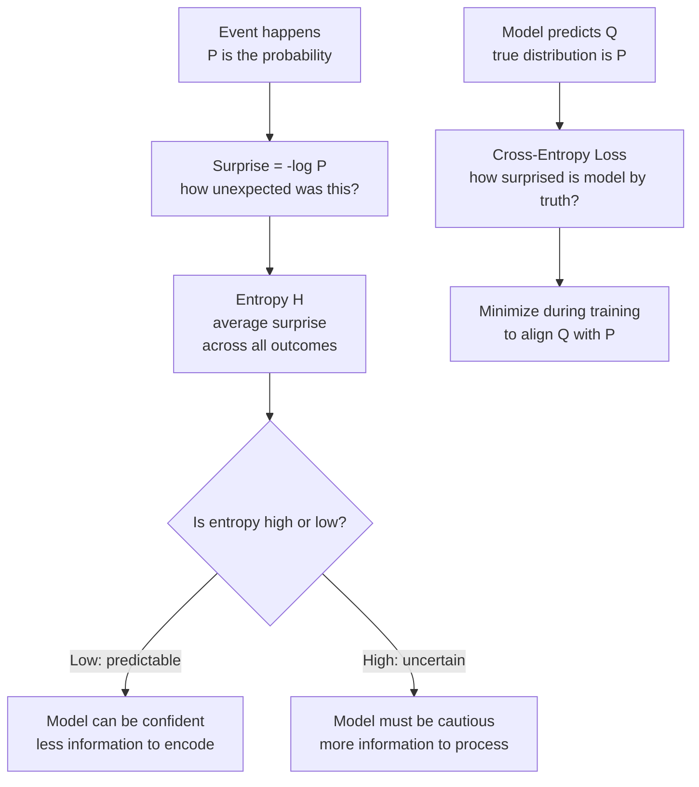

# Information Theory — Theory

Imagine two weather forecasters. Forecaster A works in the Sahara Desert and predicts: "It'll be sunny tomorrow." Nobody is surprised. It's almost always sunny there. Forecaster B works in London and predicts: "It'll snow in July." Everyone is shocked. That almost never happens. Both forecasters made one prediction — but one carried almost no information while the other carried a lot.

👉 This is why we need **Information Theory** — to mathematically measure surprise, uncertainty, and how much "information" a message actually carries. This connects directly to how AI measures its own prediction errors.

---

## What Is Information?

Claude Shannon (1948) asked a brilliant question: can we measure information like we measure weight or temperature?

His answer: the information in an event is related to how surprising it is.

- An event with probability 1 (certain) carries **zero** information. You already knew it.
- An event with probability 0.5 (coin flip) carries more information.
- An event with probability 0.001 (extremely rare) carries a lot of information.

Formally:
```
Information(event) = -log₂(P(event))
```

If P = 1:   -log₂(1) = 0 bits (no surprise, no info)
If P = 0.5: -log₂(0.5) = 1 bit (one coin flip worth of info)
If P = 0.25: -log₂(0.25) = 2 bits
If P = 0.001: -log₂(0.001) ≈ 10 bits (very surprising, very informative)

The rarer the event, the more bits of information it carries.

---

## Entropy — Average Surprise

What if you want to measure the average surprise of an entire situation — not just one event?

**Entropy** measures the average amount of information (surprise) across all possible events.

```
H = -Σ P(x) × log₂(P(x))
     for all x
```

In plain English: for each possible outcome, weight its surprise by how often it occurs, then average everything up.

**Example 1 — Low entropy situation:**
A bag of 100 marbles, all red.
- P(red) = 1.0, P(blue) = 0.0
- H = -(1.0 × log₂(1.0)) = 0 bits

Zero entropy. Zero surprise. You always know what you'll get.

**Example 2 — High entropy situation:**
A bag of 100 marbles, 50 red, 50 blue.
- H = -(0.5 × log₂(0.5) + 0.5 × log₂(0.5)) = 1 bit

Maximum entropy for two outcomes. Maximum surprise.

---

## Cross-Entropy — Comparing Two Distributions

Now suppose you have a model that predicts the distribution of outcomes. The true distribution is P (reality). Your model predicts distribution Q.

**Cross-entropy** measures how surprised your model is by the true outcomes:

```
H(P, Q) = -Σ P(x) × log₂(Q(x))
```

If your model predicts perfectly (Q = P), cross-entropy equals entropy — the irreducible minimum.

If your model is wrong (Q is different from P), cross-entropy is higher than entropy.

**Cross-entropy loss** in machine learning is literally this. When a model predicts class probabilities and we compare them to the true labels:
- Model says P(cat) = 0.9, true label is cat → small loss (model was right)
- Model says P(cat) = 0.1, true label is cat → large loss (model was very wrong)

The worse the model's predictions, the higher the cross-entropy loss. Training minimizes it.

---

## KL Divergence — How Different Are Two Distributions?

**KL Divergence** (Kullback-Leibler divergence) measures how different distribution Q is from distribution P:

```
KL(P || Q) = Σ P(x) × log(P(x) / Q(x))
```

Key properties:
- KL(P || Q) = 0 when P = Q (they're identical)
- KL(P || Q) > 0 when P ≠ Q (always non-negative)
- KL(P || Q) ≠ KL(Q || P) — it's NOT symmetric

**Connection to cross-entropy:**
```
Cross-entropy H(P,Q) = Entropy H(P) + KL(P || Q)
```

So minimizing cross-entropy is the same as minimizing KL divergence (since entropy is fixed for the true distribution). This is why cross-entropy loss is the default in classification problems.

---

## The Information Flow



---

## Why This Matters for AI

Information theory is not abstract philosophy. It's literally built into AI training:

| AI Concept | Information Theory Concept |
|---|---|
| Classification loss | Cross-entropy loss = H(P, Q) |
| How wrong is the model? | KL divergence between prediction and truth |
| Language model next-word prediction | Cross-entropy over vocabulary distribution |
| Model compression | Minimum description length (entropy) |
| Variational Autoencoders (VAE) | KL divergence in the loss function |
| ChatGPT's training objective | Minimize cross-entropy over human-written text |

Every time a language model predicts the next word, it's outputting a probability distribution. Cross-entropy measures how close that distribution is to reality (the actual next word). Training minimizes this — over trillions of word predictions.

---

✅ **What you just learned:** Information is measured by surprise (rare events carry more info), entropy is average surprise across a distribution, and cross-entropy loss measures how wrong a model's predicted distribution is compared to reality — which is why it's the most common loss function in AI.

🔨 **Build this now:** Think of a true/false quiz where you know 90% of the answers. Versus one where you know 50%. Which has higher "entropy" from your perspective? Now think: a well-trained AI on familiar data has low entropy in its predictions. An AI asked about something it never saw has high entropy — it's uncertain. Does that match your intuition?

➡️ **Next step:** Machine Learning Foundations — `02_ML_Fundamentals/`

---

## 📂 Navigation

**In this folder:**
| File | |
|---|---|
| 📄 **Theory.md** | ← you are here |
| [📄 Cheatsheet.md](./Cheatsheet.md) | Quick reference |
| [📄 Interview_QA.md](./Interview_QA.md) | Interview prep |
| [📄 Intuition_First.md](./Intuition_First.md) | No-formula intuition primer |

⬅️ **Prev:** [04 Calculus and Optimization](../04_Calculus_and_Optimization/Theory.md) &nbsp;&nbsp;&nbsp; ➡️ **Next:** [01 What is ML](../../02_Machine_Learning_Foundations/01_What_is_ML/Theory.md)
