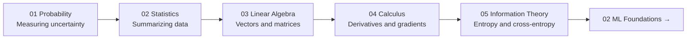

# 01 Math for AI

You don't need to be a mathematician to do AI. But you need to understand *why* the math exists — what problem it solves, what it's measuring.

This section teaches the 5 mathematical foundations that show up everywhere in AI. Each one is explained with a story first, then the formal definition.

---

## Topics in This Section

| # | Topic | What you learn |
|---|---|---|
| 01 | [Probability](./01_Probability/Theory.md) | How to measure uncertainty. The language of every ML prediction. |
| 02 | [Statistics](./02_Statistics/Theory.md) | How to summarize data. Mean, variance, normal distribution, why they matter. |
| 03 | [Linear Algebra](./03_Linear_Algebra/Theory.md) | Vectors and matrices — how data and model weights are stored and transformed. |
| 04 | [Calculus and Optimization](./04_Calculus_and_Optimization/Theory.md) | Derivatives and gradient descent — how models actually learn. |
| 05 | [Information Theory](./05_Information_Theory/Theory.md) | Entropy and cross-entropy — the math behind loss functions and compression. |

---

## Learning Path

---

## What You'll Be Able to Do After This Section

- Understand why a neural network prediction is a probability distribution
- Read a loss curve and know what the numbers mean
- Understand what a gradient is and why we follow it downhill
- Know why cross-entropy loss is the natural choice for classification
- Understand what "embedding" means when a vector represents a word

---

## 📂 Navigation

⬅️ **Prev:** [00 Learning Guide](../00_Learning_Guide/Readme.md) &nbsp;&nbsp;&nbsp; ➡️ **Next:** [01 Probability](./01_Probability/Theory.md)
