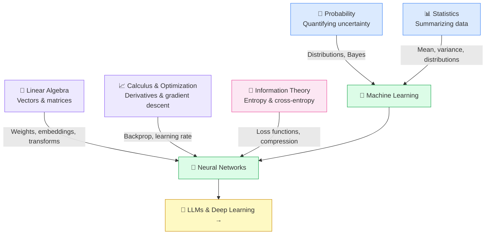

# ∑ Math for AI

⬅️ [00 Learning Guide](../00_Learning_Guide/Readme.md) &nbsp;|&nbsp; [🏠 Home](../00_Learning_Guide/Readme.md) &nbsp;|&nbsp; [02 ML Foundations ➡️](../02_Machine_Learning_Foundations/Readme.md)

> Five mathematical foundations that underpin every algorithm, every loss curve, and every prediction in AI — understand these and everything else clicks into place.

**[▶ Start here → Probability Theory](./01_Probability/Theory.md)**

---

## At a Glance

| | |
|---|---|
| 📚 Topics | 5 topics |
| ⏱️ Est. Time | 4–6 hours |
| 📋 Prerequisites | Basic algebra |
| 🔓 Unlocks | [02 ML Foundations](../02_Machine_Learning_Foundations/Readme.md) |

---

## What's in This Section

---

## Topics

| # | Topic | What You'll Learn | Key Files |
|---|---|---|---|
| 01 | [Probability](./01_Probability/Theory.md) | Quantify uncertainty — the language of every ML prediction | [📖 Theory](./01_Probability/Theory.md) · [⚡ Cheatsheet](./01_Probability/Cheatsheet.md) · [🎯 Q&A](./01_Probability/Interview_QA.md) · [💡 Intuition](./01_Probability/Intuition_First.md) |
| 02 | [Statistics](./02_Statistics/Theory.md) | Mean, variance, distributions — how to reason about data | [📖 Theory](./02_Statistics/Theory.md) · [⚡ Cheatsheet](./02_Statistics/Cheatsheet.md) · [🎯 Q&A](./02_Statistics/Interview_QA.md) · [💡 Intuition](./02_Statistics/Intuition_First.md) |
| 03 | [Linear Algebra](./03_Linear_Algebra/Theory.md) | Vectors and matrices — the physical structure of AI | [📖 Theory](./03_Linear_Algebra/Theory.md) · [⚡ Cheatsheet](./03_Linear_Algebra/Cheatsheet.md) · [🎯 Q&A](./03_Linear_Algebra/Interview_QA.md) · [📐 Vectors](./03_Linear_Algebra/Vectors_and_Matrices.md) |
| 04 | [Calculus & Optimization](./04_Calculus_and_Optimization/Theory.md) | Derivatives and gradient descent — the training engine | [📖 Theory](./04_Calculus_and_Optimization/Theory.md) · [⚡ Cheatsheet](./04_Calculus_and_Optimization/Cheatsheet.md) · [🎯 Q&A](./04_Calculus_and_Optimization/Interview_QA.md) |
| 05 | [Information Theory](./05_Information_Theory/Theory.md) | Entropy and cross-entropy — why loss functions are shaped as they are | [📖 Theory](./05_Information_Theory/Theory.md) · [⚡ Cheatsheet](./05_Information_Theory/Cheatsheet.md) · [🎯 Q&A](./05_Information_Theory/Interview_QA.md) |

---

## Key Concepts at a Glance

| Concept | Why It Matters in AI |
|---|---|
| **Probability** | Every model output is a probability distribution — P(next token), P(spam), P(label) |
| **Statistics** | Mean, variance, and distributions describe your data and your model's behavior |
| **Linear Algebra** | Data = vectors, weights = matrices, forward pass = matrix multiplication |
| **Calculus** | Gradient descent = always step in the direction that reduces loss |
| **Information Theory** | Cross-entropy loss = measuring how "surprised" the model is by the true label |

---

## 📂 Navigation

⬅️ **Prev:** [00 Learning Guide](../00_Learning_Guide/Readme.md) &nbsp;&nbsp; ➡️ **Next:** [02 Machine Learning Foundations](../02_Machine_Learning_Foundations/Readme.md)
