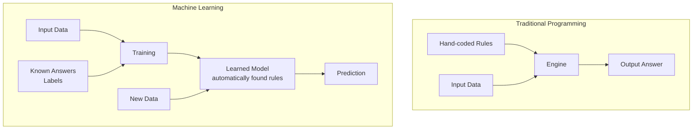

# What is Machine Learning?

## The Story 📖

You want to teach a 5-year-old to recognize dogs. You could hand them a rulebook: *"4 legs + fur + barks + tail = dog"* — but rules break instantly for a 3-legged dog or a silent one.

Instead you show them pictures: *"Dog. Dog. Cat. Dog. Bird. Dog."* After enough examples, something clicks. They see a dog they've never seen before and say "dog!" without thinking about any rules.

👉 This is exactly what **Machine Learning** is — instead of writing rules, you show examples and let the computer figure out the rules itself.

---

## 📌 Learning Priority

**Must Learn** — core concepts, needed to understand the rest of this file:
[What is Machine Learning](#what-is-machine-learning) · [How It Works](#how-it-works--step-by-step) · [Why It Exists](#why-it-exists--the-problem-it-solves)

**Should Learn** — important for real projects and interviews:
[Common Mistakes](#common-mistakes-to-avoid-) · [Connection to Other Concepts](#connection-to-other-concepts-)

**Good to Know** — useful in specific situations, not needed daily:
[Real-world Examples](#real-world-examples)

**Reference** — skim once, look up when needed:
[Where You'll See This](#where-youll-see-this-in-real-ai-systems)

---

## What is Machine Learning?

**Machine Learning (ML)** is a way of building software that learns from data instead of following hard-coded rules.

```
Old way: Rules + Data → Answer
New way: Data + Answers → Rules (learned automatically)
```



#### Real-world examples
- **Spam filter** — learned what spam looks like from millions of flagged emails
- **Netflix recommendations** — learned your taste by watching what you watch and skip
- **Face unlock** — learned what your face looks like from hundreds of reference photos
- **Google Translate** — learned languages by reading billions of translated documents

---

## Why It Exists — The Problem It Solves

1. **Some rules are impossible to write** — how do you write rules for "what makes a face look happy"? Millions of subtle variations, impossible to capture manually.
2. **Rules go stale fast** — spam emails constantly change wording. An ML model keeps learning.
3. **Patterns live in data, not in our heads** — Netflix can't ask every user why they liked something, but it finds the pattern across 200 million users automatically.

👉 Without ML: a human expert must hand-code rules for every situation — impossible at scale. With ML: the computer discovers rules from examples.

---

## How It Works — Step by Step

1. **Collect Data** — inputs paired with correct answers (dog photos labeled "dog"/"not dog")
2. **Train** — model makes guesses, checks if right, adjusts on every wrong answer
3. **Learn Patterns** — after thousands of examples, the model has built internal "instincts"
4. **Predict on New Data** — give it something it's never seen; the exam
5. **Improve** — check where it went wrong, feed more data, retrain

---

## The Math / Technical Side (Simplified)

The model has internal dials called **weights**. Training = adjusting those dials until predictions are accurate. A **loss function** measures how wrong the model is — lower loss = better model. Training minimizes the noise (loss) until the signal (prediction) is sharp.

---

## Where You'll See This in Real AI Systems

- Every LLM (ChatGPT, Claude) — massive ML model trained on text
- Every recommendation feed (YouTube, Spotify, Netflix)
- Google Maps ETA predictions
- Credit card fraud detection

---

## Common Mistakes to Avoid ⚠️

- **Thinking more data always helps** — garbage data makes things worse, not better
- **Jumping to tools before understanding** — using scikit-learn without understanding what "training" means leads to confusion fast
- **Confusing training with memorization** — a model that memorizes examples but fails on new ones is useless (called overfitting)

---

## Connection to Other Concepts 🔗

- **Neural Networks** are a type of ML model inspired by the brain
- **Deep Learning** is ML with many layers of neurons
- **Training** uses **Gradient Descent** to adjust weights
- LLMs like ChatGPT are ML models trained on text at enormous scale

---

✅ **What you just learned:** Machine Learning = teaching computers with examples, not rules.

🔨 **Build this now:** Go to [Teachable Machine](https://teachablemachine.withgoogle.com/) — train a model to recognize thumbs up vs thumbs down using your webcam. Zero code. 2 minutes.

➡️ **Next step:** What happens after training? → `02_Training_vs_Inference/Theory.md`


---

## 📝 Practice Questions

- 📝 [Q4 · what-is-ml](../../ai_practice_questions_100.md#q4--interview--what-is-ml)


---

## 📂 Navigation

**In this folder:**
| File | |
|---|---|
| 📄 **Theory.md** | ← you are here |
| [📄 Cheatsheet.md](./Cheatsheet.md) | Quick reference |
| [📄 Interview_QA.md](./Interview_QA.md) | Interview prep |

⬅️ **Prev:** [01 Math for AI](../../01_Math_for_AI/Readme.md) &nbsp;&nbsp;&nbsp; ➡️ **Next:** [02 Training vs Inference](../02_Training_vs_Inference/Theory.md)
