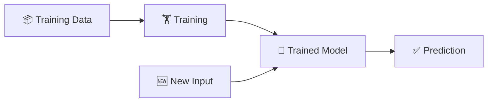

# What is Machine Learning?

## The Story 📖

You want to teach a 5-year-old to recognize dogs.

You could hand them a rulebook:
> *"4 legs + fur + barks + tail = dog"*

But what about a dog with 3 legs? Or a silent dog? The rules break instantly.

Instead, you do something smarter — you show them pictures.

*"Dog. Dog. Cat. Dog. Bird. Dog."*

After enough examples, something clicks. They just **know**. They see a dog they've never seen before and say "dog!" without thinking about any rules.

👉 This is exactly what **Machine Learning** is — instead of writing rules, you show examples and let the computer figure out the rules itself.

---

## What is Machine Learning?

**Machine Learning (ML)** is a way of building software that learns from data instead of following hard-coded rules.

**Old way (Traditional Programming):**
```
Rules + Data → Answer
```

**New way (Machine Learning):**
```
Data + Answers → Rules (learned automatically)
```

Think of it like this: instead of teaching someone chess by giving them a rulebook, you sit them down for 10,000 games until they develop instincts.

#### Real-world examples
- **Spam filter** — learned what spam looks like from millions of flagged emails
- **Netflix recommendations** — learned your taste by watching what you watch and skip
- **Face unlock** — learned what your face looks like from hundreds of reference photos
- **Google Translate** — learned languages by reading billions of translated documents

---

## Why It Exists — The Problem It Solves

1. **Some rules are impossible to write**
   - How do you write rules for "what makes a face look happy"? There are millions of subtle variations — impossible to capture manually.

2. **Rules go stale fast**
   - Spam emails constantly change wording. A fixed rulebook becomes outdated in days. An ML model keeps learning.

3. **Patterns live in data, not in our heads**
   - Netflix can't ask every user why they liked something. But it can find the pattern across 200 million users automatically.

👉 Without ML: you'd need a human expert to hand-code rules for every situation — impossible at scale. With ML: the computer discovers the rules from examples.

---

## How It Works — Step by Step

### Step 1: Collect Data
Gather examples — inputs paired with the correct answers.
- Dog photos labeled "dog" or "not dog"
- Emails labeled "spam" or "not spam"

### Step 2: Train the Model
Show the model all the examples. It makes guesses, checks if it's right, and adjusts itself every time it's wrong.
- Analogy: studying for an exam by doing past papers. Every wrong answer teaches you something.

### Step 3: The Model Learns Patterns
After seeing thousands of examples, the model has built internal patterns — like instincts baked into numbers.

### Step 4: Predict on New Data
Now give it something it has never seen before. Does it get it right?
- Analogy: the actual exam.



### Step 5: Improve
Check where it went wrong. Feed it more data. Retrain. Repeat.

---

## The Math / Technical Side (Simplified)

The model has internal dials called **weights**. Training = adjusting those dials until predictions are accurate.

A **loss function** measures how wrong the model is. Lower loss = better model.

Think of it like tuning a radio: you keep turning the dial until the signal is clear. That's literally what training does — minimizes the noise (loss) until the signal (prediction) is sharp.

---

## Where You'll See This in Real AI Systems

- Every LLM (ChatGPT, Claude) is a massive ML model trained on text
- Every recommendation feed (YouTube, Spotify, Netflix) is ML
- Google Maps ETA predictions are ML
- Credit card fraud detection is ML

ML is everywhere. You're already using its outputs dozens of times a day.

---

## Common Mistakes to Avoid ⚠️

- **Thinking more data always helps** — garbage data makes things worse, not better
- **Jumping to tools before understanding** — using scikit-learn without understanding what "training" means leads to confusion fast
- **Confusing training with memorization** — a model that memorizes examples but fails on new ones is useless (called overfitting)

---

## Connection to Other Concepts 🔗

- **Neural Networks** are a type of ML model inspired by the brain
- **Deep Learning** is ML with many layers of neurons
- **Training** uses **Gradient Descent** to adjust weights
- LLMs like ChatGPT are ML models trained on text at enormous scale

---

✅ **What you just learned:** Machine Learning = teaching computers with examples, not rules.

🔨 **Build this now:** Go to [Teachable Machine](https://teachablemachine.withgoogle.com/) — train a model to recognize thumbs up vs thumbs down using your webcam. Zero code. 2 minutes.

➡️ **Next step:** What happens after training? → `02_Training_vs_Inference/Theory.md`

---

## 📂 Navigation

**In this folder:**
| File | |
|---|---|
| 📄 **Theory.md** | ← you are here |
| [📄 Cheatsheet.md](./Cheatsheet.md) | Quick reference |
| [📄 Interview_QA.md](./Interview_QA.md) | Interview prep |

⬅️ **Prev:** [01 Math for AI](../../01_Math_for_AI/Readme.md) &nbsp;&nbsp;&nbsp; ➡️ **Next:** [02 Training vs Inference](../02_Training_vs_Inference/Theory.md)
