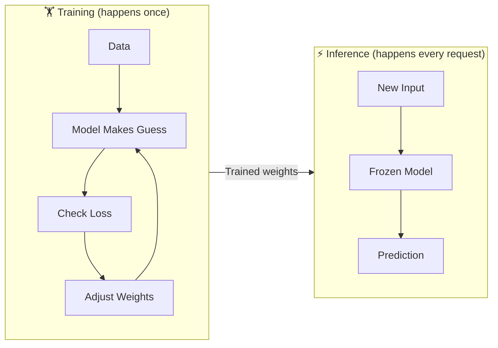

# Training vs Inference

## The Story 📖

A chef spends 10 years learning to cook — tasting dishes, making mistakes, adjusting recipes, learning from every plate that came back half-eaten.

That 10 years? That's **training**.

Now the chef opens a restaurant. Customers walk in, orders come in, and the chef just... cooks. Fast, confident, no more trial-and-error. That's **inference**.

The learning phase is over. Now it's just execution.

👉 This is the core split in every AI system — **training** is where learning happens, **inference** is where that learning gets used.

---

## What is Training?

**Training** is the process of showing a model thousands (or billions) of examples until it learns the patterns.

During training, the model:
1. Makes a prediction
2. Checks how wrong it was (the loss)
3. Adjusts its internal weights to do better next time
4. Repeats — millions of times

It's slow. It's expensive. It needs a lot of data and compute. But you only do it once (or occasionally to update the model).

## What is Inference?

**Inference** is using an already-trained model to make predictions on new data.

The weights are frozen. No learning is happening. The model just applies what it already learned.

It's fast. It's cheap (compared to training). It runs every time a user sends a request.

---

## Side by Side

---

## Why This Distinction Matters

| | Training | Inference |
|---|---|---|
| When | Once (or periodically) | Every user request |
| Speed | Slow (hours to months) | Fast (milliseconds) |
| Cost | Expensive (GPUs, lots of data) | Cheap per request |
| Weights | Being updated | Frozen |
| Goal | Learn patterns | Apply patterns |

When you use ChatGPT, you're hitting **inference**. OpenAI trained that model months ago. You're not making it smarter — you're just asking it to use what it already knows.

---

## Real-World Analogy: The Exam

- **Training** = studying, doing practice problems, getting feedback, improving
- **Inference** = sitting down and actually taking the exam

Once the exam starts, you can't study anymore. You use what you've already learned.

---

## Where You'll See This in Real AI Systems

- **Cloud AI APIs** (OpenAI, Anthropic, Google) — you're always calling inference. Training happened before you got access.
- **Fine-tuning** — a special kind of training where you take an existing model and train it more on your specific data
- **Edge AI** (AI on your phone) — the model was trained in a data center, but inference runs on-device

---

## Common Mistakes to Avoid ⚠️

- **Thinking every API call retrains the model** — it doesn't. Inference is read-only.
- **Confusing fine-tuning with retraining from scratch** — fine-tuning starts from an existing trained model, much cheaper
- **Ignoring inference cost at scale** — training is expensive once; inference cost multiplies with every user

---

## Connection to Other Concepts 🔗

- **Gradient Descent** is the engine of training — how weights get adjusted
- **Fine-tuning** is a targeted form of training on new data
- **Latency optimization** (in production AI) is all about making inference faster

---

✅ **What you just learned:** Training = learning phase (slow, once). Inference = using what was learned (fast, every request).

🔨 **Build this now:** Go to [Hugging Face Spaces](https://huggingface.co/spaces) — every demo there is pure inference. Find a text generation model and run a few prompts. You're hitting a frozen, trained model with every message.

➡️ **Next step:** What does the model actually learn from? → `03_Supervised_Learning/Theory.md`

---

## 📂 Navigation

**In this folder:**
| File | |
|---|---|
| 📄 **Theory.md** | ← you are here |
| [📄 Cheatsheet.md](./Cheatsheet.md) | Quick reference |
| [📄 Interview_QA.md](./Interview_QA.md) | Interview prep |

⬅️ **Prev:** [01 What is ML](../01_What_is_ML/Theory.md) &nbsp;&nbsp;&nbsp; ➡️ **Next:** [03 Supervised Learning](../03_Supervised_Learning/Theory.md)
