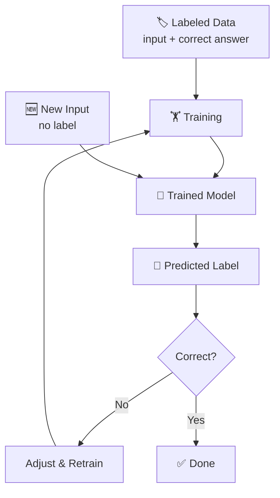

# Supervised Learning

## The Story 📖

It's your first week as a new bank employee. Your job: decide if a loan application should be approved or rejected.

Your manager doesn't give you a rulebook. Instead, they pull out a stack of 10,000 past applications — each one has the details of the applicant AND a note at the bottom saying "Approved ✅" or "Rejected ❌".

"Study these," they say. "Figure out the pattern."

After a few weeks you've read thousands of cases. You start noticing: applicants with stable income and low existing debt almost always got approved. Applicants with multiple missed payments almost always got rejected.

You've learned the pattern — from **labeled examples**.

👉 This is **Supervised Learning** — training a model using data where every example already has the correct answer attached.

---

## What is Supervised Learning?

**Supervised Learning** is the most common type of machine learning. You train a model on labeled data — examples where the input AND the correct output are both provided.

The model learns to map inputs → outputs by studying these pairs.

**Two flavors:**

| Type | Output | Example |
|---|---|---|
| **Classification** | A category/class | Spam or not spam? Dog or cat? |
| **Regression** | A number | What's the house price? |

---

## How It Works — Step by Step

### Step 1: Labeled Data
You start with a dataset where every example has an input and a known correct answer (the **label**).

```
Input: [income=80k, debt=5k, missed_payments=0]  →  Label: Approved ✅
Input: [income=30k, debt=20k, missed_payments=3]  →  Label: Rejected ❌
```

### Step 2: Train
The model looks at thousands of these pairs and adjusts itself to predict the label from the input.

### Step 3: Predict
Give the model a new application it has never seen. It predicts: Approved or Rejected?

### Step 4: Evaluate
Check how often it got it right. If it's wrong too often, retrain with more data or a better model.



---

## Real-World Examples

- **Email spam filter** — trained on emails labeled spam/not-spam
- **Image recognition** — trained on photos labeled "cat", "dog", "bird"
- **House price prediction** — trained on past sales (house features → sale price)
- **Medical diagnosis** — trained on patient records labeled with diagnoses
- **Sentiment analysis** — trained on reviews labeled positive/negative

---

## Why It Works (The Intuition)

The model is essentially learning a function:

```
f(input) = output
```

It doesn't know the formula in advance — it discovers it by looking at enough examples. The more examples, the better the approximation of the true pattern.

---

## The Catch: You Need Labels

The biggest challenge of supervised learning is **getting labeled data**. Someone has to manually attach the correct answers to every training example.

- Labeling 100,000 images as "cat" or "dog" = expensive and time-consuming
- This is why labeled datasets are valuable — they represent real human effort

---

## Common Mistakes to Avoid ⚠️

- **Bad labels = bad model** — if the labels are wrong or inconsistent, the model learns the wrong thing
- **Label leakage** — accidentally including information in the input that reveals the answer (makes the model look great in testing, useless in production)
- **Not enough label diversity** — if your training data only has one type of example, the model won't generalize

---

## Connection to Other Concepts 🔗

- **Unsupervised Learning** — the opposite: no labels, model finds patterns on its own
- **Loss Function** — measures how wrong the model's predictions are during training
- **Overfitting** — when a model memorizes labels instead of learning real patterns

---

✅ **What you just learned:** Supervised learning = training on labeled examples (input + correct answer) to predict outputs on new data.

🔨 **Build this now:** On [Kaggle](https://www.kaggle.com/datasets/uciml/iris), load the Iris dataset. It has flower measurements (inputs) and flower species (labels). This is a classic supervised learning dataset — just exploring it gives you the intuition.

➡️ **Next step:** What if you don't have labels? → `04_Unsupervised_Learning/Theory.md`

---

## 📂 Navigation

**In this folder:**
| File | |
|---|---|
| 📄 **Theory.md** | ← you are here |
| [📄 Cheatsheet.md](./Cheatsheet.md) | Quick reference |
| [📄 Interview_QA.md](./Interview_QA.md) | Interview prep |
| [📄 Code_Example.md](./Code_Example.md) | Python example |

⬅️ **Prev:** [02 Training vs Inference](../02_Training_vs_Inference/Theory.md) &nbsp;&nbsp;&nbsp; ➡️ **Next:** [04 Unsupervised Learning](../04_Unsupervised_Learning/Theory.md)
