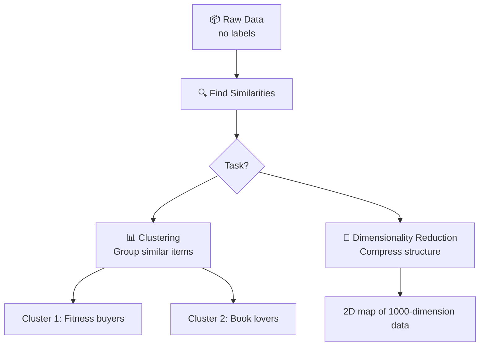
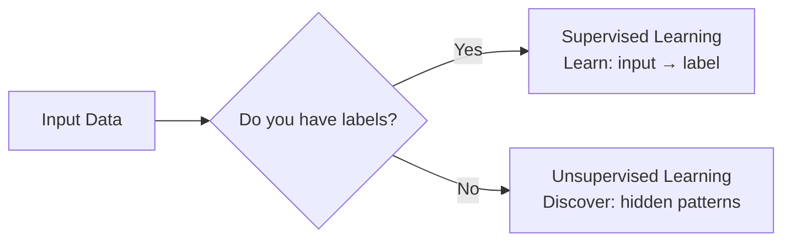

# Unsupervised Learning

## The Story 📖

Imagine you're a new librarian. Someone drops off 50,000 books with no titles, no categories, no labels. Just pages of content.

Your job: organize them so people can find similar books together.

You start reading. Slowly, patterns emerge. These 200 books keep mentioning wars and kings. These 500 are full of equations and proofs. These 1,000 are about cooking.

Nobody told you those categories existed. You discovered them yourself — just by finding things that are similar to each other.

👉 This is **Unsupervised Learning** — finding patterns in data with no labels, no correct answers, no teacher.

---

## What is Unsupervised Learning?

**Unsupervised Learning** is ML without labeled data. The model receives only inputs — no "correct answers." Its job is to find hidden structure, groupings, or patterns on its own.

**Two main tasks:**

| Task | What it does | Example |
|---|---|---|
| **Clustering** | Groups similar things together | Customer segmentation, topic modeling |
| **Dimensionality Reduction** | Compresses data while keeping structure | Visualizing high-dimensional data, compression |

---

## How It Works — Step by Step

### Step 1: Raw Data (No Labels)
You have data, but no one has told you what it means or how to categorize it.

```
[User A: buys running shoes, fitness trackers, protein powder]
[User B: buys mystery novels, tea, blankets]
[User C: buys weights, gym clothes, supplements]
```

### Step 2: Find Similarities
The model measures how similar each data point is to every other.

### Step 3: Group / Compress
It organizes data into clusters (groups of similar things) or finds a compressed representation.



---

## Real-World Examples

- **Spotify Discover Weekly** — clusters users by listening patterns without knowing your taste upfront
- **Customer segmentation** — groups millions of customers into "budget shoppers", "luxury buyers", "seasonal buyers" — nobody labeled those categories
- **Anomaly detection** — finds credit card fraud by spotting transactions that don't fit any normal cluster
- **Topic modeling** — reads thousands of news articles and discovers: these are about politics, these about sports, these about tech

---

## Supervised vs Unsupervised



---

## Common Mistakes to Avoid ⚠️

- **Expecting exact answers** — unsupervised learning finds patterns, not truth. "4 clusters" is your interpretation, not a fact.
- **Choosing the wrong number of clusters** — picking K in K-means is an art. Too few = too broad. Too many = meaningless.
- **Forgetting that scale matters** — features on different scales (age vs salary) can distort distance calculations. Always normalize.

---

## Connection to Other Concepts 🔗

- **K-Means Clustering** — the most common clustering algorithm → `03_Classical_ML_Algorithms/06_K_Means_Clustering`
- **PCA** — the most common dimensionality reduction technique → `03_Classical_ML_Algorithms/07_PCA`
- **Word Embeddings** — a form of unsupervised learning (words cluster by meaning) → `05_NLP_Foundations/03_Word_Embeddings`

---

✅ **What you just learned:** Unsupervised learning = finding patterns in unlabeled data — grouping similar things without being told what the groups are.

🔨 **Build this now:** Think of 10 movies you've seen. On paper, try to group them into 3 clusters yourself without using genre labels. Notice what features you used to group them. That manual process is exactly what a clustering algorithm does.

➡️ **Next step:** How does the model know how wrong it is? → `09_Loss_Functions/Theory.md`

---

## 📂 Navigation

**In this folder:**
| File | |
|---|---|
| 📄 **Theory.md** | ← you are here |
| [📄 Cheatsheet.md](./Cheatsheet.md) | Quick reference |
| [📄 Interview_QA.md](./Interview_QA.md) | Interview prep |
| [📄 Code_Example.md](./Code_Example.md) | Python example |

⬅️ **Prev:** [03 Supervised Learning](../03_Supervised_Learning/Theory.md) &nbsp;&nbsp;&nbsp; ➡️ **Next:** [05 Model Evaluation](../05_Model_Evaluation/Theory.md)
