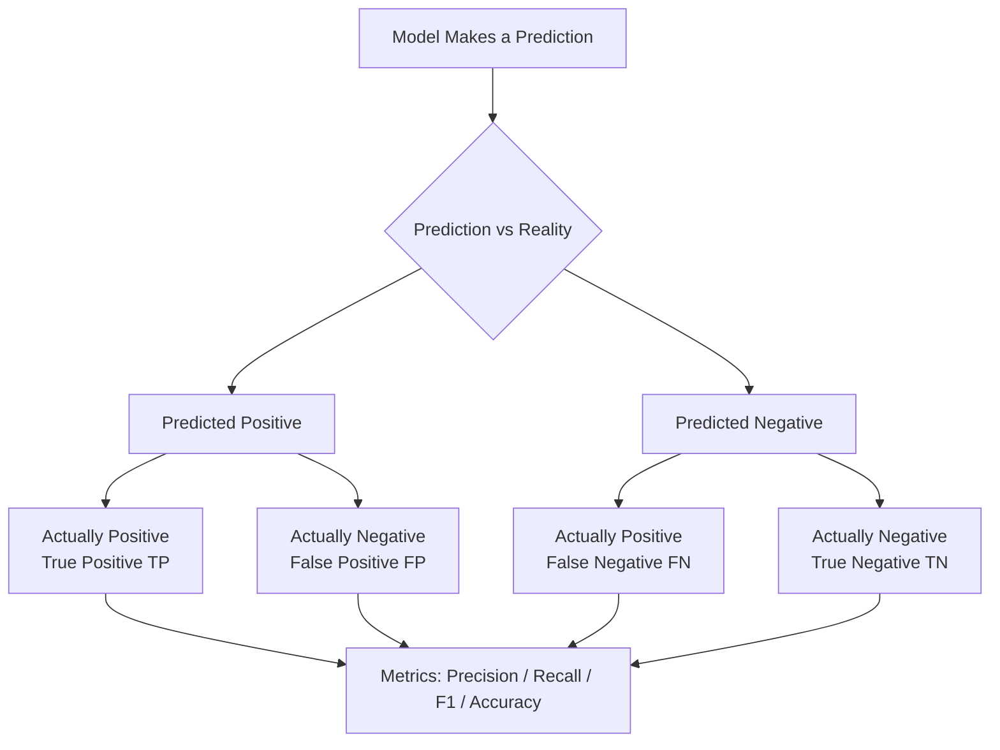

# Model Evaluation

## The Story

You took a practice exam. You got 80% correct. You feel pretty good.

Then your teacher says: "By the way, 90% of the questions were on the easy topic you already know. The hard topic — the one that actually matters for the final — you got almost all of those wrong."

Your 80% score was misleading. The raw number hid what was really going on.

A model's accuracy can do the same thing. You need better tools to really understand how well it is performing.

👉 This is why we need **Model Evaluation** — to measure what actually matters, not just the headline number.

---

## Why Accuracy Alone Lies

Imagine you build a model to detect a rare disease. It affects 1% of people.

Your model predicts "No disease" for everyone. 100% of the time.

Its accuracy? **99%.**

But it is completely useless — it never catches any actual cases.

This is the **imbalanced data** problem. When one class is much rarer than the other, accuracy is a misleading metric. You need metrics that focus on specific types of errors.

---

## The Confusion Matrix — The Foundation

Every prediction a model makes falls into one of four categories:

```
                     PREDICTED
                  Positive  Negative
ACTUAL Positive |    TP    |   FN   |
       Negative |    FP    |   TN   |
```

- **TP (True Positive):** Model said "yes" and it was right
- **TN (True Negative):** Model said "no" and it was right
- **FP (False Positive):** Model said "yes" but it was wrong (false alarm)
- **FN (False Negative):** Model said "no" but it was wrong (missed a real case)



---

## The Four Main Metrics

### Accuracy
**What it is:** Out of all predictions, how many were correct?

```
Accuracy = (TP + TN) / (TP + TN + FP + FN)
```

**Good when:** Classes are balanced. Bad when: one class is rare.

---

### Precision
**What it is:** Of everything the model said was positive, how many actually were?

```
Precision = TP / (TP + FP)
```

**Think:** "When the model fires the alarm, how often is it a real fire?"

High precision = fewer false alarms.

---

### Recall (Sensitivity)
**What it is:** Of all the real positives, how many did the model catch?

```
Recall = TP / (TP + FN)
```

**Think:** "Of all the real fires, how many did the alarm detect?"

High recall = fewer missed cases.

---

### F1 Score
**What it is:** The balance between precision and recall. One number that captures both.

```
F1 = 2 × (Precision × Recall) / (Precision + Recall)
```

It is the harmonic mean — it is only high when BOTH precision AND recall are high. One high number cannot cancel out the other.

---

## The Precision-Recall Tradeoff

Precision and recall fight each other. Improving one usually hurts the other.

| Situation | Should Prioritize | Why |
|---|---|---|
| Spam filter | Precision | You don't want good emails deleted (false positives are painful) |
| Cancer screening | Recall | You don't want to miss real cancer (false negatives are dangerous) |
| Credit fraud | Recall | Missing fraud is more costly than a few false alerts |
| Legal document review | Precision | A false positive flags an innocent person |

---

## When to Use Which Metric

| Metric | Use When |
|---|---|
| **Accuracy** | Balanced classes, roughly equal cost of errors |
| **Precision** | False alarms are costly (spam, content moderation) |
| **Recall** | Missing real cases is costly (disease, fraud, safety) |
| **F1** | You need balance — neither precision nor recall alone tells the story |
| **ROC-AUC** | Comparing models regardless of threshold; ranked outputs |

---

✅ **What you just learned:** Accuracy is misleading on imbalanced data — precision, recall, F1, and the confusion matrix give you a real picture of model performance.

🔨 **Build this now:** Write a confusion matrix by hand. Make up 10 predictions: 5 "positive" and 5 "negative." Then make up the reality. Count your TP, TN, FP, FN, then calculate precision and recall manually. It takes 5 minutes and makes these concepts click instantly.

➡️ **Next step:** What happens when a model is too good on training data? → `06_Overfitting_and_Regularization/Theory.md`

---

## 📂 Navigation

**In this folder:**
| File | |
|---|---|
| 📄 **Theory.md** | ← you are here |
| [📄 Cheatsheet.md](./Cheatsheet.md) | Quick reference |
| [📄 Interview_QA.md](./Interview_QA.md) | Interview prep |
| [📄 Metrics_Deep_Dive.md](./Metrics_Deep_Dive.md) | Deep dive into evaluation metrics |

⬅️ **Prev:** [04 Unsupervised Learning](../04_Unsupervised_Learning/Theory.md) &nbsp;&nbsp;&nbsp; ➡️ **Next:** [06 Overfitting and Regularization](../06_Overfitting_and_Regularization/Theory.md)
