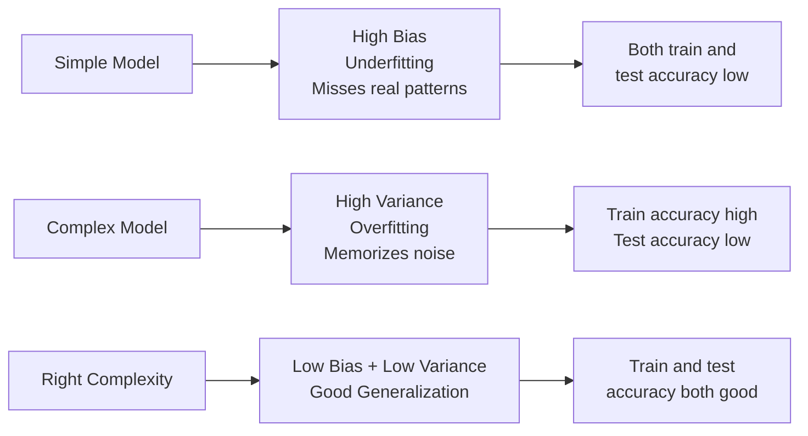

# Overfitting and Regularization

## The Story

Meet Alex. Alex has a big exam coming up. Instead of understanding the material, Alex memorizes every single past exam paper — every answer, word for word.

On the practice tests? Perfect score. 100%. Every time.

The real exam? A disaster. The questions were phrased slightly differently. The examples were new. Alex had memorized the old answers but never actually understood the concept.

Alex did not learn. Alex just memorized.

👉 This is why we need **Overfitting and Regularization** — a model that memorizes training data fails in the real world, and regularization is how we stop that from happening.

---

## What is Overfitting?

**Overfitting** is when a model learns the training data too well — including its noise, quirks, and random patterns — and fails to generalize to new data.

Signs of overfitting:
- Training accuracy: very high (95%+)
- Test/validation accuracy: much lower (60%?)
- The gap between training and validation performance is large

The model is like Alex — it knows every past question perfectly but cannot handle any new variation.

---

## What is Underfitting?

**Underfitting** is the opposite problem. The model is too simple to capture the real patterns in the data.

Signs of underfitting:
- Training accuracy: low
- Test/validation accuracy: also low
- Both are bad — the model hasn't learned anything useful

This is like a student who barely glanced at the material. They can't answer old questions OR new ones.

---

## The Bias-Variance Tradeoff

Every model error comes from three sources:

| Source | What It Is |
|---|---|
| **Bias** | Error from wrong assumptions — the model is too simple to learn the true pattern |
| **Variance** | Error from oversensitivity — the model learned the noise in this specific training set |
| **Irreducible noise** | Error from inherent randomness — you cannot remove this |

The tradeoff: reducing bias usually increases variance, and vice versa.

- **Too simple model** (linear fit on non-linear data) = high bias, low variance = underfitting
- **Too complex model** (100-layer network on 100 examples) = low bias, high variance = overfitting
- **Just right** = moderate complexity that captures real patterns without memorizing noise



---

## How to Fix Overfitting

### 1. Get More Training Data
More examples = harder to memorize, easier to learn real patterns. The simplest fix.

### 2. Regularization — L1 and L2
Regularization adds a penalty to the loss function that punishes large weights.

- **L2 Regularization (Ridge):** Adds the sum of squared weights to the loss. Large weights are penalized. The model is pushed to distribute weight across many features.
- **L1 Regularization (Lasso):** Adds the sum of absolute weights. Drives some weights to exactly zero — effectively removing features. Good for feature selection.

Think of it as telling the model: "You can learn, but don't get too complicated."

### 3. Dropout (Neural Networks)
During training, randomly turn off some neurons in each layer. This prevents any single neuron from becoming too important. The network learns more robust, distributed representations.

### 4. Early Stopping
Monitor validation loss during training. When it stops improving and starts rising, stop. Do not keep training just because training loss is still going down.

### 5. Reduce Model Complexity
Use fewer parameters, shallower layers, or simpler algorithms.

---

## The Training and Validation Curves

The training history tells the whole story:

```
Loss
 |
 |  Training loss: always goes down
 |  \
 |   \  Validation loss: goes down, then rises
 |    \_____
 |          \----___    <- overfit starts here
 |                  \___
 |________________________ Epochs
       Stop here ^
```

Early stopping watches for that valley in the validation curve and stops training when you are at the bottom.

---

✅ **What you just learned:** Overfitting = memorizing training data. Regularization (L1/L2, dropout, early stopping) forces models to learn general patterns instead of specific examples.

🔨 **Build this now:** In sklearn, train a DecisionTreeClassifier with no depth limit on any dataset. Check training accuracy vs test accuracy. Then add `max_depth=3`. Watch the gap shrink. That is regularization in action.

➡️ **Next step:** How do you prepare your raw data before training? → `07_Feature_Engineering/Theory.md`

---

## 📂 Navigation

**In this folder:**
| File | |
|---|---|
| 📄 **Theory.md** | ← you are here |
| [📄 Cheatsheet.md](./Cheatsheet.md) | Quick reference |
| [📄 Interview_QA.md](./Interview_QA.md) | Interview prep |

⬅️ **Prev:** [05 Model Evaluation](../05_Model_Evaluation/Theory.md) &nbsp;&nbsp;&nbsp; ➡️ **Next:** [07 Feature Engineering](../07_Feature_Engineering/Theory.md)
