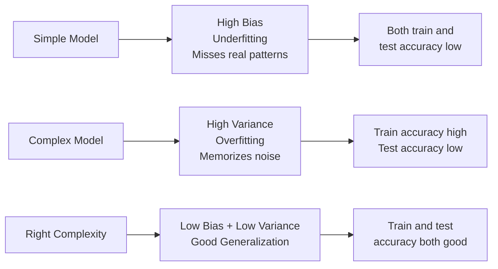
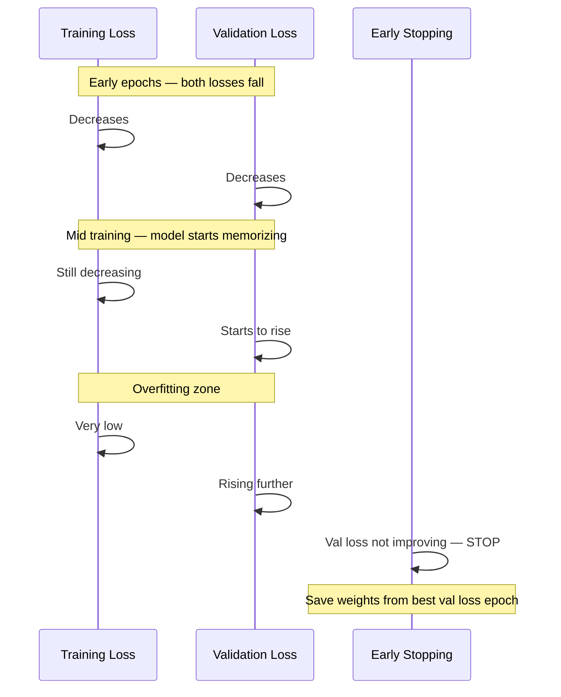

# Overfitting and Regularization

## The Story

Meet Alex. Instead of understanding the exam material, Alex memorizes every past paper word for word. Practice tests? Perfect score. Real exam? A disaster — questions were phrased differently, examples were new. Alex memorized answers, never understood the concept.

👉 This is why we need **Overfitting and Regularization** — a model that memorizes training data fails in the real world, and regularization stops that from happening.

---

## What is Overfitting?

**Overfitting** is when a model learns training data too well — including noise and random quirks — and fails to generalize to new data.

Signs: training accuracy very high (95%+), test/validation accuracy much lower (60%?). Large gap between the two.

---

## What is Underfitting?

**Underfitting** is the opposite — the model is too simple to capture real patterns. Both training AND test accuracy are low. Like a student who barely glanced at the material.

---

## The Bias-Variance Tradeoff

Every model error comes from three sources:

| Source | What It Is |
|---|---|
| **Bias** | Error from wrong assumptions — the model is too simple to learn the true pattern |
| **Variance** | Error from oversensitivity — the model learned the noise in this specific training set |
| **Irreducible noise** | Error from inherent randomness — you cannot remove this |

The tradeoff: reducing bias usually increases variance, and vice versa.

- **Too simple model** (linear fit on non-linear data) = high bias, low variance = underfitting
- **Too complex model** (100-layer network on 100 examples) = low bias, high variance = overfitting
- **Just right** = moderate complexity that captures real patterns without memorizing noise



---

## How to Fix Overfitting

### 1. Get More Training Data
More examples = harder to memorize, easier to learn real patterns. The simplest fix.

### 2. Regularization — L1 and L2
Regularization adds a penalty to the loss that punishes large weights — telling the model "you can learn, but don't get too complicated."

- **L2 (Ridge):** Penalizes sum of squared weights. Distributes weight across many features.
- **L1 (Lasso):** Penalizes sum of absolute weights. Drives some weights to zero — effective feature selection.

### 3. Dropout (Neural Networks)
During training, randomly turn off some neurons in each layer. This prevents any single neuron from becoming too important. The network learns more robust, distributed representations.

### 4. Early Stopping
Monitor validation loss during training. When it stops improving and starts rising, stop — don't keep training just because training loss is still falling.

### 5. Reduce Model Complexity
Use fewer parameters, shallower layers, or simpler algorithms.

---

## The Training and Validation Curves

```
Loss
 |  Training loss: always goes down
 |  \
 |   \  Validation loss: goes down, then rises
 |    \_____
 |          \----___    <- overfit starts here
 |                  \___
 |________________________ Epochs
       Stop here ^
```



---

✅ **What you just learned:** Overfitting = memorizing training data. Regularization (L1/L2, dropout, early stopping) forces models to learn general patterns instead of specific examples.

🔨 **Build this now:** In sklearn, train a DecisionTreeClassifier with no depth limit on any dataset. Check training accuracy vs test accuracy. Then add `max_depth=3`. Watch the gap shrink. That is regularization in action.

➡️ **Next step:** How do you prepare your raw data before training? → `07_Feature_Engineering/Theory.md`

---

## 🛠️ Practice Project

Apply what you just learned → **[B2: ML Model Comparison](../../20_Projects/00_Beginner_Projects/02_ML_Model_Comparison/Project_Guide.md)**
> This project uses: detecting overfitting via train vs test score, regularization in logistic regression (C parameter)

---

## 📂 Navigation

**In this folder:**
| File | |
|---|---|
| 📄 **Theory.md** | ← you are here |
| [📄 Cheatsheet.md](./Cheatsheet.md) | Quick reference |
| [📄 Interview_QA.md](./Interview_QA.md) | Interview prep |

⬅️ **Prev:** [05 Model Evaluation](../05_Model_Evaluation/Theory.md) &nbsp;&nbsp;&nbsp; ➡️ **Next:** [07 Feature Engineering](../07_Feature_Engineering/Theory.md)
