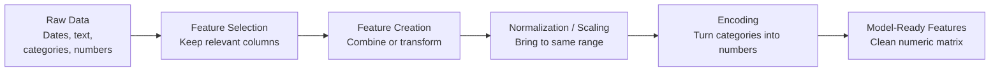

# Feature Engineering

## The Story

A detective gets a box of raw evidence: blurry surveillance footage, thousands of transactions, stacks of phone records. None of it is useful raw. The detective extracts specific timestamps, flags suspicious transactions, maps phone-call patterns. That extraction — turning raw evidence into meaningful clues — is their most important skill.

👉 This is why we need **Feature Engineering** — raw data is almost never in the right form, and the features you create determine how well your model learns.

---

## What Are Features?

**Features** are the individual input variables the model uses to make predictions. In a spreadsheet, features are the columns.

- Raw data: a column of birth dates
- Engineered feature: age in years (derived from birth date and today's date)
- Engineered feature: "is_senior" (age > 65, a binary flag)
- Engineered feature: "birth_month" (seasonality signal)

From one raw column you just created three useful features.

---

## The Feature Engineering Pipeline

---

## Core Techniques

### 1. Feature Selection
Not all columns are useful. Drop features that:
- Have near-zero variance (same value for almost every row)
- Are highly correlated with another feature (redundant)
- Have too many missing values
- Are logically irrelevant to the target

Keeping fewer, better features often beats keeping everything.

### 2. Feature Creation
Create new features from existing ones:
- `price_per_sqft = price / square_feet`
- `days_since_last_purchase` from a date column
- `hour_of_day` from a timestamp
- `is_weekend` from a day-of-week column
- Interaction terms: `age × income` as a combined signal

### 3. Normalization and Scaling
Distance-based models (KNN, SVM, neural networks) are sensitive to scale. A feature ranging 0–1,000,000 dominates one ranging 0–1.

- **Min-Max Scaling:** `(x - min) / (max - min)` → range [0, 1]
- **StandardScaler (Z-score):** `(x - mean) / std` → mean=0, std=1
- Tree-based models do **not** need scaling.

### 4. Encoding Categorical Variables
Models need numbers. Categories (like "Red", "Blue", "Green") must be converted.

- **One-Hot Encoding:** Create a binary column per category. "Color_Red", "Color_Blue", "Color_Green". Each row has a 1 in the right column and 0s elsewhere. Good for nominal categories (no ordering).
- **Label Encoding:** Assign a number to each category (Red=0, Blue=1, Green=2). Good for ordinal categories (Small=0, Medium=1, Large=2). Do NOT use on nominal categories — the model will think Blue is "between" Red and Green.

### 5. Handling Missing Values
Missing data breaks most models. Options:
- Drop rows with missing values (if few)
- Fill with mean or median (for numeric)
- Fill with mode (for categorical)
- Create a new binary "was_missing" feature (the missingness itself can be a signal)

---

## Why Feature Engineering Often Matters More Than Algorithm Choice

An expert-engineered feature set + simple logistic regression often beats raw data + neural network. The model can only learn patterns that exist in the features you give it. Good features encode domain knowledge into a form the model can use.

---

✅ **What you just learned:** Feature engineering transforms raw data into model-ready inputs — it is often the highest-leverage part of a machine learning project.

🔨 **Build this now:** Take any dataset with a date column. Create three new features from it: year, month, and day_of_week. Then create a "is_weekend" binary feature. You just turned one column into four. That is feature engineering.

➡️ **Next step:** How does the model actually learn from your features? → `08_Gradient_Descent/Theory.md`

---

## 📂 Navigation

**In this folder:**
| File | |
|---|---|
| 📄 **Theory.md** | ← you are here |
| [📄 Cheatsheet.md](./Cheatsheet.md) | Quick reference |
| [📄 Interview_QA.md](./Interview_QA.md) | Interview prep |
| [📄 Code_Example.md](./Code_Example.md) | Python code examples |

⬅️ **Prev:** [06 Overfitting and Regularization](../06_Overfitting_and_Regularization/Theory.md) &nbsp;&nbsp;&nbsp; ➡️ **Next:** [08 Gradient Descent](../08_Gradient_Descent/Theory.md)
