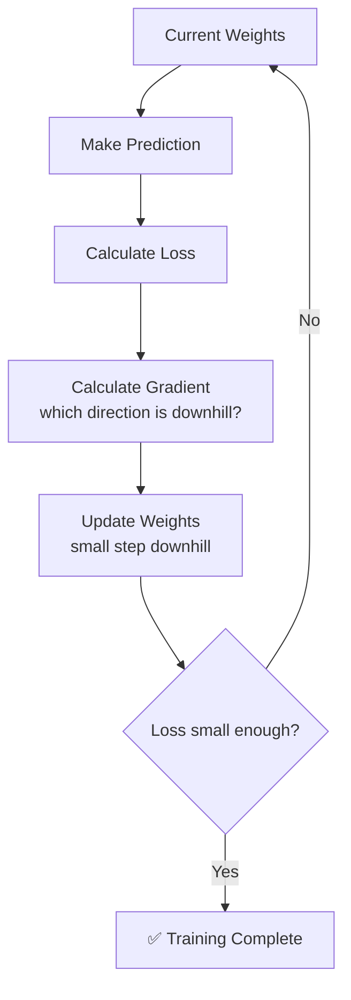
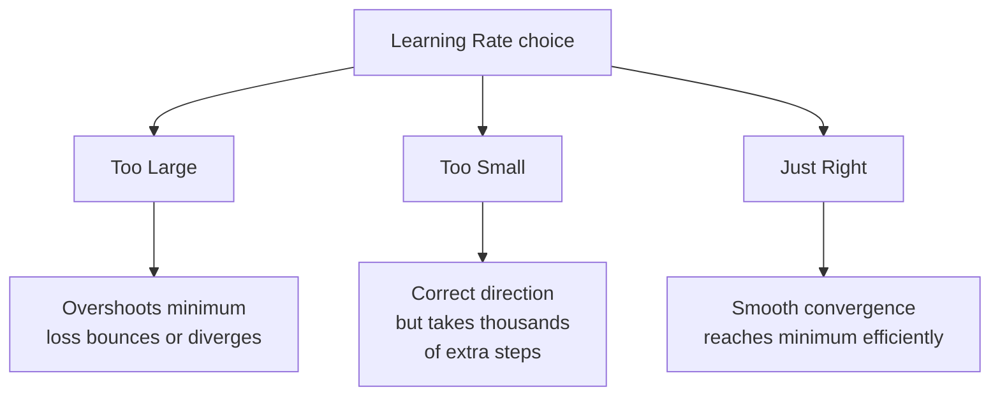

# Gradient Descent

## The Story 📖

You're blindfolded in the mountains, trying to reach the lowest valley. You can't see anything, but you can feel the slope. So you take a small step in whichever direction feels downhill. Repeat until you reach the bottom.

👉 This is **Gradient Descent** — the algorithm that trains almost every AI model by repeatedly nudging it in the direction that reduces mistakes.

---

## 📌 Learning Priority

**Must Learn** — core concepts, needed to understand the rest of this file:
[What is Gradient Descent](#what-is-gradient-descent) · [How It Works](#how-it-works--step-by-step) · [Learning Rate](#the-learning-rate--how-big-is-each-step)

**Should Learn** — important for real projects and interviews:
[3 Flavors of Gradient Descent](#3-flavors-of-gradient-descent) · [Common Mistakes](#common-mistakes-to-avoid-)

**Good to Know** — useful in specific situations, not needed daily:
[Connection to Other Concepts](#connection-to-other-concepts-)

**Reference** — skim once, look up when needed:
[Connection to Other Concepts](#connection-to-other-concepts-)

---

## What is Gradient Descent?

**Gradient Descent** minimizes the **loss** by repeatedly adjusting weights in the direction that reduces it.

- **Gradient** = the slope (which direction is "downhill" for the loss)
- **Descent** = moving downhill (reducing the loss)

The "landscape" navigated is the **loss surface** — height represents how wrong the model is; the goal is the lowest point.

---

## How It Works — Step by Step

1. Make a prediction with current weights
2. Calculate the loss (how wrong?)
3. Calculate the gradient (which direction is downhill?)
4. Update weights: small step in downhill direction
5. Repeat until loss stops decreasing



---

## The Learning Rate — How Big is Each Step?

The **learning rate** controls how big each step is.

| Learning Rate | Problem |
|---|---|
| Too large | Overshoots the valley, bounces around, never settles |
| Too small | Takes forever to reach the bottom |
| Just right | Converges smoothly to the minimum |

```
Too large:   ↓↑↓↑↓ (bouncing)
Too small:   ↓↓↓↓↓↓↓↓↓↓ (crawling)
Just right:  ↓↓↓↓ ✅
```



---

## 3 Flavors of Gradient Descent

| Type | Looks at | Speed | Stability |
|---|---|---|---|
| **Batch** | All training data at once | Slow | Stable |
| **Stochastic (SGD)** | One random example at a time | Fast | Noisy |
| **Mini-batch** | Small batches (e.g. 32 examples) | Balanced | Balanced (most common) |

Almost all modern training uses **mini-batch** gradient descent.

---

## Common Mistakes to Avoid ⚠️

- **Setting learning rate too high** — training explodes, loss shoots up instead of down
- **Not normalizing input data** — features on wildly different scales make the loss surface lopsided and hard to navigate
- **Stopping too early** — the model hasn't found the valley yet

---

## Connection to Other Concepts 🔗

- **Loss Function** — defines the "landscape" that gradient descent navigates → `09_Loss_Functions`
- **Backpropagation** — the algorithm that calculates the gradient in neural networks → `04_Neural_Networks/06_Backpropagation`
- **Optimizers** (Adam, RMSProp) — improved versions of gradient descent → `04_Neural_Networks/07_Optimizers`

---

✅ **What you just learned:** Gradient descent = the "blindfolded hiker" algorithm that trains models by repeatedly taking small steps to reduce mistakes.

🔨 **Build this now:** Imagine a simple function `loss = (weight - 5)²`. The minimum is at weight=5. Start at weight=0, compute the gradient (2*(weight-5)), subtract 0.1 × gradient, repeat. Watch weight creep toward 5. That's gradient descent in 3 lines of math.

➡️ **Next step:** What does the model actually try to minimize? → `09_Loss_Functions/Theory.md`

---

## 🛠️ Practice Project

Apply what you just learned → **[B3: Neural Net from Scratch](../../22_Capstone_Projects/03_Neural_Net_from_Scratch/03_GUIDE.md)**
> This project uses: gradient descent weight update loop, learning rate tuning, watching loss decrease epoch by epoch


---

## 📝 Practice Questions

- 📝 [Q9 · gradient-descent](../../ai_practice_questions_100.md#q9--normal--gradient-descent)


---

## 📂 Navigation

**In this folder:**
| File | |
|---|---|
| 📄 **Theory.md** | ← you are here |
| [📄 Cheatsheet.md](./Cheatsheet.md) | Quick reference |
| [📄 Interview_QA.md](./Interview_QA.md) | Interview prep |

⬅️ **Prev:** [07 Feature Engineering](../07_Feature_Engineering/Theory.md) &nbsp;&nbsp;&nbsp; ➡️ **Next:** [09 Loss Functions](../09_Loss_Functions/Theory.md)
