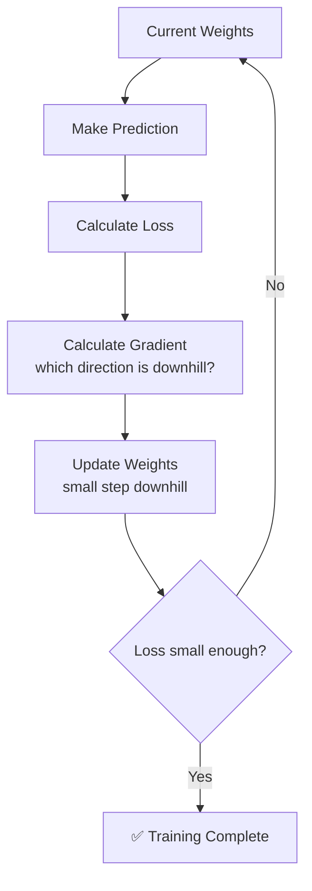

# Gradient Descent

## The Story 📖

You're blindfolded in the mountains. Your goal: reach the lowest valley.

You can't see anything. But you can feel the slope under your feet.

So you do the only sensible thing — you take a small step in whichever direction feels downhill. Then check the slope again. Take another small step downhill. Repeat.

Eventually, step by step, you reach the bottom of a valley.

You didn't need a map. You didn't need to see the whole landscape. You just kept asking: *"which way is downhill right now?"* and took a small step.

👉 This is **Gradient Descent** — the algorithm that trains almost every AI model by repeatedly nudging it in the direction that reduces its mistakes.

---

## What is Gradient Descent?

**Gradient Descent** is the optimization algorithm used to train ML models. It minimizes the **loss** (how wrong the model is) by repeatedly adjusting the model's weights in the direction that reduces the loss.

- **Gradient** = the slope (which direction is "downhill" for the loss)
- **Descent** = moving downhill (reducing the loss)

The "landscape" being navigated is the **loss surface** — a mathematical surface where the height represents how wrong the model is. The goal is to find the lowest point (minimum loss).

---

## How It Works — Step by Step

### Step 1: Make a Prediction
The model uses its current weights to make a prediction.

### Step 2: Calculate the Loss
Compare the prediction to the correct answer. How wrong was it?

### Step 3: Calculate the Gradient
Compute which direction each weight should move to reduce the loss.
- Analogy: feel the slope under your feet — which way is downhill?

### Step 4: Update the Weights
Move each weight a small amount in the downhill direction.

### Step 5: Repeat
Do this millions of times until the loss stops decreasing.



---

## The Learning Rate — How Big is Each Step?

The **learning rate** controls how big each step is.

| Learning Rate | Problem |
|---|---|
| Too large | Overshoots the valley, bounces around, never settles |
| Too small | Takes forever to reach the bottom |
| Just right | Converges smoothly to the minimum |

```
Too large:   ↓↑↓↑↓ (bouncing)
Too small:   ↓↓↓↓↓↓↓↓↓↓ (crawling)
Just right:  ↓↓↓↓ ✅
```

---

## 3 Flavors of Gradient Descent

| Type | Looks at | Speed | Stability |
|---|---|---|---|
| **Batch** | All training data at once | Slow | Stable |
| **Stochastic (SGD)** | One random example at a time | Fast | Noisy |
| **Mini-batch** | Small batches (e.g. 32 examples) | Balanced | Balanced (most common) |

Almost all modern training uses **mini-batch** gradient descent.

---

## Common Mistakes to Avoid ⚠️

- **Setting learning rate too high** — training explodes, loss shoots up instead of down
- **Not normalizing input data** — features on wildly different scales make the loss surface lopsided and hard to navigate
- **Stopping too early** — the model hasn't found the valley yet

---

## Connection to Other Concepts 🔗

- **Loss Function** — defines the "landscape" that gradient descent navigates → `09_Loss_Functions`
- **Backpropagation** — the algorithm that calculates the gradient in neural networks → `04_Neural_Networks/06_Backpropagation`
- **Optimizers** (Adam, RMSProp) — improved versions of gradient descent → `04_Neural_Networks/07_Optimizers`

---

✅ **What you just learned:** Gradient descent = the "blindfolded hiker" algorithm that trains models by repeatedly taking small steps to reduce mistakes.

🔨 **Build this now:** Imagine a simple function `loss = (weight - 5)²`. The minimum is at weight=5. Start at weight=0, compute the gradient (2*(weight-5)), subtract 0.1 × gradient, repeat. Watch weight creep toward 5. That's gradient descent in 3 lines of math.

➡️ **Next step:** What does the model actually try to minimize? → `09_Loss_Functions/Theory.md`

---

## 📂 Navigation

**In this folder:**
| File | |
|---|---|
| 📄 **Theory.md** | ← you are here |
| [📄 Cheatsheet.md](./Cheatsheet.md) | Quick reference |
| [📄 Interview_QA.md](./Interview_QA.md) | Interview prep |

⬅️ **Prev:** [07 Feature Engineering](../07_Feature_Engineering/Theory.md) &nbsp;&nbsp;&nbsp; ➡️ **Next:** [09 Loss Functions](../09_Loss_Functions/Theory.md)
