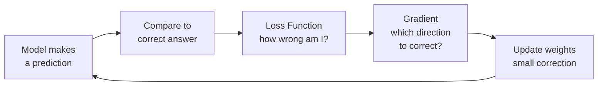
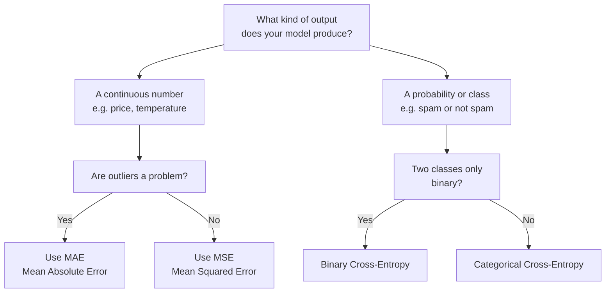

# Loss Functions

## The Story

GPS constantly measures "how far off am I?" and uses that to correct course. A tiny error → gentle recalculation. A huge error → full reroute.

👉 This is why we need **Loss Functions** — they define what "wrong" means for your problem, and the model learns entirely by minimizing them.

---

## What is a Loss Function?

A **loss function** measures how different the model's prediction is from the correct answer. Small loss = close to right. Large loss = far off. The model's only goal during training is to minimize this number — which means the choice of loss function determines what the model actually optimizes for.



---

## Loss Function for Regression: MSE

**Mean Squared Error** is used when the output is a continuous number (price, temperature, sales).

```
MSE = (1/n) × Σ (prediction - actual)²
```

Squaring makes all errors positive, punishes large errors more than small ones (off by 10 costs 100× more than off by 1), and is smooth for gradient descent. A $10,000 house-price error gets squared to 100,000,000 — forcing the model to care about large prediction errors.

---

## Loss Function for Classification: Cross-Entropy

**Cross-Entropy Loss** (log loss) is used when the output is a probability of belonging to a class.

```
Cross-Entropy = -Σ (actual × log(predicted probability))
```

If model says "90% chance spam" and it IS spam → small loss. If model says "10% chance spam" and it IS spam → huge loss. Confident wrong predictions are penalized harshly, forcing the model to be well-calibrated.

---

## Why the Choice of Loss Function Matters

| Problem | Wrong Loss | Consequence |
|---|---|---|
| House price regression | Cross-entropy | Cannot compute — needs probabilities as input |
| Spam classification | MSE | Trains a model that outputs 0s and 1s poorly; no calibrated probabilities |
| Fraud detection (imbalanced) | MSE | Ignores rare fraud cases; model learns to always predict "not fraud" |
| Ranking (search results) | MSE or cross-entropy | Neither captures position — use a ranking loss instead |

The loss function is your contract with the model: "Here is what I care about. Optimize for this."

---

## Summary: Which Loss to Use

| Task | Loss Function | Why |
|---|---|---|
| Regression (predicting numbers) | MSE or MAE | Measures numeric distance from correct answer |
| Binary classification | Binary cross-entropy | Measures probability calibration for 2 classes |
| Multi-class classification | Categorical cross-entropy | Measures probability across many classes |
| Regression (with outliers) | MAE (Mean Absolute Error) | Less sensitive to extreme errors than MSE |



---

✅ **What you just learned:** A loss function measures how wrong the model is. MSE for regression (punishes big errors hard). Cross-entropy for classification (punishes confident wrong predictions). The model learns by minimizing the loss.

🔨 **Build this now:** Pick two predictions: one that says 90% spam for an actual spam email, and one that says 10% spam for an actual spam email. Calculate cross-entropy for both: -log(0.9) vs -log(0.1). See how the confident wrong prediction gets a much larger loss.

➡️ **Next step:** Why do complex models sometimes perform worse? → `10_Bias_vs_Variance/Theory.md`

---

## 🛠️ Practice Project

Apply what you just learned → **[B2: ML Model Comparison](../../22_Capstone_Projects/02_ML_Model_Comparison/03_GUIDE.md)**
> This project uses: cross-entropy loss in classifiers, understanding what the model is minimizing during training

---

## 📂 Navigation

**In this folder:**
| File | |
|---|---|
| 📄 **Theory.md** | ← you are here |
| [📄 Cheatsheet.md](./Cheatsheet.md) | Quick reference |
| [📄 Interview_QA.md](./Interview_QA.md) | Interview prep |

⬅️ **Prev:** [08 Gradient Descent](../08_Gradient_Descent/Theory.md) &nbsp;&nbsp;&nbsp; ➡️ **Next:** [10 Bias vs Variance](../10_Bias_vs_Variance/Theory.md)
