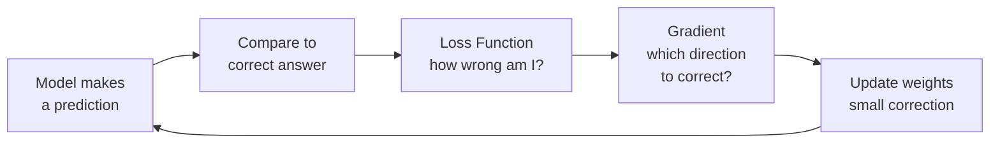

# Loss Functions

## The Story

You are driving with GPS. You enter a destination.

If your GPS is slightly wrong about your current location, it recalculates — a gentle "turn left in 200 metres."

If your GPS is wildly wrong — thinks you are in a different city — it recalculates aggressively. A full route from scratch.

The GPS is always measuring one thing: "How far off am I right now?" That measurement drives every decision it makes.

A loss function is that same measurement. It is the model's GPS — constantly asking "how wrong am I?" and using that answer to figure out how much to correct.

👉 This is why we need **Loss Functions** — they define what "wrong" means for your specific problem, and the model learns entirely by minimizing them.

---

## What is a Loss Function?

A **loss function** (also called a cost function) measures how different the model's prediction is from the correct answer.

- Small loss = model is close to right
- Large loss = model is far off
- Loss = 0 = model predicted perfectly

During training, the model's only goal is to minimize this number. That is it. Everything the model learns comes from trying to make the loss smaller.

This means the choice of loss function determines what the model actually optimizes for — and a wrong choice leads to a model that is "technically" trained but useless in practice.



---

## Loss Function for Regression: MSE

**Mean Squared Error** is used when the output is a continuous number (price, temperature, sales).

```
MSE = (1/n) × Σ (prediction - actual)²
```

**Why squaring?**
- It makes all errors positive (no negative errors canceling out positive ones)
- It punishes large errors more than small ones — being off by 10 costs 100 times more than being off by 1
- It is smooth and differentiable — gradient descent can navigate it easily

**GPS analogy:** Being 100 km off is not just "10 times worse" than being 10 km off — it is much harder to recover from. Squaring captures that.

**Example:** Predicting house prices. A $10,000 error gets squared to 100,000,000. A $100 error gets squared to 10,000. MSE forces the model to really care about large prediction errors.

---

## Loss Function for Classification: Cross-Entropy

**Cross-Entropy Loss** (also called log loss) is used when the output is a probability of belonging to a class (spam/not-spam, cat/dog/bird).

```
Cross-Entropy = -Σ (actual × log(predicted probability))
```

**What this means in plain English:**
If the model says "90% chance spam" and it IS spam, the loss is small.
If the model says "10% chance spam" and it IS spam, the loss is huge — because the model was confidently wrong.

Cross-entropy punishes confident wrong predictions very harshly. This forces the model to be well-calibrated — not just predicting the right class but with appropriate confidence.

**GPS analogy:** Not just "you're in the wrong street" — the confidence matters. If you were absolutely certain you were at the right address, being wrong is a catastrophic failure.

---

## Why the Choice of Loss Function Matters

| Problem | Wrong Loss | Consequence |
|---|---|---|
| House price regression | Cross-entropy | Cannot compute — needs probabilities as input |
| Spam classification | MSE | Trains a model that outputs 0s and 1s poorly; no calibrated probabilities |
| Fraud detection (imbalanced) | MSE | Ignores rare fraud cases; model learns to always predict "not fraud" |
| Ranking (search results) | MSE or cross-entropy | Neither captures position — use a ranking loss instead |

The loss function is your contract with the model: "Here is what I care about. Optimize for this."

---

## Summary: Which Loss to Use

| Task | Loss Function | Why |
|---|---|---|
| Regression (predicting numbers) | MSE or MAE | Measures numeric distance from correct answer |
| Binary classification | Binary cross-entropy | Measures probability calibration for 2 classes |
| Multi-class classification | Categorical cross-entropy | Measures probability across many classes |
| Regression (with outliers) | MAE (Mean Absolute Error) | Less sensitive to extreme errors than MSE |

---

✅ **What you just learned:** A loss function measures how wrong the model is. MSE for regression (punishes big errors hard). Cross-entropy for classification (punishes confident wrong predictions). The model learns by minimizing the loss.

🔨 **Build this now:** Pick two predictions: one that says 90% spam for an actual spam email, and one that says 10% spam for an actual spam email. Calculate cross-entropy for both: -log(0.9) vs -log(0.1). See how the confident wrong prediction gets a much larger loss.

➡️ **Next step:** Why do complex models sometimes perform worse? → `10_Bias_vs_Variance/Theory.md`

---

## 📂 Navigation

**In this folder:**
| File | |
|---|---|
| 📄 **Theory.md** | ← you are here |
| [📄 Cheatsheet.md](./Cheatsheet.md) | Quick reference |
| [📄 Interview_QA.md](./Interview_QA.md) | Interview prep |

⬅️ **Prev:** [08 Gradient Descent](../08_Gradient_Descent/Theory.md) &nbsp;&nbsp;&nbsp; ➡️ **Next:** [10 Bias vs Variance](../10_Bias_vs_Variance/Theory.md)
