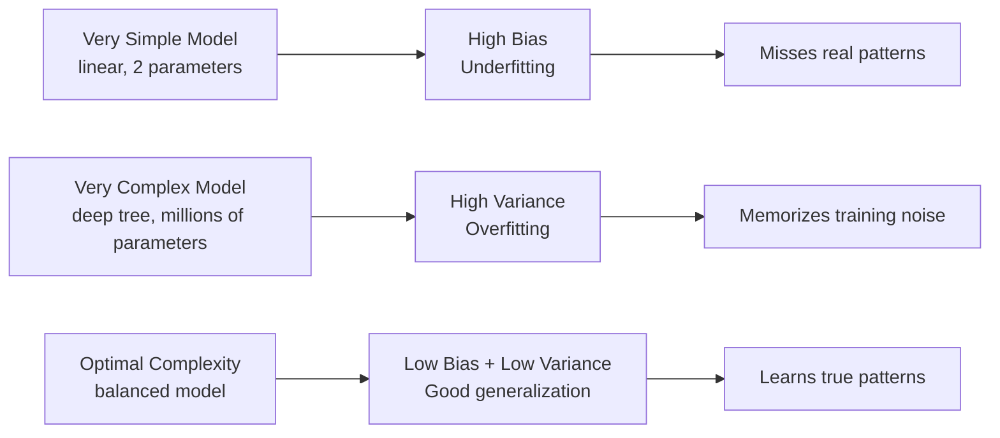
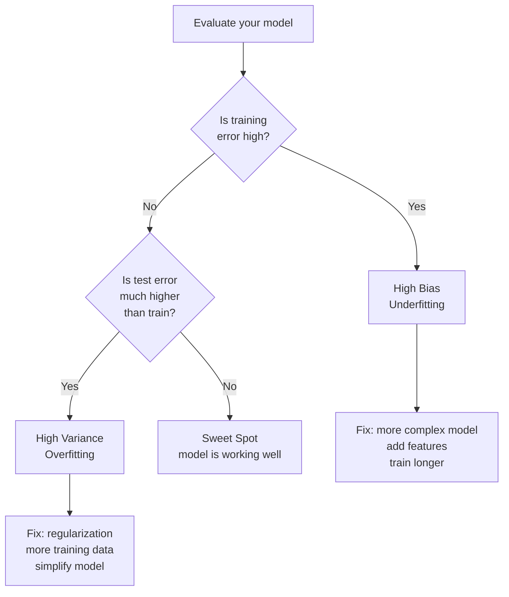

# Bias vs Variance

## The Story

Two archers are competing.

**Archer A** hits the exact same spot every single time. Dead consistent. The problem? That spot is the upper-left corner — nowhere near the bullseye. Every arrow, same wrong location.

**Archer B** scatters arrows all over the target. Some high, some low, some left, some right. But if you average all their hits, it is right in the centre.

Archer A has **high bias** — consistently wrong. Low variance — consistent.

Archer B has **low bias** — right on average. But high variance — all over the place.

You want an archer who is both accurate AND consistent. Low bias AND low variance. But making an archer more consistent often means they get locked into a location. Making them less locked in often means more scatter.

👉 This is why we need to understand **Bias vs Variance** — every model makes this tradeoff, and understanding it is how you diagnose and fix model problems.

---

## What is Bias?

**Bias** is systematic error — the model consistently gets things wrong in the same direction because it made oversimplified assumptions.

A linear model trying to fit a curved relationship has high bias. No matter how much data you give it, it cannot learn the curve — the model is too simple to represent the truth.

**High bias symptoms:**
- Training accuracy is low
- The model makes the same kind of mistake repeatedly
- Adding more data does not help much

---

## What is Variance?

**Variance** is sensitivity to the specific training data used. A high-variance model changes dramatically if you train it on a slightly different dataset.

A deep decision tree with no depth limit can memorize all 100 training examples perfectly. Train it on a slightly different 100 examples and you get a completely different tree. The model is so flexible it just memorizes whatever it sees.

**High variance symptoms:**
- Training accuracy is very high, test accuracy is much lower
- The model works great on training data, fails in production
- Adding more training data helps significantly

---

## The Tradeoff

Model complexity drives the tradeoff:

As you increase model complexity:
- Bias decreases (the model can represent more complex patterns)
- Variance increases (the model becomes more sensitive to training data)

The sweet spot is the complexity level where the total error (bias² + variance + noise) is minimized.

---

## How Complexity Affects Both

| Model Complexity | Bias | Variance | Training Error | Test Error |
|---|---|---|---|---|
| Too simple | High | Low | High | High |
| Just right | Low | Low | Low | Low |
| Too complex | Low | High | Very low | High |

---

## How to Diagnose Which Problem You Have

| Observation | Likely Problem | Fix |
|---|---|---|
| Train and test error both high | High bias (underfitting) | Use a more complex model, add features |
| Train error low, test error high | High variance (overfitting) | Regularize, get more data, simplify model |
| Train error high, test error very high | Both bias and variance | Major model redesign needed |
| Train and test error both low | Sweet spot | You're done |

---

## Real Model Examples

| Model | Typical Bias | Typical Variance |
|---|---|---|
| Linear regression | High (can't fit curves) | Low |
| Deep neural network | Low (very flexible) | High (without regularization) |
| Decision tree, no limit | Low | Very high |
| Decision tree, depth=2 | High | Low |
| Random forest | Low (ensemble) | Lower than single tree |

Regularization, dropout, and ensemble methods are all techniques for reducing variance while keeping bias manageable.

---

✅ **What you just learned:** Bias = model too simple, consistently wrong. Variance = model too complex, sensitive to training data. The tradeoff means you must balance model complexity — not too simple, not too complex.

🔨 **Build this now:** Train a sklearn DecisionTreeClassifier with max_depth=1 (high bias — check both train and test accuracy). Then train with no depth limit (high variance — check both). Then try max_depth=5. See how the gap between train and test accuracy changes with complexity.

➡️ **Next step:** Ready for actual algorithms? → `03_Classical_ML_Algorithms/01_Linear_Regression/Theory.md`

---

## 📝 Practice Questions

- 📝 [Q10 · bias-variance-tradeoff](../../ai_practice_questions_100.md#q10--interview--bias-variance-tradeoff)

---

## 📂 Navigation

**In this folder:**
| File | |
|---|---|
| 📄 **Theory.md** | ← you are here |
| [📄 Cheatsheet.md](./Cheatsheet.md) | Quick reference |
| [📄 Interview_QA.md](./Interview_QA.md) | Interview prep |

⬅️ **Prev:** [09 Loss Functions](../09_Loss_Functions/Theory.md) &nbsp;&nbsp;&nbsp; ➡️ **Next:** [01 Linear Regression](../../03_Classical_ML_Algorithms/01_Linear_Regression/Theory.md)
