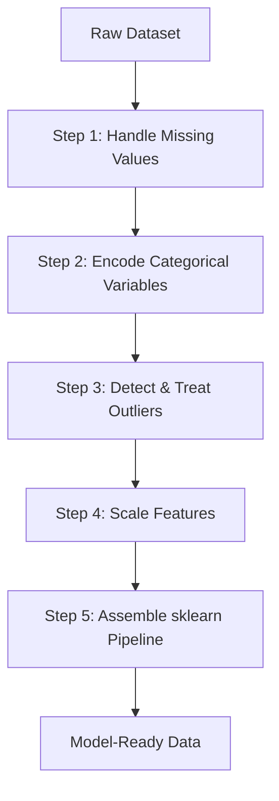
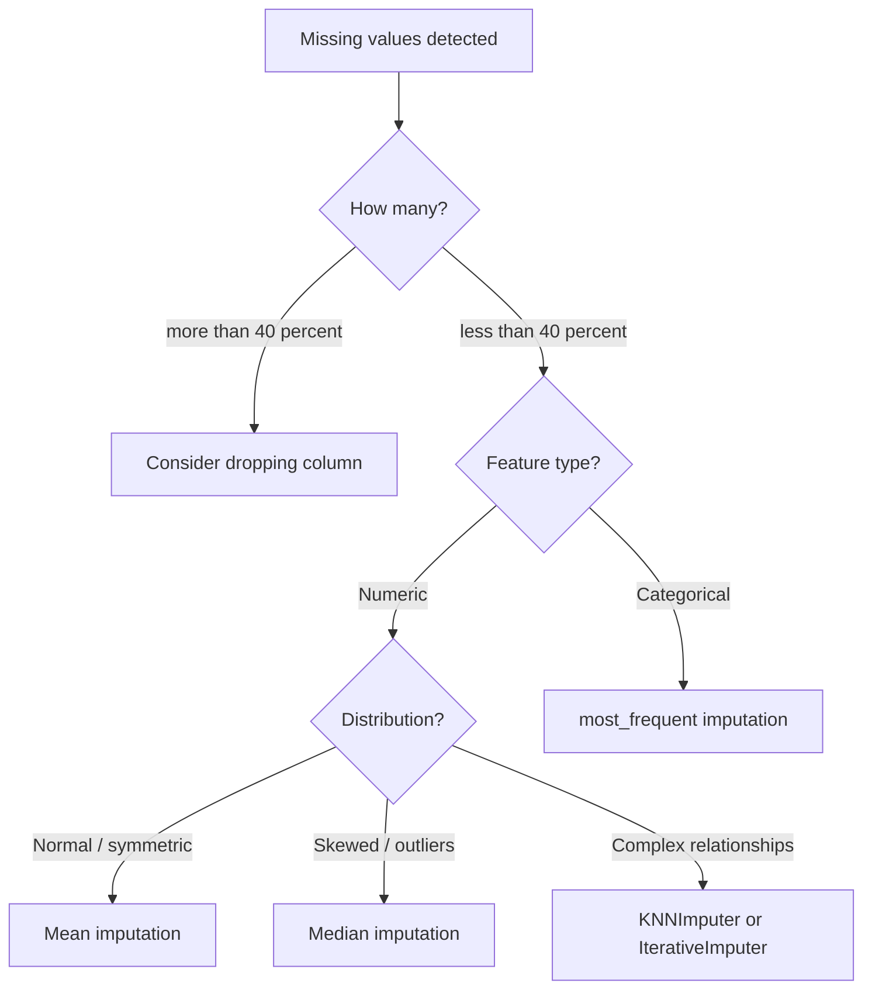
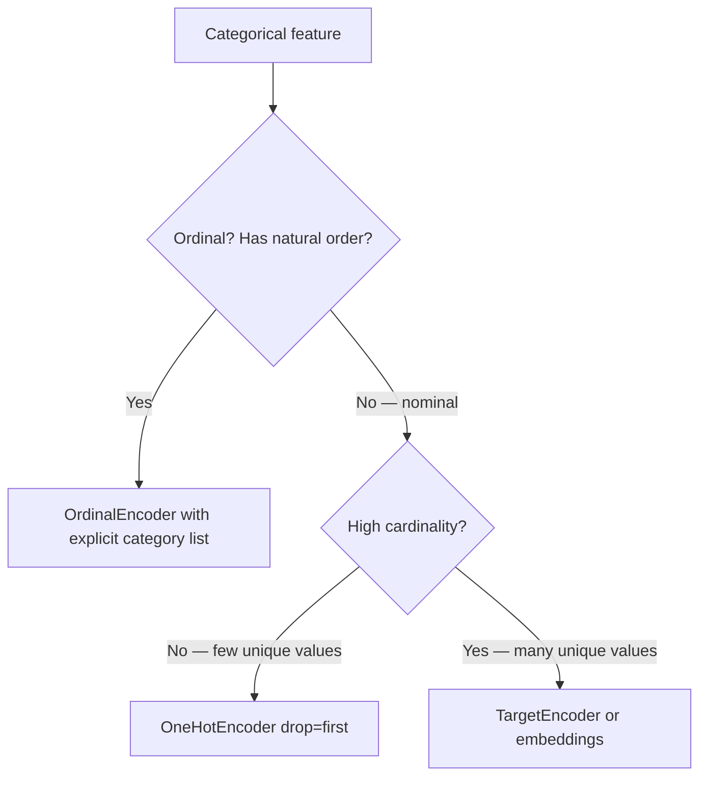

# Data Preprocessing

## The Story 📖

Imagine you are a chef preparing a five-star meal. The market delivers a crate of vegetables — some are muddy, some have rotten spots, one is enormous while another is the size of a marble, and a few labels are in a language you cannot read. You do not throw them straight into the pan. You wash them, peel them, chop them to uniform size, and translate the labels. Only then does cooking become possible.

Raw data is exactly this crate of vegetables. Machine learning models are the chef. The model cannot learn from data that has holes in it, features that dwarf each other in scale, or categories written as words instead of numbers.

👉 This is why we need **Data Preprocessing** — to transform raw, messy data into a clean, consistent form that machine learning models can actually learn from.

---

## 📌 Learning Priority

**Must Learn** — core concepts, needed to understand the rest of this file:
[What is Data Preprocessing](#what-is-data-preprocessing) · [Handling Missing Values](#step-1-handling-missing-values) · [Feature Scaling](#step-4-feature-scaling)

**Should Learn** — important for real projects and interviews:
[Encoding Categorical Variables](#step-2-encoding-categorical-variables) · [sklearn Pipeline](#step-5-sklearn-pipeline)

**Good to Know** — useful in specific situations, not needed daily:
[Outlier Detection](#step-3-outlier-detection) · [Common Mistakes](#common-mistakes-to-avoid-)

**Reference** — skim once, look up when needed:
[Where You'll See This](#where-youll-see-this-in-real-ai-systems)

---

## What is Data Preprocessing?

**Data Preprocessing** is the set of transformations applied to raw data before it is fed into a machine learning model. It converts real-world data into a numerical, normalized, model-ready format.

Core phases:
- **Cleaning** — handle missing values and remove noise
- **Encoding** — convert categories to numbers
- **Outlier treatment** — detect and neutralize extreme values
- **Scaling** — bring features to comparable numeric ranges
- **Pipeline assembly** — chain all steps to prevent data leakage

---

## Why It Exists — The Problem It Solves

**1. Garbage in, garbage out**
A model trained on data with missing values will either crash or learn incorrect patterns. Missing data is the rule, not the exception, in real-world datasets.

**2. Scale sensitivity**
Algorithms like gradient descent, SVMs, and k-NN are sensitive to feature magnitude. If `salary` ranges 30,000–200,000 and `age` ranges 18–65, the model is dominated by salary — a $1 change looks 3,000× more important than a 1-year age difference.

**3. Categorical incompatibility**
Models operate on numbers. A column containing `["cat", "dog", "rabbit"]` cannot be passed to any algorithm as-is.

👉 Without preprocessing: models learn noise, fail to converge, or produce misleading predictions. With preprocessing: models see a clean, well-scaled, fully numeric representation of reality.

---

## How It Works — Step by Step



### Step 1: Handling Missing Values



- **SimpleImputer** `strategy="mean"` — symmetric, no outliers
- **SimpleImputer** `strategy="median"` — skewed or outliers present
- **SimpleImputer** `strategy="most_frequent"` — categorical features
- **KNNImputer** — missingness correlated with other features; finds k nearest rows and averages
- **IterativeImputer** — treats each missing feature as a regression target; most accurate, highest cost

**Rule:** Fit only on training data. Never impute before the train/test split.

### Step 2: Encoding Categorical Variables



- **OrdinalEncoder** — only for ordered data: `["low", "medium", "high"]` → `[0, 1, 2]`
- **OneHotEncoder** — nominal data: creates one binary column per category. Use `drop="first"` to avoid the dummy variable trap
- **LabelEncoder** — only for the target variable `y`, never for input features
- **TargetEncoder** — replaces category with mean target value; powerful for high-cardinality features; requires cross-fitting to prevent leakage

### Step 3: Outlier Detection

**IQR fence:**
```
lower = Q1 − 1.5 × IQR
upper = Q3 + 1.5 × IQR
```
Standard univariate method. Covers ≈ 99.3% of a normal distribution.

**Z-score:** flag |z| > 3. Assumes roughly normal distribution.

**LocalOutlierFactor** — compares a point's local density to its neighbors. Effective for multivariate data.

**Treatment options:**
- **Winsorize** — cap at fence values. Retains the row, neutralizes the extreme value.
- **Log transform** — compresses right-skewed distributions naturally.
- **Drop** — only when clearly a data entry error.

### Step 4: Feature Scaling

| Scaler | Formula | Use When |
|---|---|---|
| **StandardScaler** | `(x − mean) / std` | Linear models, SVM, PCA — assumes normality |
| **MinMaxScaler** | `(x − min) / (max − min)` → [0,1] | Neural networks, bounded inputs needed |
| **RobustScaler** | `(x − median) / IQR` | Outliers present — uses robust statistics |
| **PowerTransformer** | Box-Cox or Yeo-Johnson | Highly skewed feature, linear model |
| **No scaling needed** | — | Decision trees, Random Forest, XGBoost |

### Step 5: sklearn Pipeline

```python
from sklearn.pipeline import Pipeline
from sklearn.compose import ColumnTransformer
from sklearn.impute import SimpleImputer
from sklearn.preprocessing import StandardScaler, OneHotEncoder, RobustScaler

numeric_pipeline = Pipeline([
    ("imputer", SimpleImputer(strategy="median")),
    ("scaler", RobustScaler()),
])

nominal_pipeline = Pipeline([
    ("imputer", SimpleImputer(strategy="most_frequent")),
    ("encoder", OneHotEncoder(handle_unknown="ignore", drop="first")),
])

preprocessor = ColumnTransformer([
    ("num", numeric_pipeline, ["age", "salary"]),
    ("nom", nominal_pipeline, ["city", "department"]),
])

full_pipeline = Pipeline([
    ("preprocessor", preprocessor),
    ("model", RandomForestClassifier()),
])

full_pipeline.fit(X_train, y_train)   # fits preprocessor on train only
full_pipeline.score(X_test, y_test)   # transforms test using train statistics
```

---

## The Math / Technical Side (Simplified)

**MinMaxScaler:** `x_scaled = (x − min) / (max − min)` — result always in [0, 1]

**StandardScaler:** `x_scaled = (x − μ) / σ` — result has mean=0, std=1

**RobustScaler:** `x_scaled = (x − Q2) / (Q3 − Q1)` — outliers don't distort the transform

**IQR outlier fences:** `lower = Q1 − 1.5×IQR`, `upper = Q3 + 1.5×IQR`

**One-Hot dimension:** k unique categories → k binary columns (k−1 with `drop="first"`)

---

## Where You'll See This in Real AI Systems

- **Production ML pipelines** — pipelines are serialized with `joblib.dump()` alongside the model so inference-time data receives identical transformations
- **Feature stores** (Feast, Tecton, Hopsworks) — preprocessing logic registered as feature transforms, same logic runs at training and serving to eliminate train-serve skew
- **AutoML platforms** (H2O, TPOT) — search over preprocessing strategies as part of hyperparameter optimization
- **Data validation** (Great Expectations, Pandera) — preprocessing is preceded by schema and distribution validation in mature ML systems

---

## Common Mistakes to Avoid ⚠️

- **Fitting scaler on full dataset before splitting** — leaks test set statistics into training. Always split first, then fit.
- **Imputing before train/test split** — same leakage problem with imputation statistics.
- **One-hot encoding high-cardinality features** — 500 unique cities → 499 sparse columns. Use TargetEncoder or embeddings instead.
- **Forgetting to save the fitted Pipeline** — must serialize with `joblib.dump()` and reload at inference; never refit on production data.
- **Scaling before tree-based models** — wasted compute; trees are scale-invariant.

## Connection to Other Concepts 🔗

- Relates to **Feature Engineering** (`07_Feature_Engineering`) — preprocessing is the foundation; feature engineering creates new features from clean data
- Relates to **Model Evaluation** (`05_Model_Evaluation`) — leakage from preprocessing makes test metrics unreliable
- Relates to **Classical ML Algorithms** — scale-sensitive algorithms (SVM, k-NN, linear models) require scaling; tree-based models do not

---

✅ **What you just learned:** Data preprocessing transforms raw data into model-ready form using imputation, encoding, outlier treatment, and scaling — assembled into a sklearn Pipeline to prevent data leakage at every step.

🔨 **Build this now:** Load the Titanic dataset, build a `ColumnTransformer` with `SimpleImputer + RobustScaler` for numeric columns and `SimpleImputer + OneHotEncoder` for categorical, wrap in a `Pipeline` with `LogisticRegression`, evaluate on a held-out test set.

➡️ **Next step:** Now that your data is clean → [Linear Regression](../../03_Classical_ML_Algorithms/01_Linear_Regression/Theory.md)

---

## 📂 Navigation

**In this folder:**
| File | |
|---|---|
| 📄 **Theory.md** | ← you are here |
| [📄 Cheatsheet.md](./Cheatsheet.md) | Quick reference |
| [📄 Interview_QA.md](./Interview_QA.md) | Interview prep |

⬅️ **Prev:** [Bias vs Variance](../10_Bias_vs_Variance/Theory.md) &nbsp;&nbsp;&nbsp; ➡️ **Next:** [Linear Regression](../../03_Classical_ML_Algorithms/01_Linear_Regression/Theory.md)
