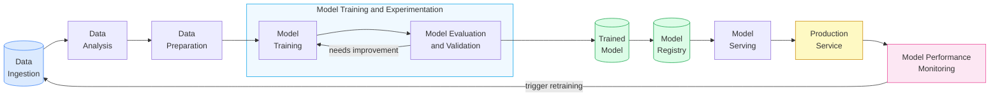

# ML Workflow — End to End

> How a real machine learning project flows from raw data to production — and back again.

## Each Stage Explained

| Stage | What Happens | Key Questions |
|---|---|---|
| **Data Ingestion** | Collect raw data from sources (DBs, APIs, files) | What data do I have? Is it labeled? |
| **Data Analysis** | Explore distributions, find patterns, detect issues | Are there outliers? Class imbalance? Missing values? |
| **Data Preparation** | Clean, transform, normalize, split train/val/test | What features matter? How to encode categoricals? |
| **Model Training** | Fit model on training data, tune hyperparameters | Which algorithm? What regularization? |
| **Model Evaluation** | Measure accuracy, precision, recall, F1 on held-out data | Is the model generalizing? Overfitting? |
| **Model Registry** | Version and store the trained model artifacts | Which version goes to production? |
| **Model Serving** | Deploy model behind an API endpoint | Latency? Batching? A/B testing? |
| **Production Service** | Model serves real users | Cost? SLAs? Monitoring alerts? |
| **Performance Monitoring** | Track live metrics, detect drift | When does the model go stale? |

## The Feedback Loop

The monitoring stage feeds back to the start — when live performance degrades (data drift, concept drift), it triggers a new training run. This is why ML systems are never truly "finished."

---

✅ **What this diagram shows:** Real ML is a loop, not a pipeline. Deployment is the beginning of maintenance, not the end.

---

## 📂 Navigation

⬅️ **Back to:** [02 ML Foundations](./Readme.md)
