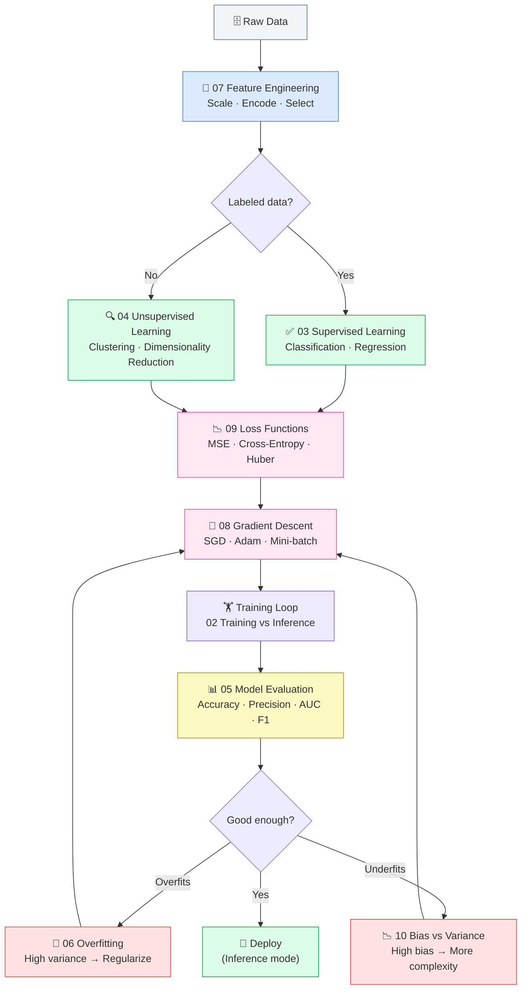

# ⚙️ Machine Learning Foundations

⬅️ [01 Math for AI](../01_Math_for_AI/Readme.md) &nbsp;|&nbsp; [🏠 Home](../00_Learning_Guide/Readme.md) &nbsp;|&nbsp; [03 Classical ML Algorithms ➡️](../03_Classical_ML_Algorithms/Readme.md)

> The complete vocabulary and mental model for how ML systems are built, trained, and broken — everything you need before touching a single algorithm.

**[▶ Start here → What is ML Theory](./01_What_is_ML/Theory.md)**

---

## At a Glance

| | |
|---|---|
| 📚 Topics | 10 topics |
| ⏱️ Est. Time | 5–7 hours |
| 📋 Prerequisites | [01 Math for AI](../01_Math_for_AI/Readme.md) |
| 🔓 Unlocks | [03 Classical ML Algorithms](../03_Classical_ML_Algorithms/Readme.md) |

---

## What's in This Section

---

## Topics

| # | Topic | What You'll Learn | Files |
|---|---|---|---|
| 01 | [What is ML?](./01_What_is_ML/Theory.md) | The three paradigms (supervised, unsupervised, RL) and how ML differs from traditional programming | [📖 Theory](./01_What_is_ML/Theory.md) · [⚡ Cheatsheet](./01_What_is_ML/Cheatsheet.md) · [🎯 Interview Q&A](./01_What_is_ML/Interview_QA.md) |
| 02 | [Training vs Inference](./02_Training_vs_Inference/Theory.md) | The two distinct phases of every ML system — learning from data vs applying what was learned | [📖 Theory](./02_Training_vs_Inference/Theory.md) · [⚡ Cheatsheet](./02_Training_vs_Inference/Cheatsheet.md) · [🎯 Interview Q&A](./02_Training_vs_Inference/Interview_QA.md) |
| 03 | [Supervised Learning](./03_Supervised_Learning/Theory.md) | Learning from labeled examples — how models map inputs to outputs for classification and regression | [📖 Theory](./03_Supervised_Learning/Theory.md) · [⚡ Cheatsheet](./03_Supervised_Learning/Cheatsheet.md) · [🎯 Interview Q&A](./03_Supervised_Learning/Interview_QA.md) · [💻 Code](./03_Supervised_Learning/Code_Example.md) |
| 04 | [Unsupervised Learning](./04_Unsupervised_Learning/Theory.md) | Finding hidden structure in unlabeled data through clustering and dimensionality reduction | [📖 Theory](./04_Unsupervised_Learning/Theory.md) · [⚡ Cheatsheet](./04_Unsupervised_Learning/Cheatsheet.md) · [🎯 Interview Q&A](./04_Unsupervised_Learning/Interview_QA.md) · [💻 Code](./04_Unsupervised_Learning/Code_Example.md) |
| 05 | [Model Evaluation](./05_Model_Evaluation/Theory.md) | How to measure whether a model is actually good — accuracy, precision, recall, F1, AUC, cross-validation | [📖 Theory](./05_Model_Evaluation/Theory.md) · [⚡ Cheatsheet](./05_Model_Evaluation/Cheatsheet.md) · [🎯 Interview Q&A](./05_Model_Evaluation/Interview_QA.md) · [📐 Metrics Deep Dive](./05_Model_Evaluation/Metrics_Deep_Dive.md) |
| 06 | [Overfitting & Regularization](./06_Overfitting_and_Regularization/Theory.md) | Why models fail on new data and how to prevent it — L1/L2, dropout, early stopping | [📖 Theory](./06_Overfitting_and_Regularization/Theory.md) · [⚡ Cheatsheet](./06_Overfitting_and_Regularization/Cheatsheet.md) · [🎯 Interview Q&A](./06_Overfitting_and_Regularization/Interview_QA.md) |
| 07 | [Feature Engineering](./07_Feature_Engineering/Theory.md) | Transforming raw data into signals a model can use — scaling, encoding, selection, creation | [📖 Theory](./07_Feature_Engineering/Theory.md) · [⚡ Cheatsheet](./07_Feature_Engineering/Cheatsheet.md) · [🎯 Interview Q&A](./07_Feature_Engineering/Interview_QA.md) · [💻 Code](./07_Feature_Engineering/Code_Example.md) |
| 08 | [Gradient Descent](./08_Gradient_Descent/Theory.md) | The optimization algorithm that trains almost every ML model — SGD, mini-batch, momentum, Adam | [📖 Theory](./08_Gradient_Descent/Theory.md) · [⚡ Cheatsheet](./08_Gradient_Descent/Cheatsheet.md) · [🎯 Interview Q&A](./08_Gradient_Descent/Interview_QA.md) |
| 09 | [Loss Functions](./09_Loss_Functions/Theory.md) | How models measure their own mistakes — MSE, cross-entropy, Huber loss, and choosing the right one | [📖 Theory](./09_Loss_Functions/Theory.md) · [⚡ Cheatsheet](./09_Loss_Functions/Cheatsheet.md) · [🎯 Interview Q&A](./09_Loss_Functions/Interview_QA.md) |
| 10 | [Bias vs Variance](./10_Bias_vs_Variance/Theory.md) | The core tradeoff in model complexity — diagnosing underfitting vs overfitting and fixing both | [📖 Theory](./10_Bias_vs_Variance/Theory.md) · [⚡ Cheatsheet](./10_Bias_vs_Variance/Cheatsheet.md) · [🎯 Interview Q&A](./10_Bias_vs_Variance/Interview_QA.md) |

---

## Key Concepts at a Glance

| Concept | Why It Matters in AI |
|---|---|
| Training is optimization | Every training run adjusts weights to minimize a loss function via gradient descent — compute loss → compute gradients → step weights → repeat until convergence |
| Loss function defines success | Use MSE for regression, cross-entropy for classification; the wrong loss optimizes for the wrong goal, producing a model excellent at something you don't care about |
| Overfitting is memorization, not learning | A model at 99% train / 60% test accuracy has memorized the training set; regularization (L1/L2, dropout, early stopping) forces patterns that generalize |
| Features matter more than algorithms | A mediocre algorithm with excellent features beats an excellent algorithm with raw, unprocessed data — feature engineering is where real-world improvement happens |
| Bias vs variance is the master dial | High bias (underfitting): add features or model complexity; high variance (overfitting): add data or regularization — every debugging decision traces back to this tradeoff |

---

## 📂 Navigation

⬅️ **Prev:** [01 Math for AI](../01_Math_for_AI/Readme.md) &nbsp;&nbsp; ➡️ **Next:** [03 Classical ML Algorithms](../03_Classical_ML_Algorithms/Readme.md)
