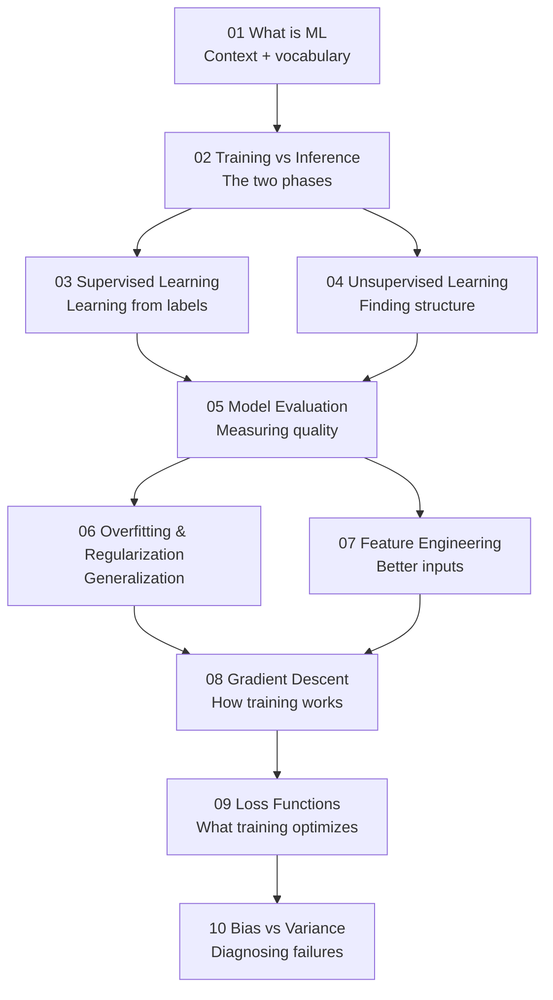

# 02 Machine Learning Foundations

Machine learning is the discipline of building systems that learn patterns from data rather than following hand-written rules. This section covers the foundational concepts every ML practitioner needs — from the basic vocabulary of training and inference, to the core mathematical engines (gradient descent, loss functions) that power every model you will ever build or use.

By the end of this section you will understand not just *what* ML algorithms do, but *why* they work and *when* they fail. That understanding is what separates engineers who can debug and improve models from those who can only run them.

---

## Topics in This Section

| # | Topic | What it covers |
|---|---|---|
| 01 | [What is Machine Learning?](./01_What_is_ML/Theory.md) | Definition, paradigms (supervised, unsupervised, reinforcement), and how ML differs from traditional programming |
| 02 | [Training vs Inference](./02_Training_vs_Inference/Theory.md) | The two phases of every ML system — learning from data vs applying what was learned |
| 03 | [Supervised Learning](./03_Supervised_Learning/Theory.md) | Learning from labeled examples; classification and regression; how the model maps inputs to outputs |
| 04 | [Unsupervised Learning](./04_Unsupervised_Learning/Theory.md) | Finding structure in unlabeled data; clustering, dimensionality reduction, and representation learning |
| 05 | [Model Evaluation](./05_Model_Evaluation/Theory.md) | How to measure whether a model is actually good; accuracy, precision, recall, F1, AUC, cross-validation |
| 06 | [Overfitting and Regularization](./06_Overfitting_and_Regularization/Theory.md) | Why models fail on new data and how to prevent it; L1/L2 regularization, dropout, early stopping |
| 07 | [Feature Engineering](./07_Feature_Engineering/Theory.md) | Transforming raw data into signals a model can use; scaling, encoding, selection, and creation |
| 08 | [Gradient Descent](./08_Gradient_Descent/Theory.md) | The optimization algorithm that trains almost every ML model; SGD, mini-batch, momentum, Adam |
| 09 | [Loss Functions](./09_Loss_Functions/Theory.md) | How models measure their own mistakes; MSE, cross-entropy, Huber loss, and choosing the right one |
| 10 | [Bias vs Variance](./10_Bias_vs_Variance/Theory.md) | The fundamental tradeoff in model complexity; diagnosing underfitting vs overfitting |

---

## Learning Path

The path is roughly linear: start at 01 to build vocabulary, work through 02–04 to understand the major paradigms, then 05–07 for practical model-building skills, and finish with 08–10 for a deep understanding of the training engine itself.

---

## What You Will Be Able to Do

After completing this section you will be able to:

1. Explain the difference between supervised, unsupervised, and reinforcement learning — and choose the right paradigm for a given problem.
2. Read a model evaluation report (accuracy, precision, recall, ROC AUC) and know whether the model is good enough to ship.
3. Diagnose whether a model is overfitting or underfitting and apply the appropriate fix.
4. Explain how gradient descent finds the minimum of a loss function — and understand why learning rate matters.
5. Select the right loss function for a classification or regression task and explain the tradeoffs.
6. Prepare a raw dataset for ML: handle missing values, scale numerical features, encode categoricals, and select informative features.
7. Use the bias-variance tradeoff to reason about model complexity decisions.

---

## Navigation

⬅️ **Prev:** [01 Math for AI](../01_Math_for_AI/Readme.md) &nbsp;&nbsp;&nbsp; ➡️ **Next:** [03 Classical ML Algorithms](../03_Classical_ML_Algorithms/Readme.md)
