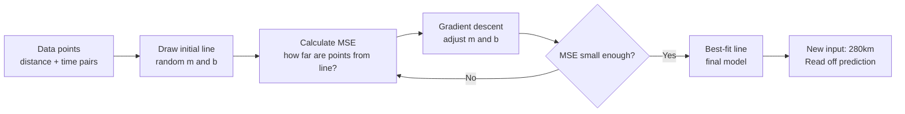
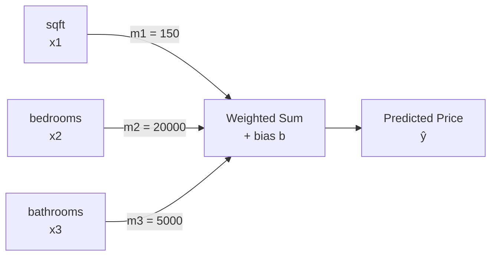

# Linear Regression

## The Story

Planning a road trip: 200 km took 2 hours, 350 km took 3.5 hours, 100 km took 1 hour. You want to estimate 280 km. Draw points, draw a best-fit line, read off the answer: about 2.8 hours.

👉 That line is a linear regression model — **Linear Regression** finds the best-fit straight line so you can predict continuous values for inputs you've never seen.

---

## What Does Linear Regression Do?

Linear regression predicts a **continuous numeric value** based on one or more input features:

- House square footage → predicted price
- Hours studied → predicted exam score
- Distance → predicted travel time

---

## The Best-Fit Line

```
prediction = m × input + b
```

- **m** = slope — how much output changes per unit of input
- **b** = intercept — output when input = 0

"Best fit" means the line where total error (distance from each point to the line) is smallest, using **MSE:**
```
MSE = (1/n) × Σ (predicted - actual)²
```

Gradient descent adjusts m and b until MSE is minimized.

---

## How the Model Learns



---

## Multiple Features (Multiple Linear Regression)

```
prediction = m₁×feature₁ + m₂×feature₂ + ... + mₙ×featureₙ + b
```

Example: `price = 150×sqft + 20000×bedrooms + 5000×bathrooms + 30000`

Each coefficient (m) shows how much that feature contributes, holding others constant. This interpretability is one of linear regression's biggest advantages.



---

## When Linear Regression Works and When It Does Not

| Works Well | Does Not Work Well |
|---|---|
| The relationship is genuinely linear | The relationship is curved or complex |
| You need to interpret which features matter | Interpretability is not required |
| Small to medium datasets | Hugely non-linear problems (image recognition) |
| You need a fast, reliable baseline | Features have complex interactions |

---

## Assumptions to Know About

Linear regression assumes:
1. Linear relationship between inputs and output
2. Errors are randomly distributed (not systematically biased)
3. Features are not perfectly correlated (no perfect multicollinearity)

Violating these doesn't crash the model — it makes predictions less reliable.

---

✅ **What you just learned:** Linear regression fits the best straight line through your data to predict continuous values — simple, interpretable, and a great first model for any regression problem.

🔨 **Build this now:** In your head (or on paper), plot 5 points: (1,2), (2,4), (3,5), (4,7), (5,9). Try to draw the best-fit line. Roughly: m≈1.8, b≈0.2. That line is your linear regression model.

➡️ **Next step:** What if you need to predict a category instead of a number? → `02_Logistic_Regression/Theory.md`

---

## 🛠️ Practice Project

Apply what you just learned → **[B2: ML Model Comparison](../../20_Projects/00_Beginner_Projects/02_ML_Model_Comparison/Project_Guide.md)**
> This project uses: training a Logistic Regression classifier, evaluating it, comparing it against tree-based models

---

## 📂 Navigation

**In this folder:**
| File | |
|---|---|
| 📄 **Theory.md** | ← you are here |
| [📄 Cheatsheet.md](./Cheatsheet.md) | Quick reference |
| [📄 Interview_QA.md](./Interview_QA.md) | Interview prep |
| [📄 Math_Intuition.md](./Math_Intuition.md) | Math intuition behind the algorithm |
| [📄 Code_Example.md](./Code_Example.md) | Python code examples |

⬅️ **Prev:** [10 Bias vs Variance](../../02_Machine_Learning_Foundations/10_Bias_vs_Variance/Theory.md) &nbsp;&nbsp;&nbsp; ➡️ **Next:** [02 Logistic Regression](../02_Logistic_Regression/Theory.md)
