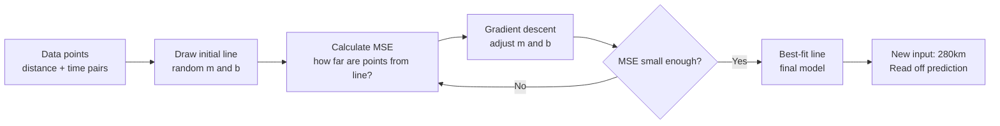

# Linear Regression

## The Story

You are planning a road trip. You have done a few trips before and kept notes: 200 km took about 2 hours, 350 km took around 3.5 hours, 100 km took about 1 hour.

You want to estimate: if the next trip is 280 km, how long will it take?

You grab a piece of paper and draw the points you know. Then you draw a single straight line through them that fits the pattern as closely as possible.

Now you just read off the line at 280 km. The answer: about 2.8 hours.

That line you drew — that is a linear regression model.

👉 This is why we need **Linear Regression** — it finds the best-fit straight line through data so you can predict continuous values for inputs you have never seen.

---

## What Does Linear Regression Do?

Linear regression predicts a **continuous numeric value** (a number, not a category) based on one or more input features.

Examples:
- House square footage → predicted price
- Hours studied → predicted exam score
- Distance → predicted travel time

The model is literally a straight line (or a flat plane in higher dimensions). Given new inputs, it reads off the predicted value.

---

## The Best-Fit Line

With one feature, the model is:
```
prediction = m × input + b
```

- **m** = the slope — how much the output changes per unit of input
- **b** = the intercept — what the output is when input = 0

"Best fit" means: out of all the possible lines you could draw, find the one where the total error (distance from each point to the line) is smallest.

The error we minimize is **MSE — Mean Squared Error:**
```
MSE = (1/n) × Σ (predicted - actual)²
```

Gradient descent adjusts m and b repeatedly until MSE is as small as possible.

---

## How the Model Learns



---

## Multiple Features (Multiple Linear Regression)

With more than one feature, you get a plane (or hyperplane):

```
prediction = m₁×feature₁ + m₂×feature₂ + ... + mₙ×featureₙ + b
```

For house prices: `price = 150×sqft + 20000×bedrooms + 5000×bathrooms + 30000`

Each coefficient (m) tells you how much that feature contributes to the prediction, holding all others constant. This interpretability is one of the biggest advantages of linear regression.

---

## When Linear Regression Works and When It Does Not

| Works Well | Does Not Work Well |
|---|---|
| The relationship is genuinely linear | The relationship is curved or complex |
| You need to interpret which features matter | Interpretability is not required |
| Small to medium datasets | Hugely non-linear problems (image recognition) |
| You need a fast, reliable baseline | Features have complex interactions |

---

## Assumptions to Know About

Linear regression assumes:
1. A linear relationship between inputs and output
2. Errors are randomly distributed (not systematically biased)
3. Features are not perfectly correlated with each other (no perfect multicollinearity)

Violating these does not make the model crash — it makes its predictions less reliable.

---

✅ **What you just learned:** Linear regression fits the best straight line through your data to predict continuous values — simple, interpretable, and a great first model for any regression problem.

🔨 **Build this now:** In your head (or on paper), plot 5 points: (1,2), (2,4), (3,5), (4,7), (5,9). Try to draw the best-fit line. Roughly: m≈1.8, b≈0.2. That line is your linear regression model.

➡️ **Next step:** What if you need to predict a category instead of a number? → `02_Logistic_Regression/Theory.md`

---

## 📂 Navigation

**In this folder:**
| File | |
|---|---|
| 📄 **Theory.md** | ← you are here |
| [📄 Cheatsheet.md](./Cheatsheet.md) | Quick reference |
| [📄 Interview_QA.md](./Interview_QA.md) | Interview prep |
| [📄 Math_Intuition.md](./Math_Intuition.md) | Math intuition behind the algorithm |
| [📄 Code_Example.md](./Code_Example.md) | Python code examples |

⬅️ **Prev:** [10 Bias vs Variance](../../02_Machine_Learning_Foundations/10_Bias_vs_Variance/Theory.md) &nbsp;&nbsp;&nbsp; ➡️ **Next:** [02 Logistic Regression](../02_Logistic_Regression/Theory.md)
