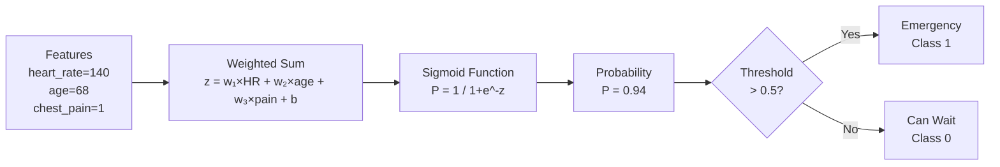

# Logistic Regression

## The Story

It is 2 AM at the hospital emergency room. A patient walks in.

The receptionist needs to make one quick decision: does this person need emergency care right now, or can they wait?

They look at a few signals: heart rate is 140 bpm (very high), age is 68, and the patient is clutching their chest and sweating.

The receptionist does not know for certain. They cannot run every test right now. But based on those signals they make a judgment call: "This person needs emergency care — right now."

They are not calculating an exact risk number to 12 decimal places. They are making a decision: emergency or not emergency. Yes or no.

But underneath that decision? A probability. "Given these signals, there is a 94% chance this is an emergency."

👉 This is why we need **Logistic Regression** — it takes input signals and converts them into a probability of belonging to a class, then makes a decision.

---

## What Does Logistic Regression Do?

Despite the name, logistic regression is a **classification** algorithm, not regression. It predicts the probability that an input belongs to a particular class.

- Output: a number between 0 and 1 (a probability)
- Then: if probability > 0.5, predict class 1. If < 0.5, predict class 0.

Examples:
- 0.94 → Emergency
- 0.07 → Can wait

---

## The Sigmoid Function — The Secret Ingredient

The problem: we have a linear equation (like linear regression) that can output any number from -∞ to +∞. But we need a probability between 0 and 1.

**The sigmoid function squishes any number into the range (0, 1):**

```
sigmoid(z) = 1 / (1 + e^(-z))
```

| Input z | Sigmoid output |
|---|---|
| -10 | ~0.00005 (near 0) |
| -2 | 0.119 |
| 0 | 0.5 |
| +2 | 0.881 |
| +10 | ~0.99995 (near 1) |

No matter what the linear equation outputs, sigmoid converts it to a valid probability.

---

## How It Works — Step by Step



---

## The Decision Boundary

The decision boundary is the input values where the model outputs exactly 0.5 — the line between "predict class 0" and "predict class 1."

For logistic regression, this boundary is always a straight line (in 2D) or a flat plane (in higher dimensions).

This is both a strength and a limitation:
- Strength: simple, interpretable
- Limitation: cannot model curved decision boundaries (some problems need curves)

---

## Training: Log Loss

Logistic regression is trained using **log loss (cross-entropy)**:

```
Loss = -[y × log(ŷ) + (1-y) × log(1-ŷ)]
```

This penalizes confident wrong predictions severely. If the model says 99% probability of emergency and the person was fine — that is a large loss. Gradient descent minimizes this loss to find the best weights.

---

## Logistic vs Linear Regression

| | Linear Regression | Logistic Regression |
|---|---|---|
| Output | Any number (-∞ to +∞) | Probability (0 to 1) |
| Task | Regression | Classification |
| Loss | MSE | Log loss (cross-entropy) |
| Output layer | None | Sigmoid |
| Decision | The number itself | Number → class via threshold |

---

✅ **What you just learned:** Logistic regression uses the sigmoid function to convert any input into a probability, then applies a threshold to make a classification decision.

🔨 **Build this now:** Open Python and compute sigmoid(2), sigmoid(0), sigmoid(-2). Use: `import math; 1 / (1 + math.exp(-2))`. See how 2 maps to ~0.88, 0 maps to 0.5, and -2 maps to ~0.12. That is the sigmoid doing its job.

➡️ **Next step:** What if the decision boundary is not a straight line? → `03_Decision_Trees/Theory.md`

---

## 📂 Navigation

**In this folder:**
| File | |
|---|---|
| 📄 **Theory.md** | ← you are here |
| [📄 Cheatsheet.md](./Cheatsheet.md) | Quick reference |
| [📄 Interview_QA.md](./Interview_QA.md) | Interview prep |
| [📄 Math_Intuition.md](./Math_Intuition.md) | Math intuition behind the algorithm |
| [📄 Code_Example.md](./Code_Example.md) | Python code examples |

⬅️ **Prev:** [01 Linear Regression](../01_Linear_Regression/Theory.md) &nbsp;&nbsp;&nbsp; ➡️ **Next:** [03 Decision Trees](../03_Decision_Trees/Theory.md)
