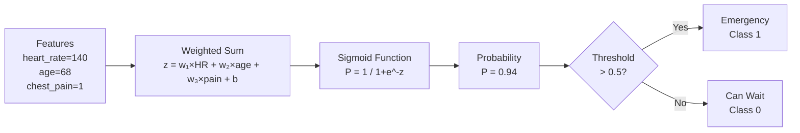

# Logistic Regression

## The Story

2 AM at the ER. A patient walks in: heart rate 140 bpm, age 68, clutching chest, sweating. The receptionist can't run every test — but makes a judgment call: "Emergency care, now." Not a certainty, but a probability: "Given these signals, 94% chance this is an emergency."

👉 This is why we need **Logistic Regression** — it converts input signals into a probability of belonging to a class, then makes a decision.

---

## 📌 Learning Priority

**Must Learn** — core concepts, needed to understand the rest of this file:
[What Does Logistic Regression Do](#what-does-logistic-regression-do) · [Sigmoid Function](#the-sigmoid-function--the-secret-ingredient) · [How It Works](#how-it-works--step-by-step)

**Should Learn** — important for real projects and interviews:
[Decision Boundary](#the-decision-boundary) · [Training Log Loss](#training-log-loss)

**Good to Know** — useful in specific situations, not needed daily:
[Logistic vs Linear Regression](#logistic-vs-linear-regression)

**Reference** — skim once, look up when needed:
[Logistic vs Linear Regression](#logistic-vs-linear-regression)

---

## What Does Logistic Regression Do?

Despite the name, logistic regression is a **classification** algorithm, not regression. It predicts the probability that an input belongs to a particular class.

- Output: a number between 0 and 1 (a probability)
- Then: if probability > 0.5, predict class 1. If < 0.5, predict class 0.

Examples:
- 0.94 → Emergency
- 0.07 → Can wait

---

## The Sigmoid Function — The Secret Ingredient

A linear equation outputs any number (-∞ to +∞), but we need a probability between 0 and 1. The **sigmoid function** squishes any number into (0, 1):

```
sigmoid(z) = 1 / (1 + e^(-z))
```

| Input z | Sigmoid output |
|---|---|
| -10 | ~0.00005 |
| 0 | 0.5 |
| +10 | ~0.99995 |

---

## How It Works — Step by Step



---

## The Decision Boundary

The decision boundary is where the model outputs exactly 0.5 — the line between "predict class 0" and "predict class 1." For logistic regression this is always a straight line (2D) or flat plane (higher dimensions):

- Strength: simple, interpretable
- Limitation: can't model curved boundaries → use Decision Tree or Neural Network

---

## Training: Log Loss

Trained using **log loss (cross-entropy):**

```
Loss = -[y × log(ŷ) + (1-y) × log(1-ŷ)]
```

Confident wrong predictions get a large loss. Gradient descent minimizes this to find the best weights.

---

## Logistic vs Linear Regression

| | Linear Regression | Logistic Regression |
|---|---|---|
| Output | Any number (-∞ to +∞) | Probability (0 to 1) |
| Task | Regression | Classification |
| Loss | MSE | Log loss (cross-entropy) |
| Output layer | None | Sigmoid |
| Decision | The number itself | Number → class via threshold |

---

✅ **What you just learned:** Logistic regression uses the sigmoid function to convert any input into a probability, then applies a threshold to make a classification decision.

🔨 **Build this now:** Open Python and compute sigmoid(2), sigmoid(0), sigmoid(-2). Use: `import math; 1 / (1 + math.exp(-2))`. See how 2 maps to ~0.88, 0 maps to 0.5, and -2 maps to ~0.12. That is the sigmoid doing its job.

➡️ **Next step:** What if the decision boundary is not a straight line? → `03_Decision_Trees/Theory.md`

---

## 🛠️ Practice Project

Apply what you just learned → **[B2: ML Model Comparison](../../22_Capstone_Projects/02_ML_Model_Comparison/03_GUIDE.md)**
> This project uses: Logistic Regression as one of 4 classifiers you train, compare, and evaluate on the Iris dataset


---

## 📝 Practice Questions

- 📝 [Q12 · logistic-regression](../../ai_practice_questions_100.md#q12--normal--logistic-regression)


---

## 📂 Navigation

**In this folder:**
| File | |
|---|---|
| 📄 **Theory.md** | ← you are here |
| [📄 Cheatsheet.md](./Cheatsheet.md) | Quick reference |
| [📄 Interview_QA.md](./Interview_QA.md) | Interview prep |
| [📄 Math_Intuition.md](./Math_Intuition.md) | Math intuition behind the algorithm |
| [📄 Code_Example.md](./Code_Example.md) | Python code examples |

⬅️ **Prev:** [01 Linear Regression](../01_Linear_Regression/Theory.md) &nbsp;&nbsp;&nbsp; ➡️ **Next:** [03 Decision Trees](../03_Decision_Trees/Theory.md)
