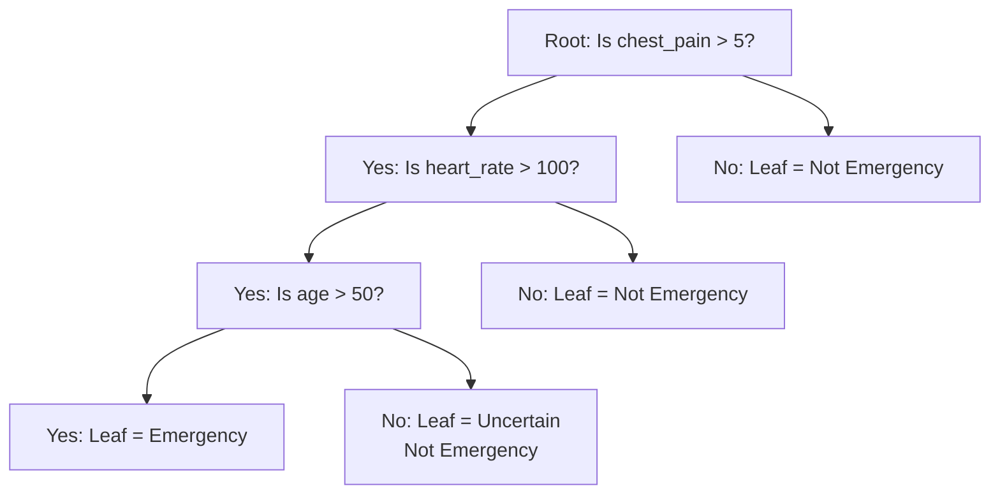

# Decision Trees

## The Story

You are playing the game "20 Questions." Your friend is thinking of an animal.

You start asking questions:
1. "Is it a mammal?" — Yes.
2. "Does it have four legs?" — Yes.
3. "Is it larger than a dog?" — Yes.
4. "Is it a horse?" — Yes!

You found it in 4 questions. Why did that work? Because each question cut the remaining possibilities roughly in half. You did not ask random questions — you asked the most useful ones first.

A decision tree does exactly this. It automatically figures out which questions to ask, in what order, to best separate your data into classes.

👉 This is why we need **Decision Trees** — they learn the most useful series of yes/no questions to classify data, and you can read every decision.

---

## What Does a Decision Tree Do?

A decision tree learns a hierarchy of if/else rules from your training data. It can be used for:

- **Classification** — "Is this email spam or not?"
- **Regression** — "What price should this house sell for?"

The result is a tree you can actually read. Every prediction traces a path from the root to a leaf.

---

## Key Parts of a Tree

- **Root node:** The first question — the most useful split on the full dataset
- **Internal nodes:** Subsequent questions — further splits on subsets of data
- **Branch:** The path taken when a question is answered yes or no
- **Leaf node:** The final answer — a class label or predicted value

---

## How Does the Tree Choose Which Question to Ask First?

It tries every possible split on every feature and picks the one that creates the purest groups.

**Gini Impurity** measures how mixed a group is:
- Gini = 0: perfectly pure (all one class)
- Gini = 0.5: maximally impure (50/50 mix)

The tree picks the split that reduces impurity the most. This is called **information gain**.

For the 20 Questions game: asking "Is it a living thing?" when everything is already a living thing gives you zero information gain. Asking "Is it a mammal?" when there are equal animals of all types gives you high information gain.

---

## Depth and Overfitting

A tree with no depth limit will grow until it has one example per leaf — it memorizes every training example perfectly. 100% training accuracy, terrible test accuracy.

**max_depth** limits how many questions the tree can ask. Shallow trees (depth 3–5) generalize better. They make simpler, more robust decisions.

This is the main hyperparameter to tune in decision trees.

---

## Why Decision Trees Are Loved

| Feature | Why It Matters |
|---|---|
| Fully interpretable | You can print the tree and read every rule |
| No feature scaling needed | Tree splits are rank-based, not distance-based |
| Handles mixed feature types | Numeric and categorical features work natively |
| Fast to train and predict | Simple comparisons — very fast |
| Can model non-linear patterns | Each split creates a non-linear boundary |

---

✅ **What you just learned:** Decision trees find the best yes/no questions to split your data into pure groups — fully interpretable, no scaling needed, but prone to overfitting without depth limits.

🔨 **Build this now:** In sklearn, train a `DecisionTreeClassifier(max_depth=3)` on the Iris dataset. Then run `sklearn.tree.export_text(model, feature_names=iris.feature_names)` to print the actual tree rules. You will see exactly what questions the model learned.

➡️ **Next step:** What if one tree is not enough? → `04_Random_Forests/Theory.md`

---

## 📂 Navigation

**In this folder:**
| File | |
|---|---|
| 📄 **Theory.md** | ← you are here |
| [📄 Cheatsheet.md](./Cheatsheet.md) | Quick reference |
| [📄 Interview_QA.md](./Interview_QA.md) | Interview prep |
| [📄 Code_Example.md](./Code_Example.md) | Python code examples |

⬅️ **Prev:** [02 Logistic Regression](../02_Logistic_Regression/Theory.md) &nbsp;&nbsp;&nbsp; ➡️ **Next:** [04 Random Forests](../04_Random_Forests/Theory.md)
