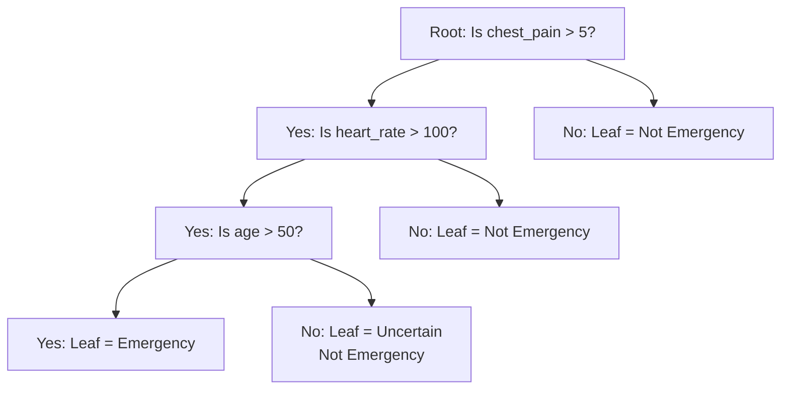
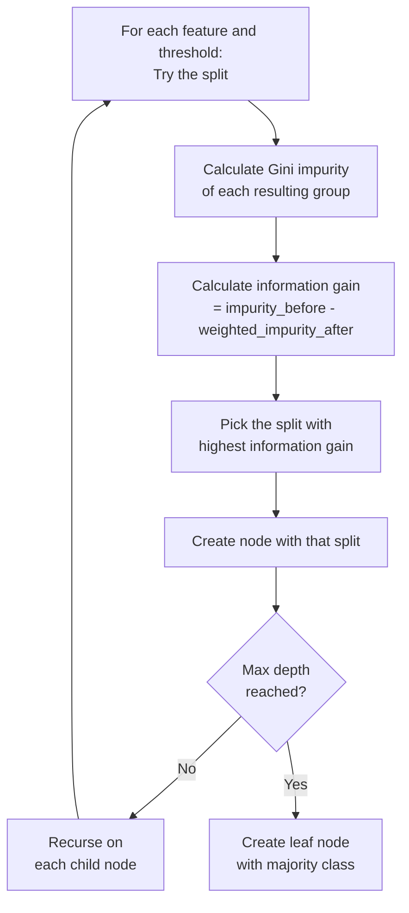

# Decision Trees

## The Story

Playing "20 Questions" — your friend thinks of an animal. You ask: mammal? four legs? larger than a dog? horse? Found in 4 questions. Each question cut remaining possibilities roughly in half.

👉 A decision tree does exactly this — it automatically figures out which questions to ask, in what order, to best separate data into classes.

---

## What Does a Decision Tree Do?

A decision tree learns a hierarchy of if/else rules from training data. Used for **classification** ("Is this spam?") or **regression** ("What's the house price?"). Every prediction traces a path from root to leaf — fully readable.

---

## Key Parts of a Tree

- **Root node:** The first question — the most useful split on the full dataset
- **Internal nodes:** Subsequent questions — further splits on subsets of data
- **Branch:** The path taken when a question is answered yes or no
- **Leaf node:** The final answer — a class label or predicted value

---

## How Does the Tree Choose Which Question to Ask First?

It tries every possible split on every feature and picks the one creating the purest groups. **Gini Impurity** measures how mixed a group is (0 = pure, 0.5 = max mix). The tree picks the split that reduces impurity most — called **information gain**.

---

## Depth and Overfitting

A tree with no depth limit grows until it has one example per leaf — 100% training accuracy, terrible test accuracy. **max_depth** limits questions asked. Shallow trees (depth 3–5) generalize better — this is the main hyperparameter to tune.

---

## Why Decision Trees Are Loved

| Feature | Why It Matters |
|---|---|
| Fully interpretable | You can print the tree and read every rule |
| No feature scaling needed | Tree splits are rank-based, not distance-based |
| Handles mixed feature types | Numeric and categorical features work natively |
| Fast to train and predict | Simple comparisons — very fast |
| Can model non-linear patterns | Each split creates a non-linear boundary |

---

✅ **What you just learned:** Decision trees find the best yes/no questions to split your data into pure groups — fully interpretable, no scaling needed, but prone to overfitting without depth limits.

🔨 **Build this now:** In sklearn, train a `DecisionTreeClassifier(max_depth=3)` on the Iris dataset. Then run `sklearn.tree.export_text(model, feature_names=iris.feature_names)` to print the actual tree rules. You will see exactly what questions the model learned.

➡️ **Next step:** What if one tree is not enough? → `04_Random_Forests/Theory.md`

---

## 🛠️ Practice Project

Apply what you just learned → **[B2: ML Model Comparison](../../20_Projects/00_Beginner_Projects/02_ML_Model_Comparison/Project_Guide.md)**
> This project uses: Decision Tree classifier, tree depth tuning, visualizing the confusion matrix

---

## 📂 Navigation

**In this folder:**
| File | |
|---|---|
| 📄 **Theory.md** | ← you are here |
| [📄 Cheatsheet.md](./Cheatsheet.md) | Quick reference |
| [📄 Interview_QA.md](./Interview_QA.md) | Interview prep |
| [📄 Code_Example.md](./Code_Example.md) | Python code examples |

⬅️ **Prev:** [02 Logistic Regression](../02_Logistic_Regression/Theory.md) &nbsp;&nbsp;&nbsp; ➡️ **Next:** [04 Random Forests](../04_Random_Forests/Theory.md)
