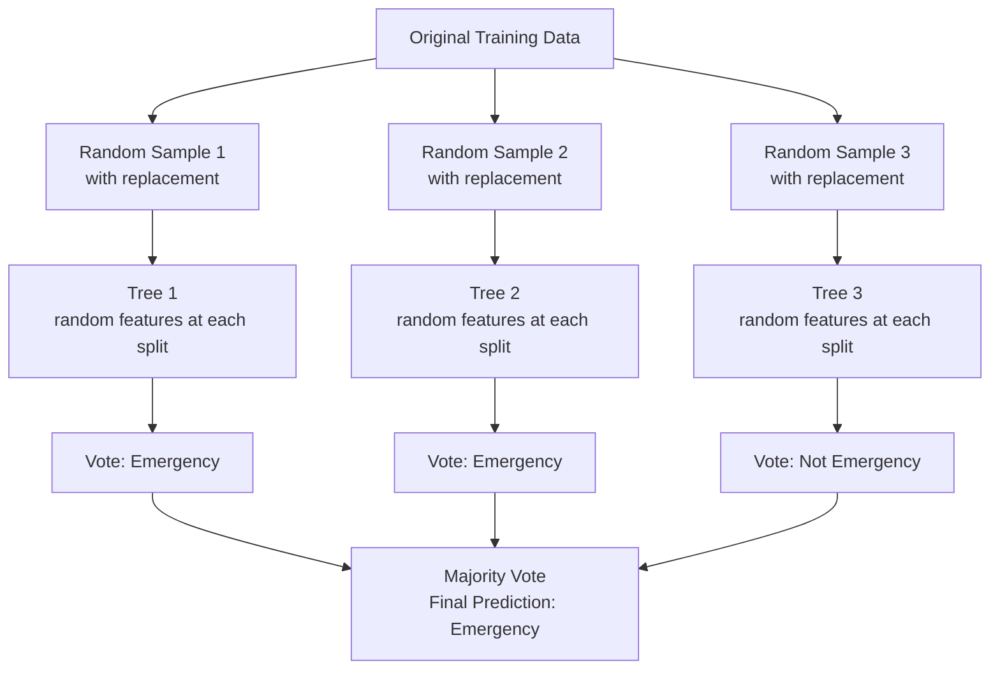

# Random Forests

## The Story

You need to make a big financial decision — should you invest your savings in a particular company?

You could ask one friend. But what if their view is biased? What if they missed something important?

So instead you ask 100 friends. Each one looks at slightly different information — one focuses on the financials, one on the management, one on the industry trends, one on recent news. Some are more optimistic by nature, some more conservative.

You listen to all 100 of them, then go with the majority vote.

The result? Much better than any single friend's advice. Their individual errors and blind spots cancel each other out. Their collective judgment is more reliable than anyone's individual opinion.

👉 This is why we need **Random Forests** — a collection of diverse decision trees that vote together, canceling each other's mistakes to produce more accurate and robust predictions.

---

## What is a Random Forest?

A random forest is an **ensemble** of decision trees. Instead of training one tree, you train hundreds of them — each on slightly different data and with access to different features. Then you combine their predictions.

For classification: majority vote wins.
For regression: average the predictions.

---

## Two Key Ideas: Bagging and Feature Randomness

### Bagging (Bootstrap Aggregating)
Each tree in the forest is trained on a different random sample of the training data (sampled with replacement — the same example can appear multiple times). This means no two trees see exactly the same data. Each tree has slightly different "knowledge."

This sampling process is called **bootstrapping**. Aggregating (combining) the results is the "aggregating" in bagging.

### Random Feature Selection
At each split in each tree, only a random subset of features is considered. For a dataset with 10 features, each split might only consider 3 randomly chosen features. This ensures trees are not all asking the same questions.

These two sources of randomness create a diverse collection of different trees.

---

## Why Ensembles Beat Single Trees

Each individual tree has high variance — it memorizes its particular training sample and differs significantly from tree to tree.

When you average many high-variance models that are each independently noisy, their errors cancel each other out. What remains is the shared signal — the patterns that appear consistently across all trees regardless of which specific data points they saw.

This is the magic of ensembles: **individual errors average away; shared patterns survive.**

---

## Feature Importance

Random forests provide a useful side product: **feature importance**. Each feature gets a score based on how much it contributed to reducing impurity across all trees. This helps you understand which inputs actually drive predictions — very useful for feature selection and explaining the model.

---

## Strengths of Random Forests

| Strength | Why It Matters |
|---|---|
| High accuracy on tabular data | Often competitive with or better than more complex models |
| Resistant to overfitting | Averaging many trees smooths out individual overfitting |
| No feature scaling needed | Tree-based — scale does not affect splits |
| Handles missing data and mixed types | More robust than linear models |
| Feature importance built in | Understand your data while building the model |
| Works well out of the box | Defaults are usually reasonable |

---

## The One Weakness

Random forests are harder to interpret than single decision trees. You cannot print 500 trees and explain them. For single-prediction explanations, tools like SHAP can help. But random forests give up the clean "here is the rule" transparency of a single tree in exchange for much better accuracy.

---

✅ **What you just learned:** A random forest trains hundreds of diverse decision trees on random data subsets and random feature subsets, then combines their votes — producing far better accuracy than any single tree.

🔨 **Build this now:** Train a `RandomForestClassifier(n_estimators=100)` on any dataset alongside a single `DecisionTreeClassifier`. Compare test accuracy. The forest will almost always win. Then compare the test accuracy gap between training and test — the forest's gap will be smaller.

➡️ **Next step:** What about drawing the sharpest possible boundary between classes? → `05_SVM/Theory.md`

---

## 📂 Navigation

**In this folder:**
| File | |
|---|---|
| 📄 **Theory.md** | ← you are here |
| [📄 Cheatsheet.md](./Cheatsheet.md) | Quick reference |
| [📄 Interview_QA.md](./Interview_QA.md) | Interview prep |
| [📄 Code_Example.md](./Code_Example.md) | Python code examples |

⬅️ **Prev:** [03 Decision Trees](../03_Decision_Trees/Theory.md) &nbsp;&nbsp;&nbsp; ➡️ **Next:** [05 SVM](../05_SVM/Theory.md)
