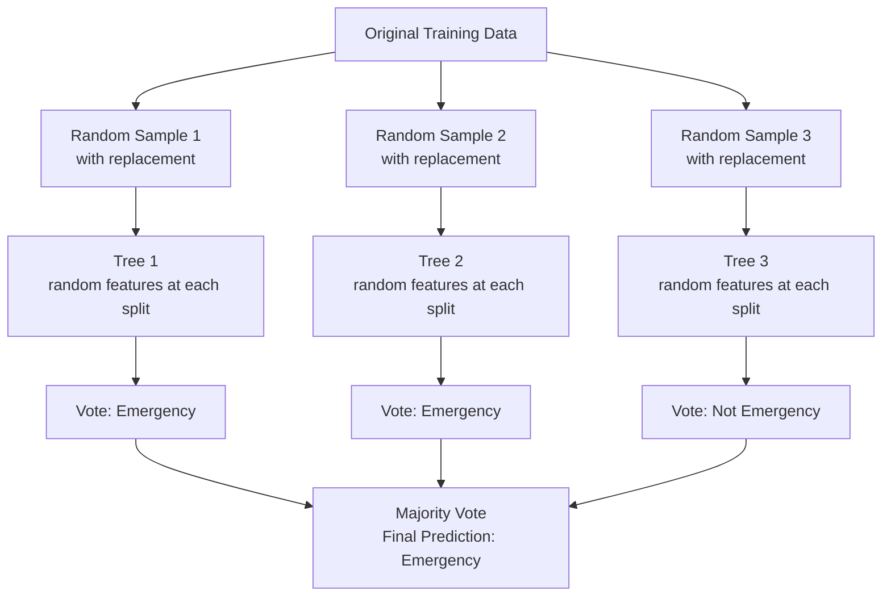

# Random Forests

## The Story

Big financial decision: ask one friend and risk their bias, or ask 100 friends, each looking at different information? With 100 opinions, individual errors cancel out. Collective judgment is more reliable.

👉 This is why we need **Random Forests** — a collection of diverse decision trees that vote together, canceling each other's mistakes.

---

## What is a Random Forest?

A random forest is an **ensemble** of decision trees. Instead of training one tree, you train hundreds of them — each on slightly different data and with access to different features. Then you combine their predictions.

For classification: majority vote wins.
For regression: average the predictions.

---

## Two Key Ideas: Bagging and Feature Randomness

### Bagging (Bootstrap Aggregating)
Each tree trains on a different random sample of training data (sampled with replacement). No two trees see the same data — each has slightly different "knowledge."

### Random Feature Selection
At each split, only a random subset of features is considered (e.g., 3 of 10). Trees are not all asking the same questions.

These two sources of randomness create a diverse collection of different trees.

---

## Why Ensembles Beat Single Trees

Each individual tree has high variance — it memorizes its training sample. When you average many high-variance models that are each independently noisy, errors cancel out. What remains is the shared signal — patterns appearing consistently across all trees.

**Individual errors average away; shared patterns survive.**

## Feature Importance

Random forests provide **feature importance** as a side product: each feature's score reflects how much it contributed to reducing impurity across all trees. Useful for feature selection and model explanation.

---

## Strengths of Random Forests

| Strength | Why It Matters |
|---|---|
| High accuracy on tabular data | Often competitive with or better than more complex models |
| Resistant to overfitting | Averaging many trees smooths out individual overfitting |
| No feature scaling needed | Tree-based — scale does not affect splits |
| Handles missing data and mixed types | More robust than linear models |
| Feature importance built in | Understand your data while building the model |
| Works well out of the box | Defaults are usually reasonable |

---

## The One Weakness

Random forests are harder to interpret than single trees — you can't print 500 trees and explain them. They trade the clean "here is the rule" transparency of a single tree for much better accuracy. SHAP can help with single-prediction explanations.

---

✅ **What you just learned:** A random forest trains hundreds of diverse decision trees on random data subsets and random feature subsets, then combines their votes — producing far better accuracy than any single tree.

🔨 **Build this now:** Train a `RandomForestClassifier(n_estimators=100)` on any dataset alongside a single `DecisionTreeClassifier`. Compare test accuracy. The forest will almost always win. Then compare the test accuracy gap between training and test — the forest's gap will be smaller.

➡️ **Next step:** What about drawing the sharpest possible boundary between classes? → `05_SVM/Theory.md`

---

## 🛠️ Practice Project

Apply what you just learned → **[B2: ML Model Comparison](../../20_Projects/00_Beginner_Projects/02_ML_Model_Comparison/Project_Guide.md)**
> This project uses: Random Forest as the strongest baseline, feature importance, comparing ensemble vs single tree

---

## 📝 Practice Questions

- 📝 [Q14 · random-forests](../../ai_practice_questions_100.md#q14--thinking--random-forests)

---

## 📂 Navigation

**In this folder:**
| File | |
|---|---|
| 📄 **Theory.md** | ← you are here |
| [📄 Cheatsheet.md](./Cheatsheet.md) | Quick reference |
| [📄 Interview_QA.md](./Interview_QA.md) | Interview prep |
| [📄 Code_Example.md](./Code_Example.md) | Python code examples |

⬅️ **Prev:** [03 Decision Trees](../03_Decision_Trees/Theory.md) &nbsp;&nbsp;&nbsp; ➡️ **Next:** [05 SVM](../05_SVM/Theory.md)
