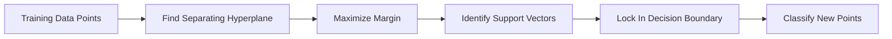
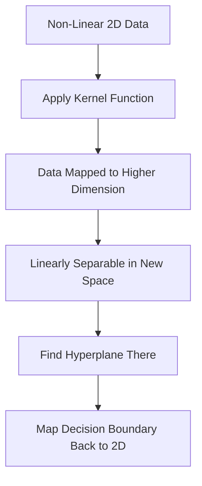

# Support Vector Machines (SVM)

Imagine you're sorting oranges and apples on a table. You want to draw a single line between them. But not just any line — you want the line that leaves the most breathing room on both sides. The fruits sitting right on the edge of that space, closest to the line, are the trickiest ones to separate. Those edge fruits are what SVM obsesses over.

👉 This is why we need **Support Vector Machines** — to find the decision boundary with the maximum possible margin between classes.

---

## The Core Idea

SVM does not just find *a* line that separates two groups. It finds the *best* line — the one that maximizes the gap between the two groups.

That gap is called the **margin**. The data points sitting at the edges of that margin are called **support vectors**. They literally "support" (define) the boundary. Remove any other point and the boundary stays the same. Remove a support vector and the boundary shifts.

---

## Key Concepts

### Hyperplane

In 2D, the decision boundary is a line. In 3D, it is a flat plane. In higher dimensions, it is called a **hyperplane**. It is just the flat surface that divides one class from another.

For a 2D problem: the hyperplane is a line `w·x + b = 0`
- Points on one side: positive class
- Points on the other side: negative class

### Maximum Margin Classifier

SVM does not just want to classify correctly. It wants to classify with *confidence*. A wide margin means the model is far from being wrong. A narrow margin means a small shift in data could cause misclassification.

Think of it like parking a car in a space. You could park centred (maximum margin) or squeeze to one side (small margin). Centred is safer.

### Support Vectors

These are the data points closest to the hyperplane. They are the only points that matter for defining the boundary. Everything else is irrelevant. This is one reason SVM is memory-efficient — it only remembers the support vectors, not all the data.

### The Kernel Trick (For Non-Linear Data)

What if the data cannot be separated by a straight line? Like if oranges and apples are mixed together in a circle pattern?

The **kernel trick** solves this by transforming the data into a higher dimension where it *can* be separated linearly.

Imagine you have dots on a table mixed together (2D). You cannot draw a straight line to separate them. But if you lift some dots up (into 3D), suddenly a flat plane can separate them perfectly. The kernel trick mathematically does this lifting — without actually computing the new coordinates explicitly.

Common kernels:
- **Linear** — for data that is already linearly separable
- **RBF (Radial Basis Function)** — the most popular, handles circular/complex patterns
- **Polynomial** — for curved boundaries

---

## When SVM Shines

SVM is not always the best tool. Here is when it works really well:

| Situation | Why SVM Works |
|---|---|
| Small to medium datasets | Efficient with limited data |
| High-dimensional data | Works well even with many features (e.g. text) |
| Clear margin of separation | Maximum margin assumption holds |
| Image classification (historically) | Was state of the art before deep learning |

### When SVM Struggles

- Very large datasets — training is slow (quadratic in time)
- Overlapping classes — unclear what margin to maximize
- Needing probability estimates — SVM gives class labels, not probabilities (by default)

---

## The C Parameter — Trading Off Margin vs Mistakes

Real data is messy. Sometimes you cannot perfectly separate the classes. SVM has a parameter called **C** that controls this trade-off:

- **High C** — tries hard to classify everything correctly. Smaller margin, risk of overfitting.
- **Low C** — allows some misclassifications. Larger margin, better generalization.

Think of C as your tolerance for mistakes. Low tolerance = tight fit. High tolerance = relaxed fit.

---

## Quick Recap

- SVM finds the hyperplane with the **maximum margin** between classes
- **Support vectors** are the data points closest to the boundary — they define it
- The **kernel trick** handles non-linear data by projecting it to a higher dimension
- **C** controls the trade-off between a wide margin and fewer classification errors

---

✅ **What you just learned:** SVM finds the widest possible decision boundary between classes, using only the support vectors to define it, and the kernel trick to handle non-linear data.

🔨 **Build this now:** Open a Python notebook. Create two clusters of points using `sklearn.datasets.make_classification`. Train an SVM with `sklearn.svm.SVC(kernel='linear')`. Print the number of support vectors with `model.n_support_`.

➡️ **Next step:** K-Means Clustering → `03_Classical_ML_Algorithms/06_K_Means_Clustering/Theory.md`

---

## 📂 Navigation

**In this folder:**
| File | |
|---|---|
| **Theory.md** | ← you are here |
| [Cheatsheet.md](./Cheatsheet.md) | Key terms, when to use, golden rules |
| [Interview_QA.md](./Interview_QA.md) | Beginner to advanced interview questions |
| [Math_Intuition.md](./Math_Intuition.md) | Hyperplane geometry, kernel trick, C parameter |

⬅️ **Prev:** [04 Random Forests](../04_Random_Forests/Theory.md) &nbsp;&nbsp;&nbsp; ➡️ **Next:** [06 K-Means Clustering](../06_K_Means_Clustering/Theory.md)
