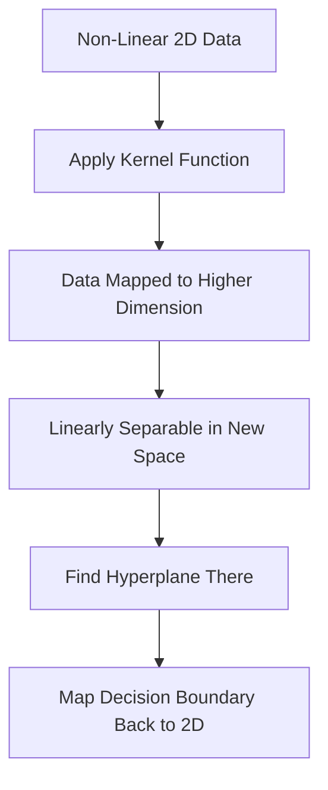

# Support Vector Machines (SVM)

Imagine sorting oranges and apples on a table. You want to draw a line between them — not just any line, but the one with the most breathing room on both sides. The fruits sitting right at the edge of that space are the trickiest to separate. SVM obsesses over those edge fruits.

👉 This is why we need **Support Vector Machines** — to find the decision boundary with the maximum possible margin between classes.

---

## The Core Idea

SVM finds the *best* line — the one that maximizes the gap between two groups. That gap is the **margin**. The data points at the edges of that margin are **support vectors** — they define the boundary. Remove any other point and the boundary stays the same. Remove a support vector and it shifts.

---

## Key Concepts

### Hyperplane

In 2D: decision boundary is a line. In 3D: a flat plane. In higher dimensions: a **hyperplane** — just the flat surface dividing one class from another. For 2D: `w·x + b = 0`.

### Maximum Margin Classifier

SVM classifies with *confidence*. A wide margin means the model is far from being wrong. Narrow margin = a small data shift could cause misclassification. Think: parking centred in a space (max margin) vs. squeezing to one side.

### Support Vectors

The data points closest to the hyperplane. Only these define the boundary — everything else is irrelevant. This makes SVM memory-efficient.

### The Kernel Trick (For Non-Linear Data)

What if data can't be separated by a straight line? The **kernel trick** projects data into a higher dimension where it *can* be separated linearly — without computing the new coordinates explicitly. Like lifting mixed dots from a table (2D) into 3D so a flat plane can separate them.

Common kernels:
- **Linear** — for data that is already linearly separable
- **RBF (Radial Basis Function)** — the most popular, handles circular/complex patterns
- **Polynomial** — for curved boundaries

---

## When SVM Shines

| Situation | Why SVM Works |
|---|---|
| Small to medium datasets | Efficient with limited data |
| High-dimensional data | Works well with many features (e.g. text) |
| Clear margin of separation | Maximum margin assumption holds |
| Image classification (historically) | Was state of the art before deep learning |

**When SVM Struggles:** Very large datasets (training is slow), overlapping classes, or when probability estimates are needed.

---

## The C Parameter — Trading Off Margin vs Mistakes

**C** controls the trade-off between margin width and classification errors:

- **High C** — classify everything correctly; smaller margin, risk of overfitting
- **Low C** — allow some misclassifications; larger margin, better generalization

---

## Quick Recap

- SVM finds the hyperplane with **maximum margin** between classes
- **Support vectors** are the closest data points — they define the boundary
- **Kernel trick** handles non-linear data by projecting to a higher dimension
- **C** controls the trade-off between wide margin and fewer classification errors

---

✅ **What you just learned:** SVM finds the widest possible decision boundary between classes, using only the support vectors to define it, and the kernel trick to handle non-linear data.

🔨 **Build this now:** Open a Python notebook. Create two clusters of points using `sklearn.datasets.make_classification`. Train an SVM with `sklearn.svm.SVC(kernel='linear')`. Print the number of support vectors with `model.n_support_`.

➡️ **Next step:** K-Means Clustering → `03_Classical_ML_Algorithms/06_K_Means_Clustering/Theory.md`

---

## 📂 Navigation

**In this folder:**
| File | |
|---|---|
| **Theory.md** | ← you are here |
| [Cheatsheet.md](./Cheatsheet.md) | Key terms, when to use, golden rules |
| [Interview_QA.md](./Interview_QA.md) | Beginner to advanced interview questions |
| [Math_Intuition.md](./Math_Intuition.md) | Hyperplane geometry, kernel trick, C parameter |

⬅️ **Prev:** [04 Random Forests](../04_Random_Forests/Theory.md) &nbsp;&nbsp;&nbsp; ➡️ **Next:** [06 K-Means Clustering](../06_K_Means_Clustering/Theory.md)
