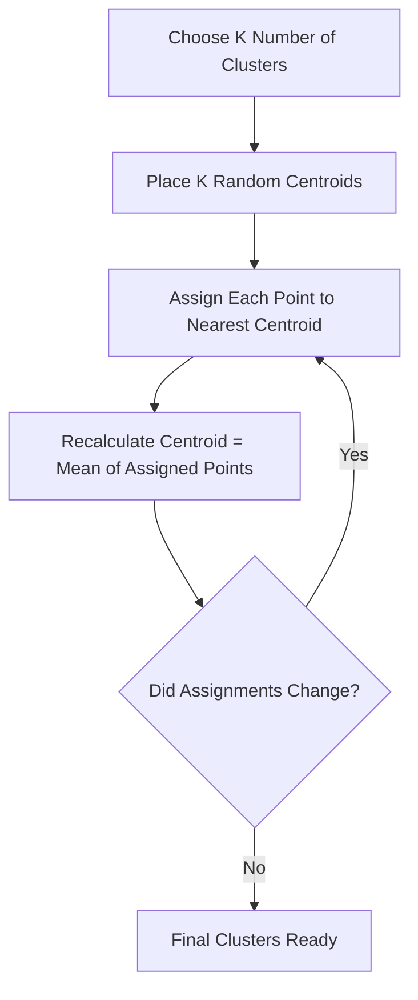

# K-Means Clustering

You come home one day to find your desk completely buried. Books, pens, phone cables, sticky notes, receipts — all mixed together. You do not have a filing system. You just start moving similar things together. Pens and markers go in one pile. Papers and receipts form another. Cables and electronics form a third. You did not decide the categories in advance. The groups just emerged naturally from what was similar.

👉 This is why we need **K-Means Clustering** — to find natural groupings in data when you have no labels to guide you.

---

## What Is Clustering?

Everything we have covered so far — linear regression, decision trees, SVM — was **supervised learning**. You had labelled data. The algorithm learned from examples with known answers.

Clustering is **unsupervised learning**. There are no labels. No right answers. The algorithm just tries to find structure in the data on its own.

K-Means asks: "given these data points, can you group them into K natural clusters?"

---

## How the K-Means Algorithm Works

It is surprisingly simple. Just four steps that repeat:

**Step 1 — Pick K random starting points (centroids)**
Randomly place K points in your data space. These are your initial cluster centres.

**Step 2 — Assign every data point to its nearest centroid**
Measure the distance from each data point to each centroid. Assign the point to whichever centroid is closest.

**Step 3 — Update each centroid**
Move each centroid to the average position of all the points assigned to it.

**Step 4 — Repeat steps 2 and 3 until nothing changes**
Keep reassigning and updating until the cluster assignments stop changing. That is convergence.

---

## A Concrete Example

Say you have 9 customers described by two features: age and spending score. You want K=3 clusters.

- Iteration 1: Random centroids placed. Customers assigned to nearest one. Some assignments are wrong because centroids started in bad positions.
- Iteration 2: Centroids move to the mean of their assigned customers. Assignments update.
- Iteration 5: Centroids have settled. Assignments are stable. You have 3 meaningful customer segments.

---

## How to Choose K — The Elbow Method

The biggest question with K-Means: **how many clusters should you pick?**

You cannot just try K=100. That would make every point its own cluster — perfectly grouped but useless.

The **elbow method** works like this:
1. Run K-Means for K = 1, 2, 3, 4, 5, ..., 10
2. For each K, calculate the **inertia** — the total distance from every point to its assigned centroid (also called WCSS: Within-Cluster Sum of Squares)
3. Plot K vs inertia
4. Look for the "elbow" — where the inertia stops dropping sharply and flattens out

The elbow point is the right K. Adding more clusters beyond that point does not meaningfully improve the groupings.

---

## What K-Means Assumes

K-Means has some built-in assumptions. It works best when:
- Clusters are roughly **spherical** (round) in shape
- Clusters are roughly **equal in size**
- Clusters are roughly **equal in density** (similar number of points)

When these assumptions do not hold, K-Means can produce weird results.

---

## Limitations

K-Means has a few real weaknesses to know about:

| Limitation | Why It Matters |
|---|---|
| You must choose K in advance | You may not know the right number of clusters |
| Sensitive to initial random centroids | Different random starts can give different results. Use `n_init` to run multiple times |
| Sensitive to outliers | One outlier can drag a centroid far from the true cluster centre |
| Assumes spherical clusters | Fails on elongated or irregular shapes |
| Assumes similar cluster sizes | Struggles with very different-sized clusters |

---

## Real-World Uses

- **Customer segmentation** — group customers by purchasing behaviour
- **Image compression** — replace similar pixel colours with one representative colour
- **Document grouping** — cluster news articles by topic without labels
- **Anomaly detection** — points far from any centroid may be anomalies

---

✅ **What you just learned:** K-Means finds K natural groups in unlabelled data by repeatedly assigning points to the nearest centroid and moving centroids to the mean of their assigned points until stable.

🔨 **Build this now:** Generate some 2D blob data with `sklearn.datasets.make_blobs(n_samples=150, centers=3)`. Run `KMeans(n_clusters=3)` on it. Print `model.cluster_centers_` and `model.inertia_`. Then try K=2 and K=5 and compare inertia values.

➡️ **Next step:** PCA & Dimensionality Reduction → `03_Classical_ML_Algorithms/07_PCA_Dimensionality_Reduction/Theory.md`

---

## 📂 Navigation

**In this folder:**
| File | |
|---|---|
| **Theory.md** | ← you are here |
| [Cheatsheet.md](./Cheatsheet.md) | Key terms, when to use, golden rules |
| [Interview_QA.md](./Interview_QA.md) | Beginner to advanced interview questions |
| [Code_Example.md](./Code_Example.md) | Full working Python example with elbow method |

⬅️ **Prev:** [05 SVM](../05_SVM/Theory.md) &nbsp;&nbsp;&nbsp; ➡️ **Next:** [07 PCA](../07_PCA_Dimensionality_Reduction/Theory.md)
