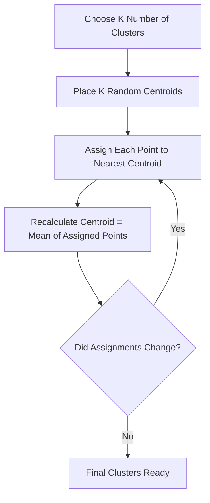

# K-Means Clustering

You come home to a buried desk: books, pens, cables, receipts all mixed together. Without a filing system, you start moving similar things together. Pens in one pile, papers in another, cables in a third. You didn't decide the categories in advance — groups emerged from what was similar.

👉 This is why we need **K-Means Clustering** — to find natural groupings in data when you have no labels.

---

## 📌 Learning Priority

**Must Learn** — core concepts, needed to understand the rest of this file:
[What Is Clustering](#what-is-clustering) · [How the Algorithm Works](#how-the-k-means-algorithm-works) · [How to Choose K](#how-to-choose-k--the-elbow-method)

**Should Learn** — important for real projects and interviews:
[Limitations](#limitations) · [What K-Means Assumes](#what-k-means-assumes)

**Good to Know** — useful in specific situations, not needed daily:
[Real-World Uses](#real-world-uses)

**Reference** — skim once, look up when needed:
[Real-World Uses](#real-world-uses)

---

## What Is Clustering?

Everything covered so far was **supervised learning** — labeled data, known answers. Clustering is **unsupervised**. No labels, no right answers. K-Means asks: "given these data points, can you group them into K natural clusters?"

---

## How the K-Means Algorithm Works

Four steps that repeat:

1. **Place K random centroids** in data space
2. **Assign every point** to its nearest centroid
3. **Update each centroid** to the average position of all points assigned to it
4. **Repeat** until assignments stop changing (convergence)

---

## A Concrete Example

9 customers described by age and spending score, K=3. After a few iterations centroids settle into 3 meaningful customer segments.

---

## How to Choose K — The Elbow Method

1. Run K-Means for K = 1, 2, ..., 10
2. For each K, calculate **inertia** (total distance from every point to its centroid — WCSS)
3. Plot K vs inertia
4. Look for the "elbow" — where inertia stops dropping sharply

The elbow point is the right K. Beyond it, adding clusters doesn't meaningfully improve groupings.

---

## What K-Means Assumes

Works best when clusters are roughly **spherical**, **equal in size**, and **equal in density**. When these assumptions don't hold, K-Means can produce odd results.

---

## Limitations

K-Means has a few real weaknesses to know about:

| Limitation | Why It Matters |
|---|---|
| You must choose K in advance | You may not know the right number of clusters |
| Sensitive to initial random centroids | Different random starts can give different results. Use `n_init` to run multiple times |
| Sensitive to outliers | One outlier can drag a centroid far from the true cluster centre |
| Assumes spherical clusters | Fails on elongated or irregular shapes |
| Assumes similar cluster sizes | Struggles with very different-sized clusters |

---

## Real-World Uses

- **Customer segmentation** — group customers by purchasing behaviour
- **Image compression** — replace similar pixel colours with one representative colour
- **Document grouping** — cluster news articles by topic without labels
- **Anomaly detection** — points far from any centroid may be anomalies

---

✅ **What you just learned:** K-Means finds K natural groups in unlabelled data by repeatedly assigning points to the nearest centroid and moving centroids to the mean of their assigned points until stable.

🔨 **Build this now:** Generate some 2D blob data with `sklearn.datasets.make_blobs(n_samples=150, centers=3)`. Run `KMeans(n_clusters=3)` on it. Print `model.cluster_centers_` and `model.inertia_`. Then try K=2 and K=5 and compare inertia values.

➡️ **Next step:** PCA & Dimensionality Reduction → `03_Classical_ML_Algorithms/07_PCA_Dimensionality_Reduction/Theory.md`

---

## 📂 Navigation

**In this folder:**
| File | |
|---|---|
| **Theory.md** | ← you are here |
| [Cheatsheet.md](./Cheatsheet.md) | Key terms, when to use, golden rules |
| [Interview_QA.md](./Interview_QA.md) | Beginner to advanced interview questions |
| [Code_Example.md](./Code_Example.md) | Full working Python example with elbow method |

⬅️ **Prev:** [05 SVM](../05_SVM/Theory.md) &nbsp;&nbsp;&nbsp; ➡️ **Next:** [07 PCA](../07_PCA_Dimensionality_Reduction/Theory.md)
