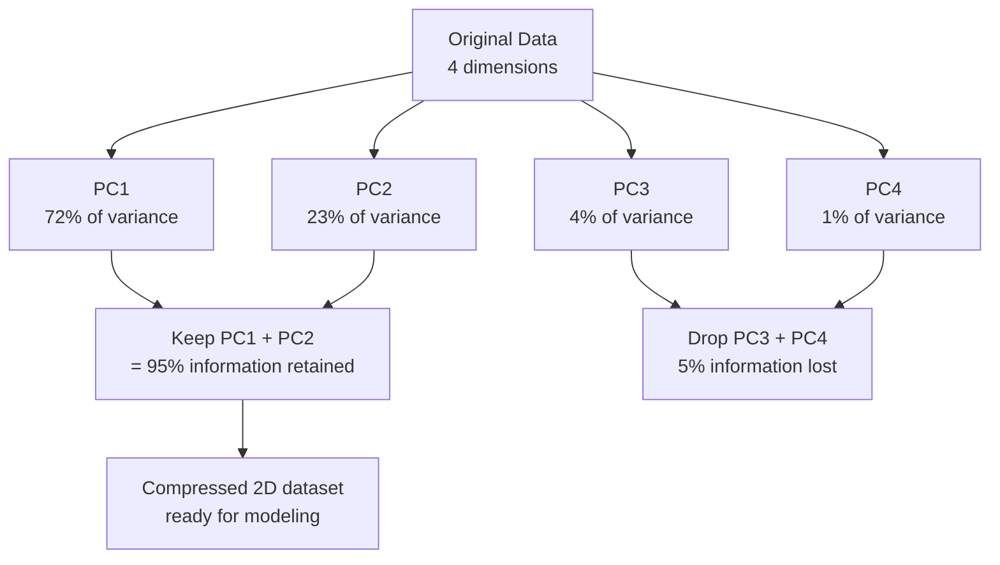

# PCA — Principal Component Analysis

You sculpted a detailed face in 3D. To show someone far away, you take two photographs: one from the front (captures nose, eyes, cheeks), one from the side (captures forehead depth, chin). Two flat photos — 3D reduced to 2D, but the most important structure is kept.

👉 This is why we need **PCA** — to compress high-dimensional data into fewer dimensions while keeping as much structure (variance) as possible.

---

## What Is Dimensionality?

Every feature is a dimension. A dataset with 500 features lives in 500-dimensional space.

## The Curse of Dimensionality

As dimensions increase, data becomes increasingly sparse. 100 points in 1D are fairly close together. Spread them across 2D, then 3D, then 100D — they become incredibly far apart. This causes:

- Distance-based algorithms (K-Means, KNN) to stop working well
- Models to overfit (need exponentially more data as dimensions grow)
- Slow training and impossible visualization

---

## PCA: Finding the Best Angles

PCA finds the "best camera angles" — directions that capture the most variation. These directions are **principal components**.

- **PC1**: direction of maximum variance (most information)
- **PC2**: second-most variance, perpendicular to PC1
- **PC3**: perpendicular to PC1 and PC2, and so on

---

## Variance Explained

Not all components are equally useful. The first few usually capture most information. PCA tells you exactly how much variance each component explains.

On the Iris dataset (4 features): PC1 explains 72%, PC2 explains 23% — together 95% of all information in just 2 dimensions. Measured by the **explained variance ratio**.

---

## What Does PCA Actually Do to the Data?

PCA does not select existing features. It creates **new features** (principal components) as combinations of originals. Instead of measuring height and arm-length separately, PCA might find "general body size" captures most variation.

After PCA: new features have no direct interpretable names, but there are fewer of them capturing the most important structure.

---

## When to Use PCA

| Use PCA When | Avoid PCA When |
|---|---|
| Too many features, model is slow | You need interpretable features |
| Features are highly correlated | You have very few features already |
| You want to visualise high-dimensional data | Your features are already independent |
| Preprocessing before KNN or K-Means | You are using tree-based models (they handle high-dim well) |

---

## Important: PCA Is Unsupervised

PCA only looks at X (features), not y (target). It may compress features important for prediction along with irrelevant ones. Use it as a compression tool, not a feature selection tool.

---

✅ **What you just learned:** PCA reduces the number of features by finding the directions of maximum variance (principal components) and projecting data onto the top few, preserving most of the information.

🔨 **Build this now:** Load the Iris dataset with `sklearn.datasets.load_iris()`. Create a `PCA(n_components=2)` object. Fit and transform the 4-feature data to 2 components. Print `pca.explained_variance_ratio_` to see how much information is kept.

➡️ **Next step:** Naive Bayes → `03_Classical_ML_Algorithms/08_Naive_Bayes/Theory.md`

---

## 📂 Navigation

**In this folder:**
| File | |
|---|---|
| **Theory.md** | ← you are here |
| [Cheatsheet.md](./Cheatsheet.md) | Key terms, when to use, golden rules |
| [Interview_QA.md](./Interview_QA.md) | Beginner to advanced interview questions |
| [Math_Intuition.md](./Math_Intuition.md) | Eigenvectors, variance geometry, covariance matrix |
| [Code_Example.md](./Code_Example.md) | Full working Python example with Iris dataset |

⬅️ **Prev:** [06 K-Means Clustering](../06_K_Means_Clustering/Theory.md) &nbsp;&nbsp;&nbsp; ➡️ **Next:** [08 Naive Bayes](../08_Naive_Bayes/Theory.md)
