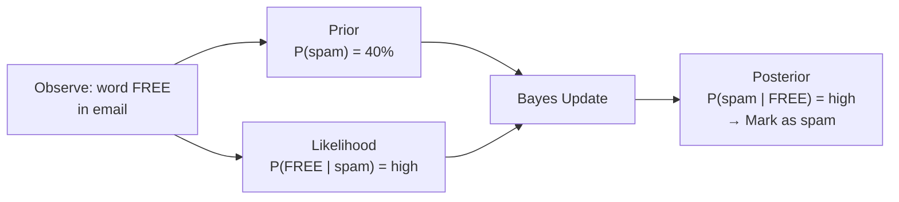
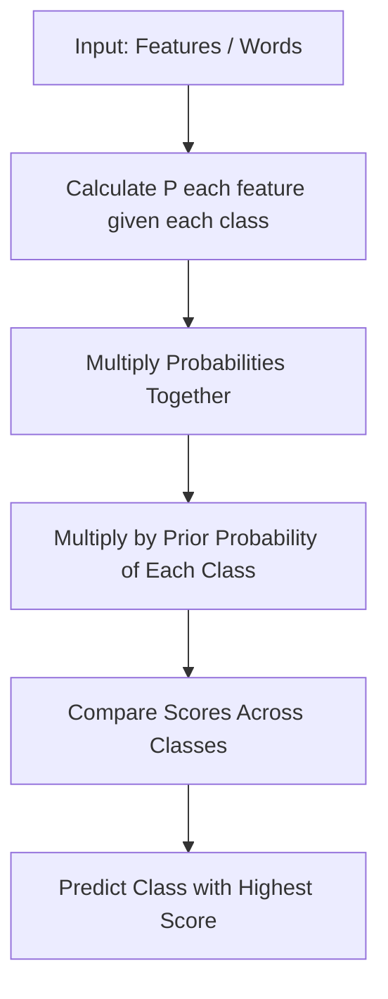

# Naive Bayes

A doctor sees a patient with three symptoms: fever, cough, fatigue. From experience, each symptom individually pushes toward "flu." The doctor asks each symptom separately — "how much does *this alone* shift the odds?" — then multiplies those independent signals together.

👉 This is why we need **Naive Bayes** — to classify by combining independent probabilities, making it extremely fast and effective, especially for text.

---

## Bayes' Theorem — Plain English First

Bayes' theorem answers: given that I just observed something, how should I update my belief?

`P(class | features) = P(features | class) × P(class) / P(features)`

- `P(class | features)` = probability of this class given what I see (what we want)
- `P(features | class)` = how likely is this feature pattern if the class is true (learned from data)
- `P(class)` = how common is this class in general (prior)
- `P(features)` = how common is this feature pattern overall (normalizing constant)

Example: email with "FREE" → P("FREE" | spam) is high, P(spam) = 40% → high probability of spam.

---

## The Naive Part

Real Bayes with many features is expensive — you'd need to model the joint probability of all features. For 10,000 unique words, essentially impossible.

The "naive" assumption: **treat every feature as independent.**

Instead of: `P(fever AND cough AND fatigue | flu)` compute: `P(fever | flu) × P(cough | flu) × P(fatigue | flu)`

Is this always true? Almost never. Does it work anyway? Often remarkably well, especially for text.

---

## Why Naive Bayes Works for Text

- Each word is a feature — a document can have 10,000 features
- NB treats each word independently → 10,000 small probability calculations
- Training is just **counting**: how often does each word appear in spam vs ham?
- No gradient descent, no optimization — just counting → extremely fast to train and predict

---

## Types of Naive Bayes

| Type | Use When | Features Are |
|---|---|---|
| **Multinomial NB** | Text classification | Word counts or frequencies |
| **Bernoulli NB** | Short text, binary presence | Word present/absent (0 or 1) |
| **Gaussian NB** | Continuous features | Normally distributed real numbers |

For spam detection and document classification, **Multinomial NB** is the standard choice.

---

## The Laplace Smoothing Problem

If a word appears in test data but never in training data, its probability is 0 — and multiplying 0 into the chain kills the whole calculation. **Laplace smoothing** adds a small count to every word's frequency to ensure no probability is ever exactly 0. Controlled by the `alpha` parameter in sklearn (default: 1.0).

---

## When Naive Bayes Shines vs When It Struggles

| Naive Bayes Works Well When | Naive Bayes Struggles When |
|---|---|
| Text classification (spam, sentiment, topics) | Features are highly correlated |
| Very small training datasets | You need accurate probability estimates |
| Real-time prediction needed (extremely fast) | Continuous features with non-Gaussian distributions |
| High-dimensional sparse data (e.g. word counts) | Complex decision boundaries needed |
| Baseline model / first benchmark | Feature independence assumption is badly violated |

---

✅ **What you just learned:** Naive Bayes classifies by multiplying the independent probability of each feature given each class, using Bayes' theorem, making it fast and powerful for text classification despite its simplifying independence assumption.

🔨 **Build this now:** Load the 20 Newsgroups dataset with `sklearn.datasets.fetch_20newsgroups(categories=['sci.space', 'rec.sport.hockey'])`. Use `CountVectorizer` to convert text to word counts. Train `MultinomialNB()`. Predict the category of a new sentence.

➡️ **Next step:** Algorithm Comparison → `03_Classical_ML_Algorithms/Algorithm_Comparison.md`

---

## 📂 Navigation

**In this folder:**
| File | |
|---|---|
| **Theory.md** | ← you are here |
| [Cheatsheet.md](./Cheatsheet.md) | Key terms, when to use, golden rules |
| [Interview_QA.md](./Interview_QA.md) | Beginner to advanced interview questions |
| [Code_Example.md](./Code_Example.md) | Full working Python spam detector example |

⬅️ **Prev:** [07 PCA](../07_PCA_Dimensionality_Reduction/Theory.md) &nbsp;&nbsp;&nbsp; ➡️ **Next:** [04 Neural Networks and Deep Learning](../../04_Neural_Networks_and_Deep_Learning/Readme.md)
