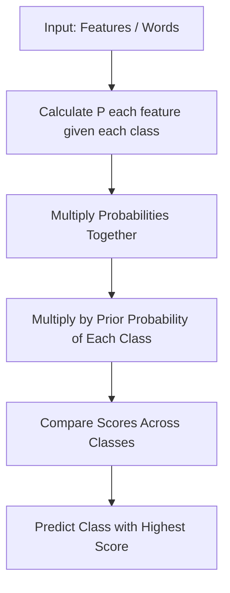

# Naive Bayes

You are a doctor. A patient walks in with three symptoms: fever, cough, and fatigue. You have seen thousands of patients before. You know from experience: fever makes flu very likely. Cough also makes flu likely. Fatigue is common with flu too. Each symptom individually pushes you toward "flu." You multiply these independent signals together and arrive at your diagnosis.

You never said "what combination of all three symptoms points to flu?" You just asked each symptom separately: "how much does *this alone* shift the odds?" Then you multiplied.

👉 This is why we need **Naive Bayes** — to classify by combining independent probabilities, making it extremely fast and surprisingly effective, especially for text.

---

## Bayes' Theorem — Plain English First

Bayes' theorem answers one question: given that I just observed something, how should I update my belief?

Formal version: `P(class | features) = P(features | class) × P(class) / P(features)`

Plain English version:
- `P(class | features)` = probability of this class given what I see (what we want)
- `P(features | class)` = how likely is this feature pattern if the class is true (learned from data)
- `P(class)` = how common is this class in general (prior knowledge)
- `P(features)` = how common is this feature pattern overall (just a normalizing constant)

Example: You get an email with the word "FREE." What is the probability it is spam?

- `P(spam | "FREE")` = ?
- `P("FREE" | spam)` = very high — spammers love "FREE"
- `P(spam)` = maybe 40% of all emails you get are spam
- Combine them → high probability of spam

---

## The Naive Part

Real Bayes theorem with many features is expensive to compute. You would need to model the joint probability of all features together. For a text document with 10,000 unique words, that is essentially impossible.

The "naive" assumption: **treat every feature as independent**.

This means instead of: `P(fever AND cough AND fatigue | flu)`

You compute: `P(fever | flu) × P(cough | flu) × P(fatigue | flu)`

Is this assumption always true? Almost never. Fever and cough are correlated. Words in a document are related to each other.

Does it work anyway? Often remarkably well. Especially for text classification.

---

## Why Naive Bayes Works for Text

Text classification is Naive Bayes' strongest domain. Here is why:

- Each word is one feature. A document might have 10,000 features.
- Most ML models struggle with 10,000 features.
- Naive Bayes treats each word independently — so 10,000 features becomes 10,000 small probability calculations. Easy.
- Training is just counting: how many times does each word appear in spam vs ham emails?
- No gradient descent, no optimization — just counting.

This makes Naive Bayes extremely fast to train and to predict.

---

## Types of Naive Bayes

| Type | Use When | Features Are |
|---|---|---|
| **Multinomial NB** | Text classification | Word counts or frequencies |
| **Bernoulli NB** | Short text, binary presence | Word present/absent (0 or 1) |
| **Gaussian NB** | Continuous features | Normally distributed real numbers |

For spam detection and document classification, **Multinomial NB** is the standard choice.

---

## The Laplace Smoothing Problem

What if a word appears in test data that was never in training data? Its probability would be 0. Multiplying 0 into the chain of probabilities kills the whole calculation.

**Laplace smoothing** (also called additive smoothing) adds a small count to every word's frequency, even words that never appeared. This ensures no probability is ever exactly 0.

In sklearn, this is controlled by the `alpha` parameter (default: 1.0).

---

## When Naive Bayes Shines vs When It Struggles

| Naive Bayes Works Well When | Naive Bayes Struggles When |
|---|---|
| Text classification (spam, sentiment, topics) | Features are highly correlated |
| Very small training datasets | You need accurate probability estimates |
| Real-time prediction needed (extremely fast) | Continuous features with non-Gaussian distributions |
| High-dimensional sparse data (e.g. word counts) | Complex decision boundaries needed |
| Baseline model / first benchmark | Feature independence assumption is badly violated |

---

✅ **What you just learned:** Naive Bayes classifies by multiplying the independent probability of each feature given each class, using Bayes' theorem, making it fast and powerful for text classification despite its simplifying independence assumption.

🔨 **Build this now:** Load the 20 Newsgroups dataset with `sklearn.datasets.fetch_20newsgroups(categories=['sci.space', 'rec.sport.hockey'])`. Use `CountVectorizer` to convert text to word counts. Train `MultinomialNB()`. Predict the category of a new sentence.

➡️ **Next step:** Algorithm Comparison → `03_Classical_ML_Algorithms/Algorithm_Comparison.md`

---

## 📂 Navigation

**In this folder:**
| File | |
|---|---|
| **Theory.md** | ← you are here |
| [Cheatsheet.md](./Cheatsheet.md) | Key terms, when to use, golden rules |
| [Interview_QA.md](./Interview_QA.md) | Beginner to advanced interview questions |
| [Code_Example.md](./Code_Example.md) | Full working Python spam detector example |

⬅️ **Prev:** [07 PCA](../07_PCA_Dimensionality_Reduction/Theory.md) &nbsp;&nbsp;&nbsp; ➡️ **Next:** [04 Neural Networks and Deep Learning](../../04_Neural_Networks_and_Deep_Learning/Readme.md)
